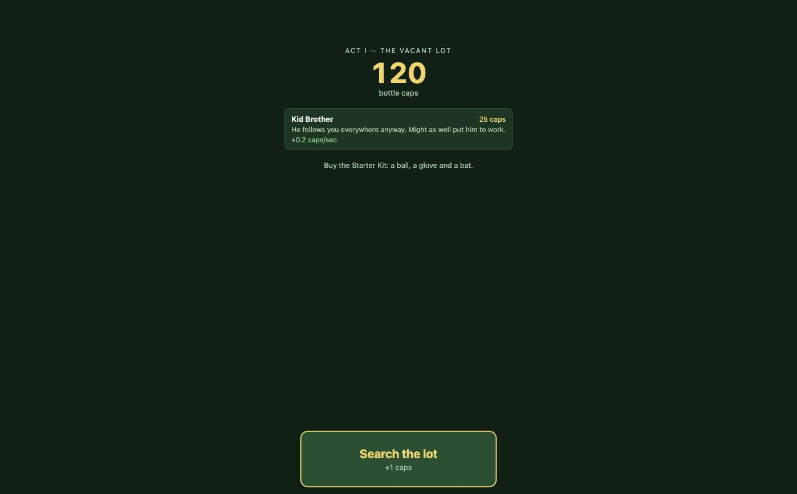
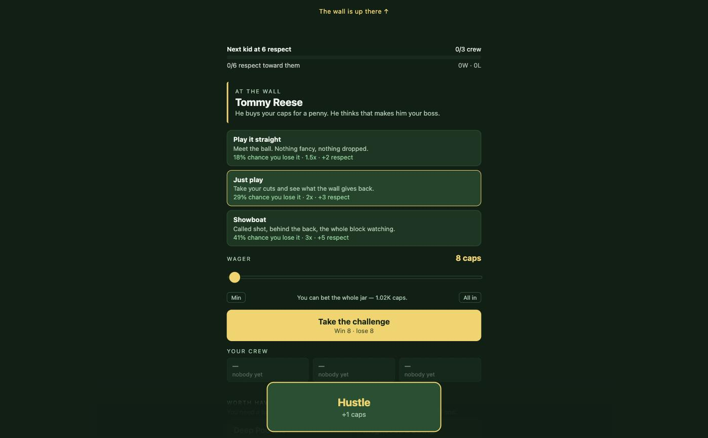
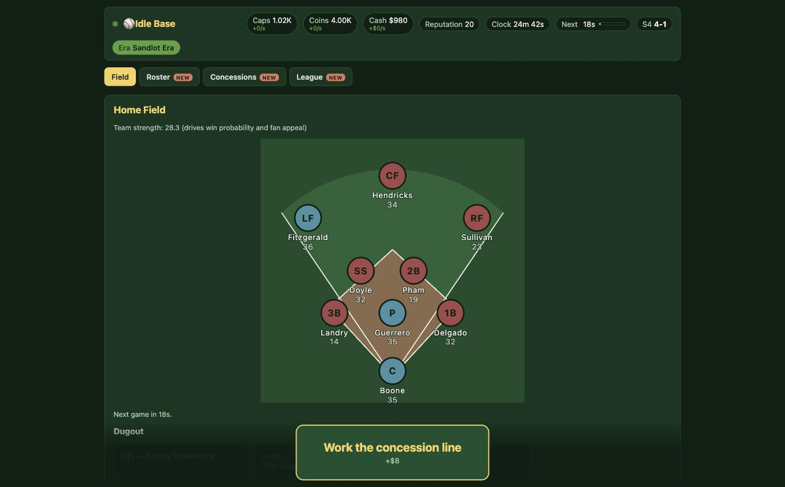
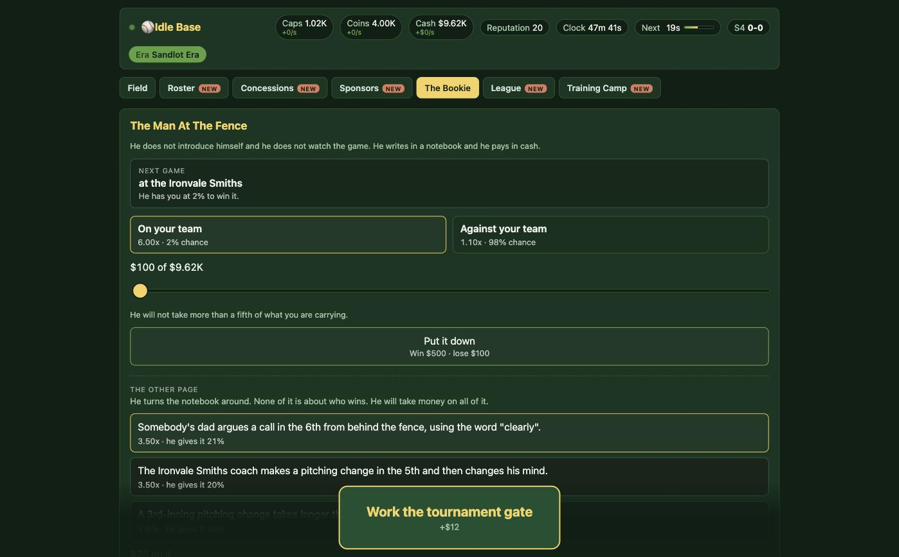
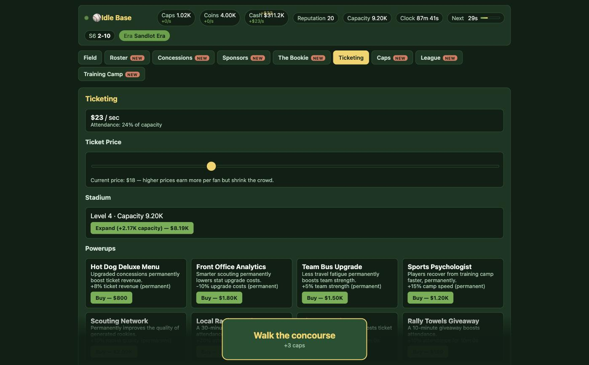
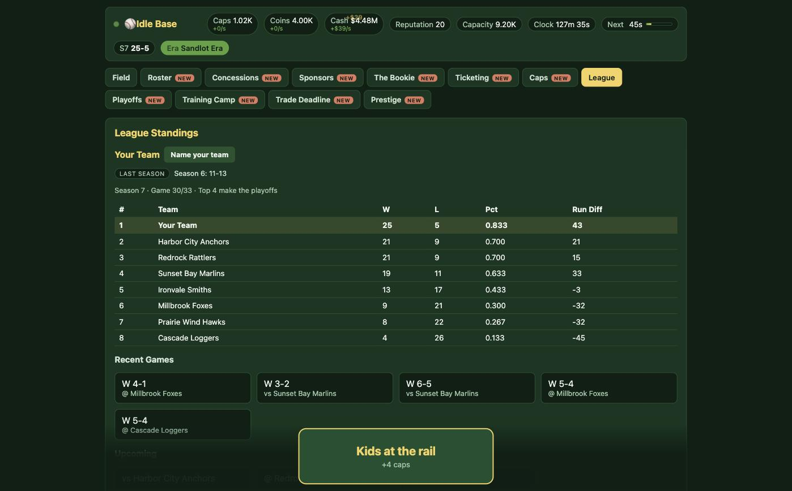
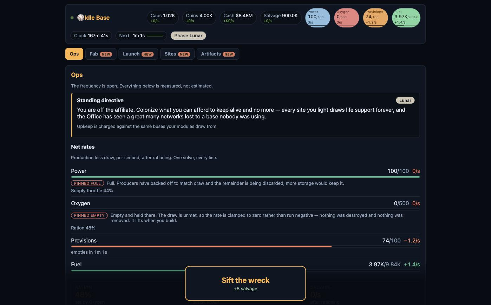

# Idle Base

An idle baseball odyssey. You are nine years old, there is a vacant lot behind the hardware
store, and there is money in the dirt if you know where to look.

**Play it: https://brentfisher.github.io/idle-base/**

The game runs entirely in the browser and saves to `localStorage`, so it keeps your progress
between visits on the same device. It plays on a phone.

## The odyssey

Seven acts, played once per save. Each one is a different game that happens to use the same
simulation, and each ends on a condition the engine can check rather than on a timer.

| Act | | Ends when |
|---|---|---|
| I | The Vacant Lot | You buy the Starter Kit — glove, ball and bat |
| II | Off the Wall | Five wall-ball wins and a crew of three |
| III | Little League | You finish first in a six-game season |
| IV | Travel Ball | You win 60% of your games across two full travel seasons |
| V | The Minors | You fill a 10,000-seat stadium and win the pennant |
| VI | The Big Leagues | You win the championship, then accept the call-up — **your choice** |
| VII | The Farm Team | Nothing. It is the end of the arc. |

### What they look like

One screen from each act, in order. Every act reuses the same engine and the same save; what
changes is what the screen is *for* — a button in the dirt, a wager against a wall, a lineup, a
man at the fence with a notebook, a stadium's gate revenue, a pennant race, and a colony you are
keeping alive from a wreck. Click any of them for the full-size image.

<table>
  <tr>
    <td width="33%"><a href="docs/screenshots/act-1-the-vacant-lot.jpg"></a><br><sub><b>I — The Vacant Lot.</b> One button, one screen.</sub></td>
    <td width="33%"><a href="docs/screenshots/act-2-off-the-wall.jpg"></a><br><sub><b>II — Off the Wall.</b> Bounded wagers, and a crew.</sub></td>
    <td width="33%"><a href="docs/screenshots/act-3-little-league.jpg"></a><br><sub><b>III — Little League.</b> The first real team.</sub></td>
  </tr>
  <tr>
    <td><a href="docs/screenshots/act-4-travel-ball.jpg"></a><br><sub><b>IV — Travel Ball.</b> Somebody's uncle is taking bets.</sub></td>
    <td><a href="docs/screenshots/act-5-the-minors.jpg"></a><br><sub><b>V — The Minors.</b> Baseball becomes a business.</sub></td>
    <td><a href="docs/screenshots/act-6-the-big-leagues.jpg"></a><br><sub><b>VI — The Big Leagues.</b> A pennant race, and the call-up.</sub></td>
  </tr>
  <tr>
    <td colspan="3"><a href="docs/screenshots/act-7-the-farm-team.jpg"></a><br><sub><b>VII — The Farm Team.</b> The same engine, wearing a different game. Nothing here is a team any more.</sub></td>
  </tr>
</table>

Winning the championship in Act VI is the game's win condition. Act VII is what you may choose
to do afterwards, and it is one-way: the trophy ceremony is interrupted, baseball turns out to
have been an aptitude program, Earth is a farm team, and there is a call-up. The franchise is
torn down and replaced by a colony you keep alive while you build your way off the planet — a
different game with the same engine underneath, its own currency (Salvage), its own resources
that fill and drain against a ceiling (Power, Oxygen, Provisions, Fuel), and its own five-phase
ladder out from the wreck.

Declining the call-up is not permanent. Act VI carries on as it always has, the offer is remade
after every title, and **prestige** replays Act VI through a ladder of eras
(`src/data/eras.js`) — it returns you to the Act VI floor and never past it, so the odyssey
itself is still played once per save.

### What is built

**All seven acts are playable end to end.** Act VII's simulation — the colony and its resource
solve, the module ladder, site colonization and launch pads, launches with transit and the
overshoot decision, the artifact puzzles, the contract board — now has the screens to go with it:
Ops, Fab, Launch, Sites, Artifacts, Contracts, and the standings board the ending is read from.

## Running it locally

```sh
npm install
npm start      # webpack dev server on http://localhost:8080
npm run build  # production bundle into dist/
```

## How it is put together

Plain CommonJS, no TypeScript, no test runner. React only in `src/components/`.

| Directory | What lives there |
|---|---|
| `src/data/` | Configuration and authored prose. Numbers and copy, never logic. |
| `src/engine/` | The simulation. Pure functions — no React, no DOM, no `localStorage`. |
| `src/state/` | The reducer, its actions, and the shape of a save. |
| `src/components/` | React. Renders what the engine says; decides nothing itself. |
| `openspec/` | Change proposals, designs and delta specs, one directory per change. |
| `docs/` | The PRDs the acts are built against — one for Acts I–VI, one for Act VII. |

Three conventions carry most of the weight:

- **Engine modules are pure and headless.** Every mechanic can be driven from a Node script
  with a seeded random number generator, which is how the acts are balanced — the tuning
  comments in `src/data/acts.js` record the measurements, not opinions.
- **Presentation-ready views.** A shop engine exports `listOffers(state)`, which has already
  decided cost, ownership, affordability and availability, and `purchase(state, id)`, which
  returns new state or `null` for refused. The component renders the rows and recomputes none
  of it. `engine/lotShop.js` ↔ `components/lot/LotShop.js` is the pattern; every shop in the
  game follows it, and `engine/wallBall.js`'s `challengeView` is the same idea for a screen
  that is not a shop.
- **Saves are never migrated.** `persistence/saveLoad.js` discards a save whose version does
  not match, so anything new has to read correctly when it is simply absent from an older
  save. That constraint shapes more of the code than any other.

One simulation entry point: `engine/tickEngine.js`'s `advance(state, deltaSeconds)`, called
identically by the one-second timer and by the offline catch-up when you come back to the tab.
Income is integrated as a rate rather than fired as an event, which is what lets an eight-hour
absence resolve in a handful of passes.

## Deployment

`.github/workflows/pages.yml` builds the bundle and publishes it to GitHub Pages on every push
to `master`, and can be run by hand from any branch to preview a story before it merges. The
build output is never committed — `dist/` stays gitignored and the workflow produces it fresh,
so what is served is always what the source builds.
