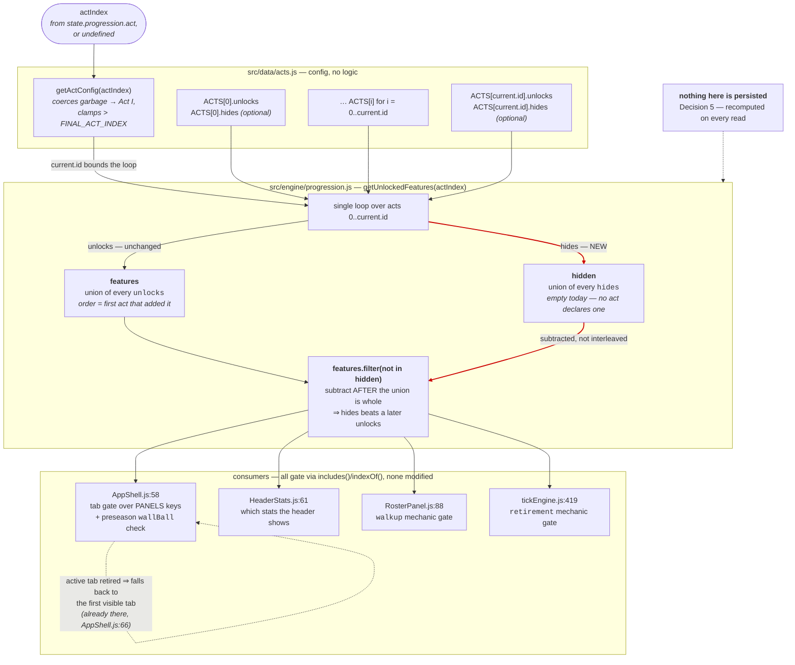

## Context

See proposal.md — Why. The constraint that shapes everything below is
`changes/odyssey-progression-architecture/design.md` **Decision 5**: which features are unlocked is
derived from the act index on every read and is never persisted. Whatever expresses "this act
retires that feature" has to be resolvable from `data/acts.js` + the current act index alone, with
no help from the save.

Two further constraints come from the repo rather than the design:

- `src/data/` is config with no logic (project conventions). `hides` can be *declared* there but
  every rule about how it resolves — precedence, range, what an absent key means — has to live in
  `src/engine/`.
- There is no test framework, linter or CI. The only verification available is driving the pure
  engines under `node`, which works because `src/engine/` and `src/data/` are plain CommonJS with
  no build step. That constrains the *evidence*, so the shape of the change was chosen partly for
  what could be proven about it.

## Goals / Non-Goals

**Goals:**

- Give act config a way to remove a feature id, symmetric with `unlocks` and in the same namespace.
- Keep the result derived on read; add no persisted field and no migration.
- Ship byte-identical behaviour, and *prove* it rather than argue it.
- Settle the precedence question in code and in a comment now, while it is cheap and hypothetical,
  rather than during the Act VII story when a wrong answer looks like a content bug.

**Non-Goals:**

- Act VII, or any act declaring `hides`. Not in this change.
- Any per-feature teardown behaviour beyond removal from the returned array — no "hidden but
  visible", no archive tab, no transition animation.
- Reworking how consumers gate. They already read the array through `includes()`; a shrinking array
  is handled by the code that is there.
- Anything about `rules`, `modifierBonuses`, `exit`, or the act-transition loop.

## Decisions

### Decision 1 — `hides` is an optional act config array, not a stored flag and not a predicate

`hides: [...featureId]` sits beside `unlocks` on an act, drawn from the same id namespace: an id
matching a key of AppShell's `PANELS` map retires a whole tab, anything else retires a mechanic
inside a panel that stays visible.

*Alternative rejected — a persisted `progression.hiddenFeatures` list, written on act entry.* This
is the option that breaks Decision 5. It would freeze one edit of `data/acts.js` into every save in
the wild: change your mind about which act retires the roster tab and existing saves keep the old
answer forever, or you write the migration this architecture exists to avoid. Config resolved on
read has none of that — retuning `hides` takes effect on the next render of an existing save.

*Alternative rejected — a `hides` predicate over state, like `exit`.* Exit conditions are
predicates because they ask about what the player *did*. Retirement asks about where the player
*is*, which is the act index, which `getUnlockedFeatures` already has. A predicate would add an
evaluation order and a state dependency to a function that is currently a pure function of one
integer, and buys nothing today.

### Decision 2 — Resolution is UNION-THEN-SUBTRACT, and `hides` therefore beats a later `unlocks`

The whole `unlocks` union for acts `0..actIndex` is built first; only then is every id named by any
of those same acts' `hides` removed from it. The subtraction is not interleaved per act.

The observable consequence is the rule: **`hides` wins over `unlocks` of the same id, regardless of
which act each sits in.** Per-act interleaving would give the opposite for the specific case where
a later act's `unlocks` names an id an earlier act hid — that act would silently restore it.

The reason to prefer subtract-last is how these arrays are authored. Every `unlocks` array lists
only what its act ADDS; ids are never restated, because unlocks are cumulative — `walkup` appears
once, under Act IV, and stays on through Acts V and VI without being mentioned again
(`data/walkupSongsConfig.js` records exactly this). So an id reappearing in a later act's `unlocks`
after an earlier act hid it is far more likely two config edits colliding than an author intending
a restoration. Union-then-subtract makes that collision inert: bringing a retired feature back has
to be a new decision someone types out (delete the `hides` entry), never an emergent effect of
which order two edits landed in. The same rule settles the degenerate case of a single act naming
an id in both of its arrays — hidden, no special case needed.

The subtraction reads `hides` from acts `0..actIndex` only, exactly as the union does. A teardown
authored into a late act is invisible to a player who has not reached it; nothing leaks backward.

*Alternative rejected — per-act interleaving ("last act wins").* Defensible in the abstract, and it
is what a naive reading of "acts are applied in order" suggests. Rejected because it makes the
safe-looking authoring action (re-listing an id) load-bearing, and because it would mean a
`hides`/`unlocks` pair inside one act depends on nothing the config expresses — there is no order
between two keys of the same object literal.

*Alternative rejected — leaving the precedence undefined and forbidding the overlap by convention.*
The repo has no linter to enforce a convention, so "forbidden" would mean "undefined behaviour that
nothing catches".

### Decision 3 — Filter the finished union rather than rebuilding it

`features.filter((feature) => !hidden.includes(feature))` preserves the order the union produced,
which matters for the no-op proof: with `hidden` empty the function must return the same ids in the
same order, not merely the same set. AppShell derives its tab order from `PANELS` and does not care,
but the proof is stronger as an ordered comparison and costs nothing to keep.

The `hides` collection loop is folded into the existing `unlocks` loop rather than added as a
second pass — same range, same bound (`current.id`), no new traversal of `ACTS`.

### Decision 4 — No component changes, and the two limits Act VII inherits

`components/layout/AppShell.js:64-67` was read, not assumed. It already handles the case:

```js
const effectiveTab = visibleTabs.indexOf(activeTab) !== -1 ? activeTab : visibleTabs[0] || 'field';
```

If the tab the player is sitting on stops being unlocked, the shell falls back to the first visible
tab rather than rendering blank. That is the whole component-side requirement for a retired tab, and
it predates this change. The other three consumers gate on `includes()`/`indexOf()` of the returned
array, so for a *mechanic* id the consumer's existing check is the entire gate — `hides` is not a
tab-only feature.

Two real limits were found while verifying, neither triggered by this change (no act declares
`hides`) and both inherited by the Act VII story:

1. `visibleTabs[0] || 'field'` falls back to the literal `'field'`, and `PANELS[effectiveTab] ||
   FieldView` backstops to `FieldView`. An act that hides every current tab would therefore render
   `FieldView` regardless — correct today, wrong for an act that means to retire `field` itself.
   Act VII must supply the tab that replaces the ones it retires, or change that backstop.
2. `AppShell`'s pre-season branch renders `<LotPanel />` unconditionally (`lot` is not a `PANELS`
   key), so `hides: ['lot']` would be inert there. Retiring the lot is not expressible through this
   mechanism without a component change.

Both are recorded here rather than fixed, because fixing them would mean editing components in a
change whose entire claim is that it changes no behaviour.

## The resolution, and who reads it



## Verification

No test framework exists, so the acceptance check is driving the pure engine under `node` against
two trees: the base commit `fe545c8` extracted with `git archive`, and the working tree.

**The no-op.** `getUnlockedFeatures` is called on both trees for every index a live call path can
produce — `undefined` (both `RosterPanel.js:88` and `HeaderStats.js:61` pass
`state.progression ? state.progression.act : undefined`), `-1` and `6` (the `getActConfig` coercion
and clamp branches), and `0` through `5`. Outputs are serialised as ordered JSON arrays and
`diff`ed. The diff must be empty with nothing excluded, and a positive assertion on the Act VI
result (26 ids, `lot` first, `prestige` last) guards against the empty diff being two identical
crashes.

**The mechanism.** Proven against a scratch config that is **not** committed to `data/acts.js`. The
scratch act is made by **mutating an existing `ACTS` entry in place, deliberately not by appending a
seventh act**: `FINAL_ACT_INDEX` is `ACTS.length - 1` captured at module load and `getActConfig()`
clamps anything above it, so an appended act would be clamped away and every assertion would pass
for the wrong reason. Each case runs in its own `node` process so no module-cache state leaks
between them. The discriminating case is `ACTS[2].hides = ['camp']` where `camp` is unlocked by
`ACTS[3]` — under per-act subtraction Act III would restore it; under union-then-subtract it stays
gone. Running that same case against the base tree returns `camp` present, which is what shows the
harness is testing the new code rather than agreeing with itself.

## Risks / Trade-offs

- **An author hides an id that no act unlocks (typo, renamed feature).** → Inert: the filter finds
  nothing to remove and the output is unchanged. Silent rather than loud, which is the right trade
  in `src/data/` where a throw would reach a player with no test framework in between
  (`getActConfig`'s comment makes the same call for the same reason). Covered by a harness case.
- **`hides` and the tab id drift apart.** Feature ids must equal `PANELS` keys to gate a tab, and
  nothing enforces that for `unlocks` today either. → Same exposure as the existing key, documented
  in the same place; no new class of error.
- **Precedence surprises an author later.** → It is stated twice on purpose, at the two altitudes
  someone will be reading at: the author-facing consequence in `data/acts.js`'s header ("re-listing
  the id will not bring it back — delete the `hides` entry"), the reasoning in
  `engine/progression.js` above the function.
- **`hides` is a removal primitive, and Decision 6 forbids removing the manual income action.**
  (`changes/odyssey-progression-architecture/design.md`, Decision 6: no mechanic may remove the
  manual click/Hustle action — the structural guarantee that no run of losses is unrecoverable.)
  → Inert by construction today. `hustle` appears in `ACTS[0].unlocks` but is read by nothing:
  grepping the tree finds that string in `data/acts.js` and nowhere else, and `AppShell.js:88-90`
  records that the click button exists in every act and is never gated (PRD 6.4). So
  `hides: ['hustle']` has no effect. Recorded here anyway, because a later story that *did* gate
  the click on its unlock id would quietly make Decision 6 violable through a config edit — and
  the place to notice that is when writing that gate, not when writing this filter.
- **The change is inert, so nothing exercises it until Act VII.** → Accepted, and it is the point:
  inert is what makes it safe to land early. The harness cases are the compensating evidence, and
  the two AppShell limits above are written down so the Act VII story meets them as known work
  rather than as a surprise.

## Migration Plan

None, and that is a load-bearing "none". No save shape changes, no persisted field is added, and
`meta.version` is **not** bumped — `persistence/saveLoad.js` discards on mismatch, so bumping it
would wipe every save in the wild for a change that alters nothing a player can see. A save written
before this change resolves to the identical feature list after it.

Rollback is reverting the commit; there is no state written by this change to clean up.
