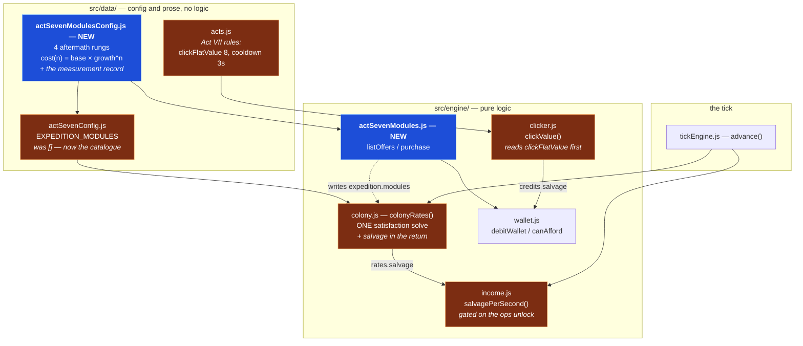

# Design — Act VII `aftermath` economy

## The change, drawn



## Why the Salvage rate lives in `colonyRates` and not in `income.js`

Salvage is spent through the wallet, so the obvious home for its rate is `income.js`
beside ticketing and concessions. It is computed in `colony.js` instead, and the reason
is the **ration**.

A Reclaimer Drone consumes Power and Provisions. When the colony is starved, the
satisfaction solve rations every consumer — and a drone's *output* has to be throttled
by the same factor that throttles its input. If `income.js` summed the drones itself it
would need its own copy of the throughput and load-follow arithmetic, which means a
second ration, which means the header can say 26/s while the wallet fills at 9/s.

Computing it inside the solve makes that divergence impossible: there is exactly one
ration, and everything downstream reads it.

```
colonyRates(state, modifiers)
  ├─ demandAtFullOutput(owned, drawMult)      ← unchanged
  ├─ solveSatisfaction(...)                   ← unchanged, ≤16 passes
  ├─ grossProduction / loadFollow / net       ← unchanged (4 consumables)
  └─ salvageFromOwned(owned, satisfaction, supplyThrottle)   ← NEW
       Σ count × producesSalvage × throughput × loadFollow
```

`colonyRates`'s existing return keys are untouched — `salvage` is **additive**. Anything
already destructuring `{ net, capacity }` is unaffected, which matters because the header
readout story (STORY-023) builds a `listResources` wrapper over this exact return.

## Why `producesSalvage` rather than `produces.salvage`

`actSevenConfig.js` states the rule that the four consumables "are NOT currencies and
must never be added to `data/currencies.js`" — they fill and drain against a ceiling,
where a currency is monotonic and spendable. Salvage is on the other side of that line.

`produces: { salvage: 3.0 }` would *appear* to work, because every resource loop in
`colony.js` iterates `EXPEDITION_RESOURCE_IDS` and would skip the key silently. It would
break the first time anything iterated `produces` directly — and it would break by
producing a wrong number rather than an error. A distinct key cannot be mistaken for a
resource by any future reader.

The consequence: `loadFollowOf()` reads `produces`, a drone has none, so its load-follow
term is structurally 1. That is correct — load-follow stops a producer overfilling a
ceiling, and Salvage has no ceiling. The term is kept in the expression so a later module
producing Salvage *and* a capped resource does not need the function reopened.

## Availability is a rank comparison, not equality

`aftermath` rows must stay buyable in `lunar` — a ladder whose bottom rung disappears is
a ladder a returning player cannot climb. `isAvailable` therefore asks "has the run
reached *at least* this phase", the same comparison `getUnlockedFeatures` makes against
`unlockedBy`.

It **fails open at both edges**: a row with no phase, and a run whose phase is
unrecognized, both reveal everything. `expedition.phase` is self-healing — recomputed
from a pure predicate ladder every `advance()` — so an unrecognized value is a corrupt
save one tick from repair. Failing closed there would empty the act's only Salvage sink
for that tick. Showing a row early is recoverable; stranding a save is not.

## The income gate is a feature id, not an act index

`salvagePerSecond` is gated on the `ops` feature being unlocked rather than on
`progression.act === 6`. Unlocked features are recomputed from the act config on every
read, so retuning when fabrication opens takes effect on an existing save with no
migration. An act-index check would be a second place that knows the arc's shape.

`ops` specifically, not `fab`: `ops` is the one Act VII tab with no `unlockedBy` entry,
so it is live from the act boundary — which is exactly when the colony can first own a
module. Gating on `fab` would withhold income until `lifeSupport` and silently zero the
whole `aftermath` economy.

## Backward compatibility

Acts I–VI are untouched, and that is checkable rather than asserted:

- `clickValue()` early-returns only when `clickFlatValue` is a positive finite number.
  No act before VII declares one, so `perClick` is neither read nor written on that path.
- `colonyRates` returns all-zero rates when no modules are owned, `integrateColony`
  returns the state object it was handed by identity, and `salvageFromOwned` sums an
  empty list to 0.
- `salvagePerSecond` returns 0 whenever `ops` is not unlocked, which is every act before
  VII, without running the solve at all.
