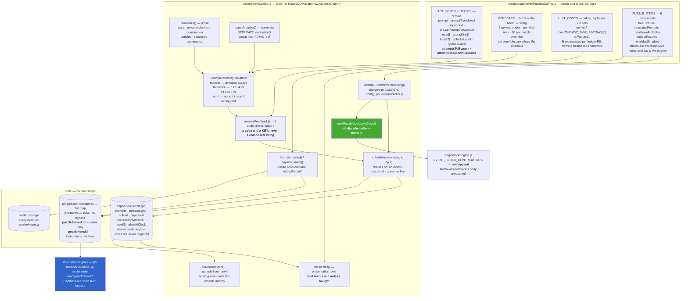

## Context

Nine artifacts, five feedback codes, three routes past each one, six instruments and a price table
that is derived rather than authored. The interesting decisions are not in any single one of those —
they are in the seams between them, and every one of the six below was taken because a seam could
have been crossed the easy way and would have been wrong.

## The change, as built

## Decision 1: Three routes past every artifact, and one of them costs nothing

Solve it, buy the ladder, or wait out the governor. The third route requires no correct answer, no
currency and no purchase — it is reachable by a player who is broke, stuck, or simply does not enjoy
puzzles, and the game does not get an opinion about which of those they are.

**Alternative rejected: two routes (solve or hint).** That is a paywall with extra steps. There is no
money in this game, so the wall is the player's time taken without a trade, and the moment a hint
becomes the only route its price stops being a sink and becomes a toll. Every hint must be a
*convenience* purchase made by someone who could have solved it.

The bypass counter is a **ceiling on the worst case, not a pace**. With positional feedback a
deducing player converges on the sequence artifact in three or four submissions against a counter of
six; they never meet it. It exists entirely for the player who does.

## Decision 2: Feedback is a code and a key, never a sentence

The grading function returns `{ code, lineId, detail }`. The prose lives in an authored table and the
renderer substitutes it.

**Alternative rejected: return the line.** Composing "CLOSE. YOUR FIGURE IS LOW." in the engine puts
a player-facing string in `src/engine/`, which is the same class of bug as a number inline in a
component. Worse, it makes the same wrong answer phrasable two ways by two panels. The `detail`
object carries the *facts* — direction, count in position — and the placeholder substitution happens
where prose already lives.

The five codes exist so that no submission is ever bare-rejected, and two of them — near and
wrong-kind — are written for the player who understood **more** than was asked. Someone who answers
`8` to the first artifact is counting arrivals, which is a better reading of the hardware than the
one the panel wanted; telling them "INCORRECT" would be a lie about what they did.

## Decision 3: One flag on solve-or-bypass, a second on solve only

`puzzle:<id>` is written on **either** resolution. `puzzleSolved:<id>` is written on solve alone.

Every downstream capability gate — the scrubber override, the assist route, the launch-window
readout — reads the first key, and therefore **cannot** accidentally distinguish the two routes. The
anti-soft-lock guarantee is expressed as a naming convention rather than as a rule somebody has to
remember: a future gate cannot punish a bypass because it is not given the vocabulary to see one.

The second key is read by the ending text and by nothing else. There is deliberately **no** third
key for "solved without hints" — that question needs the hint count, which lives in the record, so it
goes through an exported predicate instead of duplicating state that could then drift.

## Decision 4: Prices are derived at authoring time, baked, and regenerated — never computed

Prices are a duration of the phase's own income: a tier is worth 8, 26 or 80 seconds of what the
player earns in the phase where the artifact appears. Those three numbers are the only authored ones;
the fifteen prices are generated from them and from the economy's published income bands.

**Alternative rejected: compute at runtime from the config.** That puts logic in the config layer,
which the house rules forbid.

**Alternative rejected: compute at runtime from the player's actual income.** This is the tempting
one and it is the worst of the three, because it means a stuck player — poor *precisely because* they
are stuck — pays more for the hint that would unstick them than a comfortable player pays.

So the prices are baked, with the formula beside them as a comment and the derivation recorded. One
consequence is recorded in full in the config: the income bands the formula reads from were revised
after this section was drafted, so the published price column was stale and has been regenerated.
The cross-check that the regeneration is the intended one is that the resulting per-phase sink shares
land within a point and a half of the ones the design independently authored.

## Decision 5: The wake boundary returns infinity, and that is the whole trap

The contributor list this change appends to has one hard contract: return infinity when nothing is
pending. A zero pins the simulation step at zero and burns every safety iteration.

The trap here is specific and worth writing down. A record's stored deadline **defaults to zero**,
because an absent deadline must read as *ready to attempt now*. A naive minimum over the nine records
therefore returns zero for every artifact the player has ever touched and is not currently waiting
on — which is most of them, most of the time. The implementation derives each candidate from the
*clamped remaining wait* and keeps only strictly positive ones, which makes the zero unreachable and
has a second benefit: the boundary agrees with the clamp, so a shortened cooldown wakes the loop when
the panel says it will rather than at a stale deadline in the save.

It is a **UI-wake boundary, not a rate boundary**. It changes no rate, so the linear-within-a-step
property the colony solve depends on is untouched.

## Decision 6: Unbought hint text never reaches a row

Rows carry all three hint tiers with price, purchase state and affordability resolved — and `text`
is null until the tier is bought.

Prose that reaches the row reaches the DOM, and a player who opens devtools out of idle curiosity is
handed a spoiler they did not ask for. What the component cannot see, it cannot leak.

The answers themselves ship readable in the bundle, and that is fine: the third tier is near-explicit
by design, so the bundle is at worst a free hint the player could have bought. Obfuscating would mean
moving prose out of the config layer, which breaks a rule that matters for no gain.

## Risks

**The blocking coefficients behind the pace measurement are half estimated.** Four of the eight
graded artifacts remove a *fuel* tax, and the launch ladder that would price those taxes has not
shipped. The measurement therefore publishes two figures — the blocking-fraction metric the design
asks for, and an adversarial bound that counts every governed minute as fully blocking — and the
tuning clears the ceiling under both. The story that lands the launch ladder must re-measure.

**The act's combined Salvage draw is tight.** This section takes ~10.6% of the graded-phase earn
against a target band of 8–15%, and the module and colonization ladders take most of the rest. If the
combined draw overruns, this is the first table to move: no pacing table depends on it. The config
records how far that lever actually reaches, which is *not* far enough to absorb an arbitrary
surplus — a large one is a finding about the economy, not about the hint prices.
