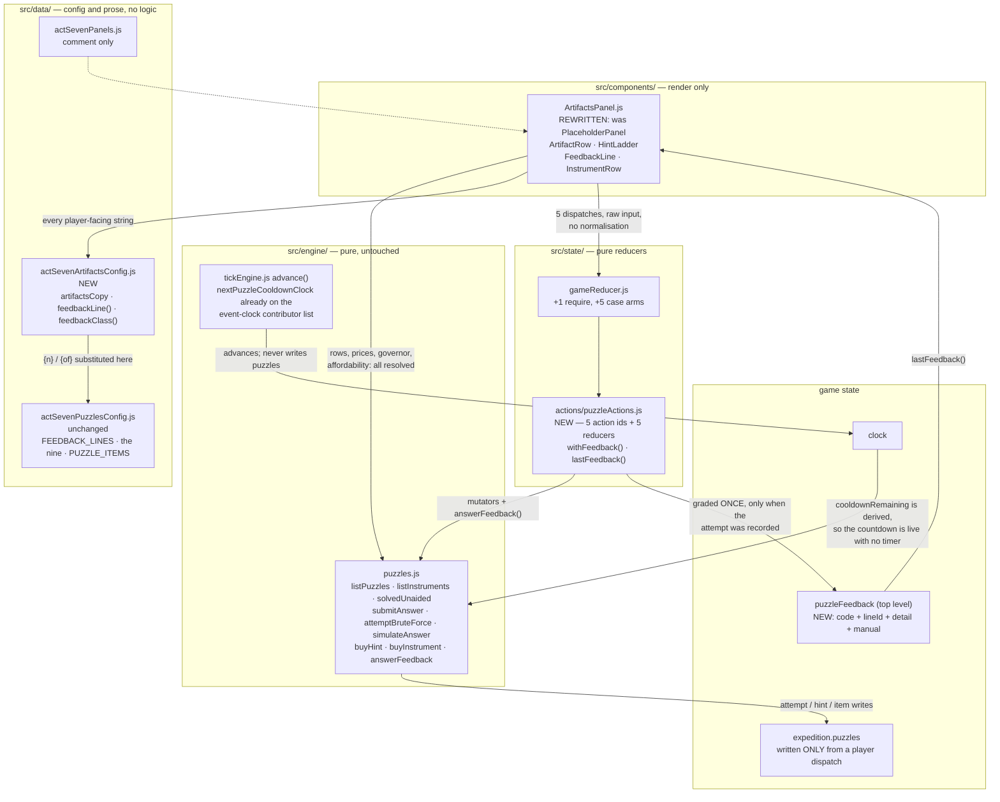

## Context

See proposal.md — Why. The constraints that actually shape this design are all pre-existing:

- **`engine/puzzles.js` already resolves everything.** `listPuzzles()` returns rows with the reveal
  gate, the prompt (translated or not), the status, the attempt count, the live governor, the hint
  ladder with prices and affordability, and the instrument readout already decided. `listInstruments()`
  does the same for the shop. A panel that recomputed any of it would be a second opinion on a
  question already answered.
- **`answerFeedback()` is pure and stateless**, and the engine says so with intent: it "takes an id
  and an input and reads no state". That makes it callable from anywhere — including a component,
  which is the trap this design is mostly about.
- **The clock is the tick's.** `attemptCooldownRemaining()` is derived from `state.clock`, and
  `nextPuzzleCooldownClock()` is already on `tickEngine.js`'s event-clock contributor list so a
  governor's expiry lands a simulation step. Nothing needs a timer; a timer would introduce a second
  clock that disagrees with the first during an offline catch-up.
- **Nothing in `advance()` writes `expedition.puzzles`.** That is what makes the system storm-safe,
  and it is a property this change must not spend.
- **Saves are never migrated.** `persistence/saveLoad.js` discards a save whose `meta.version`
  differs, so any state this change adds has to read correctly when absent.
- **`global.css` ends inside `@media (max-width: 640px)`.** A rule appended at EOF is silently
  desktop-invisible; two prior stories shipped that bug.

## Goals / Non-Goals

**Goals:**

- Make §8.1's rule observable: four unsuccessful outcomes that read differently from each other.
- Make the anti-soft-lock guarantee visible on every open artifact and stated once in words.
- Keep the panel a rendering surface — no availability, no price, no tolerance, no grading.
- Preserve storm safety and add no timer.

**Non-Goals:**

- No balance change. The act is measured at 4.86 h against a 5.00 h ceiling; nothing here moves a
  price, a cooldown or an attempt count.
- No change to `engine/puzzles.js` or `data/actSevenPuzzlesConfig.js`. Where the engine does not
  export a figure, this change records the gap rather than computing it in a component.
- No wall-time estimate for the manual route. The engine exports none, and §8.7's published table is
  about one cooldown pessimistic (the first attempt is free), so any figure invented here would be a
  promise the game does not keep.
- No notification, feed entry or toast on a solve. §10 owns the `act-7-first-puzzle` trigger.

## The change, as built

## Decisions

### Decision 1 — Feedback is graded in the reducer, not in the component

`answerFeedback()` is pure, so the panel *could* grade a draft answer on every keystroke. It must
not, for two independent reasons.

**It would be a free grading oracle.** `engine/puzzles.js` states the economics plainly: numeric
artifacts always give direction, which makes them binary-searchable, and "binary search IS the
brute-force path for a number and it is priced by the attempt cooldown rather than forbidden". A
component that graded locally sets that price to zero and quietly deletes §8.2's whole economy —
without changing a single number in `data/`. It is the same instinct that makes the engine send
`text: null` for an unbought hint: what the component cannot compute, it cannot leak.

**It would let the line disagree with the record.** `submitAnswer()` *refuses* while the governor is
live. A panel holding its own feedback would print a grade for an attempt the engine declined to
record, which is the one thing this screen may never do, because the grade is the entire product.

Grading therefore happens once, in `puzzleActions.js`, and is written **only when `submitAnswer()`
returned non-null** — the two are written together or not at all.

*Alternatives considered.* (a) Component-local `useState` holding the result of `answerFeedback()`:
rejected on both counts above. (b) Returning the feedback from the engine mutator: rejected because
it would change `submitAnswer()`'s contract for every existing caller, and the engine is out of scope
here. (c) No display persistence at all — render feedback only for the duration of one dispatch:
impossible in a reducer architecture without a timer, and a line that vanished would be worse than
one that stays.

### Decision 2 — The feedback record lives at the top level of state, not inside `expedition`

Every write in `engine/puzzles.js` goes through `withPuzzleRecord()`, which spreads back the
**defaulted** slice from `colony.js`'s `expeditionSlice()`. That accessor returns a fixed shape, so a
key it does not name is dropped by the next puzzle write — and `integrateColony()` rebuilds the slice
on every tick besides. A key on `expedition` or on a puzzle record would therefore vanish
unpredictably, and the failure would look like a rendering bug rather than a state one.

A top-level `puzzleFeedback` map survives, because `advance()` and every reducer spread `...state`.
It is read through a defaulting accessor (`lastFeedback()`), so a save written before this change
reads as "nothing said yet" and `meta.version` does not move.

It persists into the save, which is the intended reading rather than a leak: `wallBall.lastResult` is
the precedent, and a terminal that forgot what it last said the moment the tab closed would be
stranger than one that remembers. What is stored is a code and a key — never an answer, never prose.

### Decision 3 — Manual operation is its own action, though it is the engine's own alias

`attemptBruteForce()` is `submitAnswer(state, id, null)` and the engine keeps it as one code path so
that the resolution milestones cannot be set in two places. This change keeps that and still gives
the route its **own action id, its own control and its own sentence**, because the anti-soft-lock
guarantee is a promise to the player and a promise that has no visible control is not made. The
engine grades an empty submission `NULL`, whose authored line is "THE PANEL READS FIGURES. IT READ
NONE." — right for a fumbled submit, and reading as a bug after a deliberate press of a button
labelled OPERATE MANUALLY. The action records *which control was pressed*; the state write is
identical.

Consequence: SUBMIT is disabled on an empty field. An empty submission records an attempt exactly as
the manual route does, and burning a 90-second governor on a stray Enter is a hostile way to learn
that — while the player who wants to spend an attempt on nothing has a labelled control for it. The
emptiness test is on the raw string; a whitespace-only entry still goes to the engine and is graded
there, because tolerance belongs to `checkAnswer()`.

### Decision 4 — The action ids live on the action module, not in `state/actionTypes.js`

The reducers that read them and the panel that dispatches them import from the same file, so the
three cannot drift, and `gameReducer.js` grows one `require` and five `case` arms rather than a second
edit to a registry every act shares. `actionTypes.js` remains the home of the ids that predate this
change; nothing about it is deprecated.

### Decision 5 — Only the next unbought hint tier carries a control

`buyHint(state, puzzleId)` takes no tier: it always buys `hintsBought + 1`. A button on tier 3 would
therefore buy tier 1 and lie about what it did. Later tiers show their price as a target with no
control, which is the treatment the Fab bench already gives a row its spend gate is holding.

### Decision 6 — Prompts keep their columns and scroll inside their own box

Several artifacts are printed tables — a two-column insertion log, a manifest with dot leaders, a
gate/gain grid — and §8.1's rule 3 is that the player can check their own answer, which they cannot
do against a table whose columns have been re-wrapped. The prompt is `white-space: pre` with
`overflow-x: auto`, so the printout scrolls and the page never does. The answer field is 16px because
anything smaller makes iOS Safari zoom the viewport on focus, and that zoom is itself a source of
horizontal scroll.

## Risks / Trade-offs

- **A future contributor adds `answerFeedback()` to the component for a "live preview".** → Decision 1
  is recorded at length in `puzzleActions.js` and referenced from the panel's own header, where
  someone about to write that line will read it.
- **`puzzleFeedback` persists a stale line into the next session.** → Accepted, with precedent
  (`wallBall.lastResult`). It is a code and a key; nothing about the answer or an unbought hint is
  stored, so a save file leaks no more than the panel already showed.
- **The panel derives "which tier is next" from `bought`.** → A real gap: `hintRows()` emits no
  `next`/`buyable` flag. It is the shape of the ladder rather than a rule about prices, it is the only
  derivation on the screen, and it is recorded in the code and reported upstream rather than papered
  over.
- **The simulate bench's own deadline can be noticed late.** → `nextPuzzleCooldownClock()` reduces
  over `attemptCooldownRemaining()` only, so `nextSimulateAtClock` is not on the event-clock
  contributor list. After a long step the bench can read as busy for longer than it is. Reported as a
  gap against `engine/tickEngine.js`; deliberately not fixed here, because that file is out of scope
  and the bench is a `deepSpace` convenience rather than a route past anything.
- **The CSS section could be merged back inside the final media query.** → It is one contiguous named
  block with the hazard written at its head, matching the Ops and Fab sections, so a merge that takes
  both blocks stays mechanical.

## Migration Plan

None required. No save format change, no `meta.version` bump: the one new state key reads as absent
through a defaulting accessor. Rollback is reverting the commits — the engine, the config and the
tick loop are untouched, so a revert cannot strip player progress that this change created.
