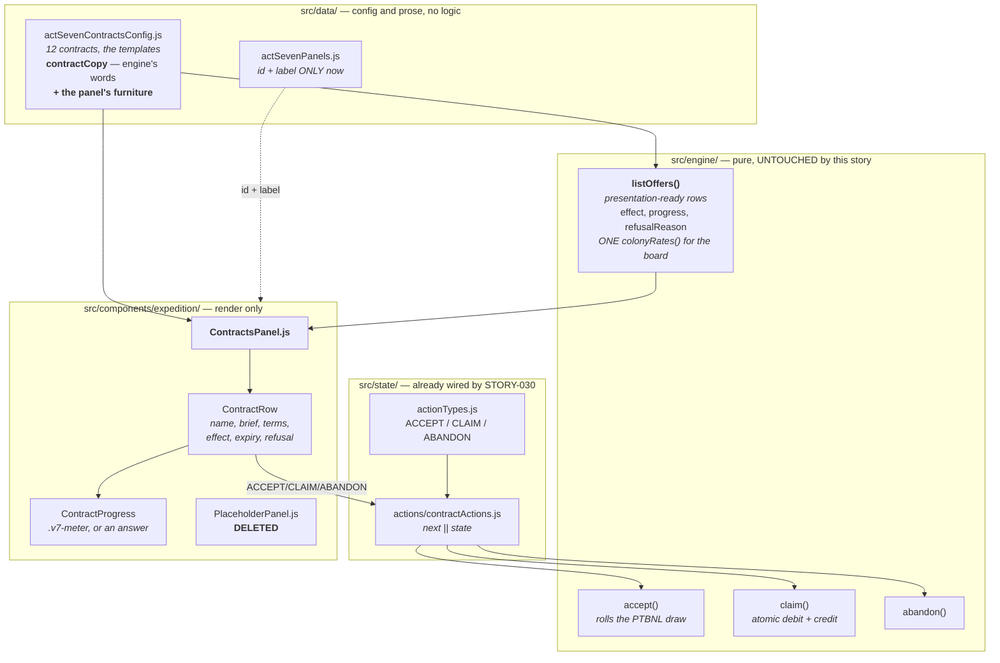

# Design — the Contracts panel

## What is actually wired



---

## Decision 1 — the payout is `effect`, never `payoutFuel`, and this would have failed silently

The row carries both, and for one contract they say different things:

```js
effect: definition.rollBand && instance.status === STATUS_OFFERED
  ? contractCopy.effectBand(payoutFuel * band[0], payoutFuel * band[1])
  : contractCopy.effect(payoutFuel, payoutSalvage),
```

§9.5: *"the band is displayed on the board; the draw is not revealed until claim."* The draw is
rolled **inside `accept()`**, so an offered Player To Be Named Later row carries a `payoutFuel` that
is neither the band nor what will be paid. Measured on this branch:

| | |
|---|---|
| `payoutFuel` on the offered row | **1000** |
| `effect` on the offered row | `+750-1500 Fuel, consideration to follow` |
| what a roll of 0.5 actually pays | **1125** |

So `payoutFuel` is a number the player must never see: it is not a promise, not a band, and not a
payout. Rendering it — the obvious move, since it is right there on the row — bypasses the branch the
engine wrote to hold the rule, and would look entirely reasonable in review.

**The panel reads neither `payoutFuel` nor `payoutSalvage`, asserted mechanically** against
comment-stripped source, and a PTBNL fixture asserts the band is on screen and `+1000 Fuel` is not.

---

## Decision 2 — the panel's copy extends `contractCopy` rather than getting its own file

A deliberate divergence from STORY-037 and STORY-039, which both stood up a
`*PanelConfig.js`. Those split because their engine configs carry hundreds of lines of measurement
record and a copy tweak had no business landing in the file holding the act's tuning.

`actSevenContractsConfig.js` carries no such record — and it **already** holds `boardEmpty`,
`panelIntro`, the five refusal sentences and every progress label, under a header stating in as many
words that it holds *"the small phrases the panel needs."* STORY-030 put panel prose there by design.
A second file would be a second authority for contract words.

---

## Decision 3 — the framing is the feature

§6.4 makes this the only purely optional tab in the act. Three things follow, and all three are
choices a reviewer should be able to see:

- **`optionalNote` sits above every row, at full ink, never `.muted`.** A player skimming past it is
  the exact failure it exists to prevent.
- **Two preamble lines, saying different things.** `optionalNote` is about the *board* — none of this
  is required. `panelIntro` (STORY-030's) is the Office's boilerplate about an *accepted* assignment
  — not finishing one is not held against you. A player can believe the second and still feel behind
  for ignoring the first.
- **Nothing on the board is urgent.** No row gets `--v7-alert` for an ordinary state, and the offer
  deadline is muted rather than red: a lapsed offer comes back as a makeup game (§9.4), so a
  countdown in alert would promise a consequence that does not exist. Amber is reserved for the
  payout — the thing being offered. Dropping is an outline button, not `danger`, because a player who
  suspects a penalty hoards a slot on an assignment they cannot finish, which is the one way this
  optional board can cost somebody something.

---

## Decision 4 — a `state` contract gets an answer, not a bar

`progressFor()` says it in its own words: *"a `state` contract is a condition, not a quantity. It has
no bar; it has an answer."* A half-full bar under *"have any three modules online simultaneously"*
would invent a middle the engine does not model.

The test lives in `contractCopy.showsBar()` rather than in JSX, because which rows have a quantity is
a **rules** question. Verified by absence: Spring Invitation's markup contains no `.v7-meter` at all,
while a quantity row in the same run draws one — so the absence is a decision, not a missing feature.

---

## Decision 5 — the refusal is rendered, not just disabled

§9.6 authors the five refusals as **sentences rather than codes**, and its own comment says why: a
player reading `slots` learns nothing. Two of the three actionable ones name something the player can
go and fix, and the third is load-bearing:

> The payout will not fit in the tank. Launch, or build storage, and it will be here.

`creditResource()` **refuses rather than clamping**, which is what stops a 900-Fuel payout being
destroyed at the moment it is earned. Nothing is lost — the contract stays claimable forever — and the
sentence says so. Both refusals are exercised as fixtures, including that a refused claim returns the
identical state object, so it has taken nothing.

---

## Decision 6 — the placeholder's fields go with it, and greps decide which

STORY-040's notes were written before 035–039 landed, and predicted that `id`, `label` **and `title`**
would survive. `title` did not: every panel authors its own `<h2>` from its own copy config, so
`title` was already dead before the placeholder went.

Verified by grep rather than by the story's prose. `blurb`, `title`, `getActSevenPanel` and
`ACT_SEVEN_PLACEHOLDER_NOTE` had exactly one reader between them — `PlaceholderPanel.js`. `id` and
`label` have live readers: `TabNav` spreads them, `AppShell`'s `PANELS` map is keyed by id.

Five rows each carried a paragraph arguing `blurb` was kept *"because the field is part of this
list's shape."* Those paragraphs went with the field they were defending.

### 6a — and the three id lists were re-checked, because two fail silently

`data/actSevenPanels.js:11-16` records the hazard: a missing key in AppShell's `PANELS` renders
nothing, a missing `TabNav` entry makes the tab unreachable, and **`npm run build` catches neither.**
`TabNav` spreads the registry rather than restating it, so `PANELS` is the only hand-authored list.
Asserted in both directions across all seven ids, plus uniqueness and label presence.

---

## What is deliberately not here

**A countdown to the next board refresh.** `nextOfferAtClock` is the board's own rotation clock. The
player meets its *result* — an offer appearing — rather than a timer to it, and a countdown would turn
an optional board into something to wait for.

**A history of filed contracts.** `completedIds` is a payout-once ledger, not a trophy case, and
`EventFeed` already reports each claim as it happens.

**Any reading of `phase`.** Ledger R3 resolves payouts **per launch, not per phase**. The row carries
`phase` and the panel never draws it; a screen that grouped or labelled by phase would be describing
a different game. Asserted by absence.
