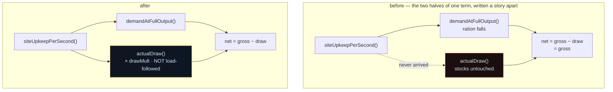

# Design — `deepSpace` content, and the site upkeep nobody was paying

This change is a five-line engine correction and three long measurement blocks. The reasoning is
recorded here rather than only in those blocks because three decisions were taken that a later
reader will otherwise re-open: **why the upkeep table was not scaled down**, **why the final fill is
deliberately flat**, and **what the `actualDraw()` correction did to the phases whose tuning predates
it**.

## 1. The correction

`siteUpkeepPerSecond(sites)` was summed into `demand` and never into the draw.

Two properties, matched deliberately to how `demandAtFullOutput()` already treats the same term:

- **Multiplied by `drawMult`** (§5.6). Life support is life support wherever it is drawn. This is the
  asymmetry with site *production*, which takes no output multiplier because a planet has no
  equipment to upgrade.
- **Not load-followed.** `loadFollowOf()` reads a definition's `produces` map; a site record has no
  such shape and a pad is not a producer. More to the point, load-follow is the rule that stops a
  *producer* overfilling a ceiling by backing off. A pad does not back off because the Provisions
  silo is full — it draws the same rate at every stock level. Throttling it would make the network
  cheapest exactly when it is richest.

`actualDraw()` has one call site, in `colonyRates()`. No new module: `engine/sites.js` and
`engine/launch.js` are already rung-agnostic and nothing here needed them.

## 2. DECISION: the upkeep table is not scaled down

§7.2 left this conditional open: reach ~300 Power/s and ~100 Provisions/s by the time The Swing is
built, "or the act stalls at its most dramatic moment. If §5's generator ceilings cannot reach that,
scale this table down and re-derive — do not raise the generator ceiling."

**Measured, the conditional does not fire.** All figures taken after the correction, driving the real
`colonyRates()` under `node`.

What the config bills at full build-out:

| site | `upkeepFactor` | pad | Power/s | O₂/s | Prov/s |
|---|---|---|---|---|---|
| Home Plate | 1.0 | T1 | 0.0 | 0.0 | 0.0 |
| The On-Deck Circle | 1.2 | T2 | 3.8 | 1.5 | 1.5 |
| First Base | 1.6 | T3 | 14.0 | 4.0 | 5.4 |
| Second Base | 3.0 | T4 | 56.0 | 9.0 | 18.0 |
| The Warning Track | 6.0 | T5 | 270.0 | 20.0 | 86.0 |
| **TOTAL** | | | **343.8** | **34.5** | **110.9** |

That is ~15% *above* §7.2's own target before a single module's draw — the table was already asking
for more than the paragraph that sized it. It is affordable anyway. A greedy sizer (deterministic, no
rng; add whichever module best relieves the tightest deficit) converges in 33 steps on:

> 11 Fusion Ring, 7 Spun Drum Farm, 13 Regolith Ice Harvester, 2 ISRU Plant, 2 Cryo Farm —
> **1,069,856 Salvage**
> gross P 1540.0 / O₂ 80.0 / Prov 168.0 / Fuel 28.0 · demand P 1429.8 / O₂ 78.5 / Prov 162.2
> **net P +110.2 · O₂ +1.5 · Prov +5.8 · Fuel +28.0 · satisfaction 1.000 on all four**

Corroborated in a full 30 h run through the real `advance()` loop rather than only in a fixture:
`padTier5@thirdBase` was bought at minute 1,106.5 with satisfaction at 1.000 on Power, Oxygen and
Provisions at the moment of purchase and for the whole tail after The Swing landed.

**So: not scaled.** §7.2's instruction was conditional on a measurement nobody had taken. Taken, it
does not fire. Scaling the table down now would spend the Track's entire character — a 6.0 factor
that makes the final pad cost six times what the same machine costs in LEO — to solve a problem the
simulation says does not exist. The alternative §7.2 forbids (raising a generator ceiling) was
likewise not taken; **neither table moved.**

### What arriving at the Track actually does, and why it is not what §7.6 modelled

**Verified structurally, across all five sites and all five pad tiers: there is no `fuel` key in any
site's `baseUpkeep` and none in any pad tier's `upkeep`.** Nothing on this ladder draws Fuel.

§7.6 models the arrival as the Fuel rate degrading in two steps — "roughly 32 → 30 → 26" — as upkeep
is subtracted from the pool feeding the refineries. **The engine does not subtract; it rations.**
Upkeep lands on Power, Oxygen and Provisions, and reaches Fuel only by throttling the refineries
through `satisfaction`, which does not move at all while there is stock in the tanks
(`solveSatisfaction`: a resource with a buffer is fully satisfied whatever its net rate).

Measured with the pre-Track sustaining portfolio and the storage a full run actually held there
(ceilings 49,100 P / 39,100 O₂ / 39,100 Prov), Fuel tank mid-fill:

| stage | net Power | net O₂ | net Prov | net Fuel | satisfaction |
|---|---|---|---|---|---|
| (a) pre-Track, T4 | 0.0 | 0.0 | 0.0 | **28.00** | 1.00 all |
| (b) Track colonized, T4 | −42.0 | −16.5 | 0.0 | **28.00** | 1.00 all |
| — buffer runway | 19.5 min | 39.5 min | never | | |
| (c) The Swing built, T5 | −285.8 | −16.5 | −71.0 | **28.00** | 1.00 all |
| — buffer runway | **2.9 min** | 39.5 min | 9.2 min | | |

Neither satisfaction nor the Fuel rate moves. **The stocks drain instead.** That is a better beat
than the one §7.6 described and it is the one §7.1 asks for — "a player arriving there watches every
rate in the header go down and has to build anyway" — because the rates going down are exactly what
the player sees, while the bar they are watching keeps filling at the same speed. The pressure is a
2.9-minute Power runway, not a slower bar. The repair costs 455,313 Salvage, which is 3.6 minutes of
income at the 2,083 Salvage/s the full run measured at `colonize@thirdBase`. Tight, affordable, and
a decision rather than a formality.

Left unattended until every buffer is exhausted, the ration finally collapses to satisfaction
0.00 / 0.03 / 0.00 and Fuel 0.02/s, converging in 16 solve passes. That is the floor of an
**unattended** colony, not what colonizing the Track does, and Decision 3.3 holds throughout —
nothing is destroyed and one generator starts the climb back.

## 3. The final threshold: 42,000, held

§7.5 assumed 26.0 Fuel/s post-Track and warned that sizing against the pre-Track figure would put the
fill at 22 minutes on paper and 27 in practice.

**Measured post-Track rate at the sustaining build-out: 28.00/s**, above the assumption. §7.6's
instruction for that case is explicit — the safe direction is D-6 measuring shorter, and the
recovered minutes go to D-5 rather than into a bigger threshold. **So 42,000 is held.**

And the pre/post distinction turns out to be a distinction without a difference, for the reason
above: nothing draws Fuel, so both are 28.0/s for any player who keeps the colony solvent.

§7.5 demands the **integral**, not the quotient, and that the comment record which was measured.
Both, at 1 s resolution across the real D-4-commit → D-6 window with the rate stepping as the Track
is colonized (t = 960 s) and as The Swing lands (t = 1,680 s):

| | fill time |
|---|---|
| quotient, 42,000 / 28.00 | 25.0 min |
| integral, build-out done 0 min after colonizing | 25.0 min |
| **integral, build-out done 3 min after colonizing** | **27.1 min** ← the measured 3.6 min of income |
| integral, build-out done 5 min | 28.4 min |
| integral, build-out done 10 min | 31.9 min |
| integral, build-out done 20 min | 41.2 min |

**27.1 minutes against a 27-minute intent.** The integral exceeds the quotient by 8.4%, inside §7.5's
stated 5–15% band, for exactly the reason §7.5 gives: the player is still building while the tank
fills.

## 4. DECISION: D-6 is deliberately flat, and must not be "fixed"

`deepSpace`'s beats, each with its flat point and the unlock that relieves it:

| beat | flat point | relieving unlock | verified? |
|---|---|---|---|
| D-1 The long transit | the entire 8-min beat, by design | **none** — designed absence, and none is wanted | n/a |
| D-2 The drum | — | — | n/a |
| D-3 The Cutoff | ~min 28: three sites, one satisfaction number, no way to tell which lever helps | per-site contribution readout (§6) + §8's routing puzzle | **not on this branch** |
| D-4 The fourth burn | ~min 48 | §9 contract chain + the warning-track puzzle (§8) | **not on this branch** |
| D-5 The Warning Track | ~min 64: the network is worse and the bar is slower | **The Swing** appears in the pad list | **measured, <200 s** |
| D-6 The swing | **the whole beat** | **nothing, deliberately** | n/a |

D-5's relief is measured rather than asserted: The Swing becomes offerable the instant the Track's
colonization completes (minute 816.1 in the full run) and costs 560,000 Salvage against the 2,814
Salvage/s measured there — under 200 seconds of income, well inside the ~5-minute rule.

**D-3's and D-4's named unlocks are §6, §8 and §9 content that does not exist on this branch**, and
the table says so rather than implying a verification that was not performed. The relief claim for
those two beats rests instead on something stronger than the schedule: the dead-air run below
records **zero** intervals longer than two minutes across D-1 through D-4. A beat with no dead air
has been relieved by whatever was actually available — a measurement of the property the rule cares
about, rather than of the mechanism §7.6 expected to supply it. When those three systems land they
can only improve the figure, and §7.6 asks for exactly this bound ("the band must hold for a player
who ignores §9 entirely").

**D-6 takes the exception, and this is why.** The Swing is the last item on §7's ladder, so §7's shop
is empty for the entire final beat *by construction* — there is nothing left to sell because there is
nowhere left to go. §7.6 states the carve-out in as many words: the dead-air metric holds everywhere
in the act except D-6. Inventing a sink to satisfy the rule would be inventing a distraction from the
last threshold in the game, at the one moment the design wants the player watching. **A simulation
run that reports dead air at D-6 is reporting intent, not a bug.** Measured: 7.33 minutes is the
longest such interval after The Swing is bought. That figure is expected to be large and expected to
grow with §5's price ladder. The carve-out is written into `data/actSevenLaunchConfig.js` in those
words because §7.6 predicts the next person to run the check will otherwise repair it.

### The dead-air metric, measured

Driven exactly as §7.6 specifies: `advance()` at 1 s resolution, recording every interval in which
the module shop, the site shop **and** the launch shop all return zero affordable rows while
`findNextEventClock()` is more than 120 seconds out.

| window | intervals > 2 min | worst | |
|---|---|---|---|
| D-1 … D-4 (min 617.7 → 808.4, to the L4 commit) | 0 | — | **PASS** |
| D-5 (min 808.4 → 1,106.5) | 91 | 3.32 min | **MISS by 1.3 min** |
| D-6 (min 1,106.5 onward) | 136 | 7.33 min | **EXCEPTED** |

(`lifeSupport` worst 3.05 min; `lunar` worst 2.20 min.)

**D-5's miss is diagnosed and deliberately not retuned.** At that point the buyer holds 30–50 copies
of every module, so the next copy of the *cheapest* row costs ~530,000 Salvage against 2,814
Salvage/s — 188 seconds between purchases. The binding term is §5's 1.14 growth exponent compounding
on a uniformly levelled portfolio; nothing §7 authors appears in that arithmetic. §7.6's own remedy
points the same way: "the fix is a cheaper Salvage sink, never a smaller threshold." Nothing in §7's
config was touched for it.

The 3.32 figure is an upper bound on two independent axes, both properties of the harness: the buyer
**spends to zero** every second (a player who banks has strictly more affordable rows), and it
**levels every module uniformly** (a player who specialises keeps cheap rows in the categories they
skipped). The metric is maximised by doing both, so 3.32 min bounds a player who does neither. And
§9's contract chain — which §7.6 schedules across exactly this window — does not exist on this
branch, which is the no-contract upper bound §7.6 says the band must hold for.

## 5. DECISION: what the correction did to the earlier phases, and why nothing was retuned

The delta is **provable rather than measured**: the new term is `drawMult × siteUpkeepPerSecond(sites)`
and `drawMult` is 1, because `lifeSupportDrawMult` is not registered in `BONUS_KEYS` — §7.0's
decision C deliberately keeps the whole site ladder outside the modifier system. So the colony is now
poorer by precisely what `actSevenSitesConfig.js` bills.

**Where it bites is Oxygen, not Power**, which the headline 343.8 Power figure hides. Oxygen is in
every site's `baseUpkeep` and the Oxygen ladder is the thinnest in the catalogue (0.35 → 1.2 → 6.0
per copy):

| stage | upkeep P / O₂ / Prov | as a share of that stage's gross |
|---|---|---|
| L2 fill (On-Deck, T2) | 3.8 / 1.5 / 1.5 | 1.4% / **10.7%** / 6.2% |
| L3 fill (First Base, T3) | 17.8 / 5.5 / 6.9 | 4.2% / **27.5%** / 14.3% |
| L4 fill (Second Base, T4) | 73.8 / 14.5 / 24.9 | 13.2% / **45.3%** / 51.8% |
| L5 fill (Track colonized, T4) | 103.8 / 34.5 / 38.9 | 14.8% / **61.6%** / 54.0% |
| L5 fill (The Swing built, T5) | 343.8 / 34.5 / 110.9 | 24.6% / 43.1% / 66.0% |

It bites from the first colonization, too: Home Plate's free 2.0 O₂/s against On-Deck's 1.5 O₂/s
leaves **+0.5**, so the act's only free atmosphere is 75% smaller than any pre-fix tuning assumed.

**End to end, though, the ladder barely moves.** Same buyer, 30 h horizon, fixed engine vs pre-fix,
minute each ladder row was bought:

| row | fixed | pre-fix | | row | fixed | pre-fix |
|---|---|---|---|---|---|---|
| `launch@onDeck` | 221.6 | 221.6 | | `colonize@secondBase` | 701.6 | 701.2 |
| `colonize@onDeck` | 284.6 | 284.6 | | `padTier4@secondBase` | 798.4 | 798.0 |
| `padTier2@onDeck` | 437.4 | 437.4 | | `launch@thirdBase` | 808.4 | 808.0 |
| `launch@firstBase` | 442.4 | 442.4 | | `colonize@thirdBase` | 816.1 | 815.7 |
| `colonize@firstBase` | 521.9 | 521.9 | | `padTier5@thirdBase` | **1106.5** | **1106.1** |
| `padTier3@firstBase` | 609.6 | 609.3 | | | | |

**0.4 minutes of drift across 18.4 hours.** That is a finding, not a null result, and the reason is
what to carry forward: a buyer holding large generator margins keeps `satisfaction` at 1.000, and
charging upkeep against a large margin changes nothing. The correction is nearly free for a colony
with slack and it is the difference between playing and stalling for one without — with the pre-Track
portfolio and The Swing built, Power runs −285.8/s where the pre-fix engine reported it comfortably
positive.

**So nothing was retuned.** The phases whose tuning predates the fix (STORY-025's `aftermath` and
`lifeSupport` work, STORY-027's cost ladder) are unaffected at the resolution their own measurements
were taken at. The one number the fix genuinely changes — the free Oxygen margin, 2.0 → 0.5 — is
recorded in `engine/colony.js` so the next story to tune Oxygen starts from the right figure.

## 6. Harness, and its bias

There is no test runner in this repo and adding one is its own change, so everything above was driven
under `node` against the pure engines. Two harnesses, both in `/tmp` and deliberately not committed:
an **injected fixture** (synthetic build-out states straight into `colonyRates()`; `resolvedSites()`
merges definitions over stored records, which is what makes injection legitimate) and a **full run**
(the real `advance()` loop at 1 s resolution with a buyer driving all three shops and clicking every
cooldown).

**Competent, not optimal** — the bias STORY-028 recorded and this harness inherits. It reproduces
STORY-028's ladder to within ~2 minutes at every rung (onDeck 284.6 vs 286.6, padTier2 437.4 vs
437.3, firstBase 521.9 vs 523.1, padTier3 609.6 vs 607.4, secondBase 701.6 vs 699.2), which is the
cross-check that it is the same class of player. It does **not** chase the Fuel-tank gate, so its
absolute clock is a lower bound on player speed and must not be read as act length; §12's five-hour
ceiling is still owed an optimal-buyer run, and STORY-032 is where that lands. What it measures
reliably is the rate and the satisfaction **at** each ladder state, which is exactly what the
questions above needed.
