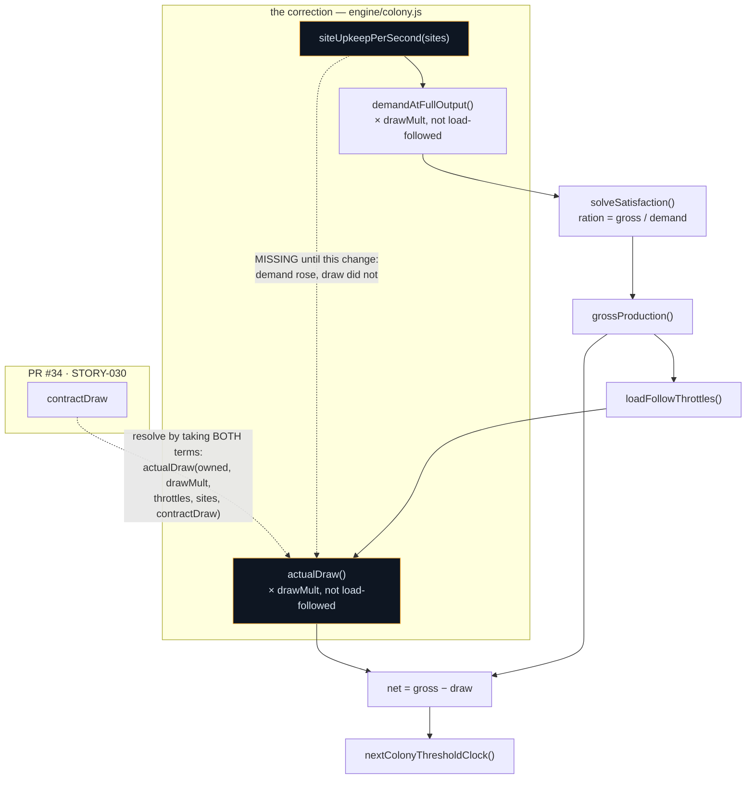
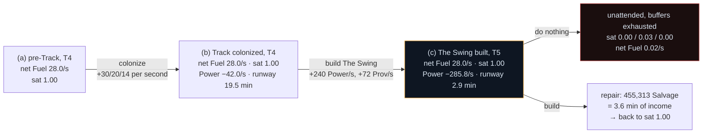

# Act VII — `deepSpace` content, and the site upkeep nobody was paying

## Why

Two things, and the second is why the first could not be trusted.

**`actualDraw()` never charged site upkeep.** STORY-027 added `siteUpkeepPerSecond()` to
`demandAtFullOutput()` and stopped there, so from that story until this one a colonized site raised
ration pressure without drawing a single unit — billed in the denominator of the ration and refunded
in the numerator of the stock. STORY-030 measured it: ten RTGs, a colonized On-Deck and a tier-2 pad
reported `demand.power 3.8` against `net.power 30.0`, which is exactly `gross`. PRD §5.7's own
eight-hour trace debits site upkeep from the stocks, so the intent was never in doubt; the two halves
of one term had simply been written a story apart.

**And §7.2 has carried an open conditional since the ladder was authored.** It says the colonized
network must reach "roughly 300 Power/sec and 100 Provisions/sec by the time The Swing is built, or
the act stalls at its most dramatic moment," and instructs whoever measures it to **scale the upkeep
table down** if it cannot — never to raise a generator ceiling, "because the point is that the Track
is *expensive*, not that it is impossible." That conditional could not be closed while the engine
did not charge upkeep. Proving an upkeep ladder against a colony that never pays upkeep proves
nothing, which is why the fix and the measurement are one change rather than two.

## What Changes

| File | Change |
|---|---|
| `engine/colony.js` | **`actualDraw()` now charges site upkeep**, scaled by `drawMult`, not load-followed — matching how `demandAtFullOutput()` already treats the same term. Plus the affordability-delta record. |
| `data/actSevenSitesConfig.js` | The AC #4 measurement: the upkeep table summed, the sustaining build-out, the not-scaled decision, and the per-rung affordability delta. **No authored number changed.** |
| `data/actSevenLaunchConfig.js` | Its `[MEASUREMENT BLOCK FILLED IN…]` placeholder discharged: the L5 fill integral, the `deepSpace` beat table with flat points and relieving unlocks, the dead-air numbers, and the D-6 carve-out. |

**No site row and no pad tier was added.** Ceres (`secondBase`, `upkeepFactor` 3.0), the Warning
Track (`thirdBase`, 6.0, no `produces` key at all) and pad tiers 4 and 5 all landed early, with
STORY-027's `b28226c`. This change is the correction, the proof, and what the proof moved — which is
nothing, and that is the finding.

## Capabilities

### New Capabilities

None. Nothing here introduces a mechanic; the ladder and the pads already exist.

### Modified Capabilities

- `expedition-state`: colony upkeep becomes a **charge** as well as a claim. The requirement that a
  colonized site's upkeep raises the ration denominator is already in force; what is added is that
  it must also be withdrawn from the stocks, and that reach and capability must remain unaffected
  by it.

## Impact

- **`engine/colony.js`** — `actualDraw()` gains a fourth parameter (`sites`) and a site-upkeep term.
  One call site, in `colonyRates()`.
- **Every existing save** — the colony genuinely gets poorer. Site upkeep is derived from config on
  every read (`resolvedSites()` merges definitions over stored records), so the correction applies to
  saves in flight rather than only to new games. No version bump, no migration; there is no migration
  path in this repo and none is needed.
- **EXPECTED MERGE CONFLICT with PR #34 (STORY-030)**, in `actualDraw()`. #34 widens the same
  signature to `actualDraw(owned, drawMult, throttles, contractDraw)` and appends a contract-draw
  loop. **Neither supersedes the other; resolve by taking BOTH terms** — a contract drawing Power and
  a pad drawing Power are both real consumers and their sum is the draw. Merged signature:
  `actualDraw(owned, drawMult, throttles, sites, contractDraw)`. Same class of conflict MERGE-NOTES
  records for the `tickEngine.js` event-clock contributors (029 vs 027), resolved the same way.
- **`data/acts.js` and the module catalogue** — untouched. §7.2's instruction to scale the upkeep
  table rather than raise a generator ceiling was honoured by scaling neither.
