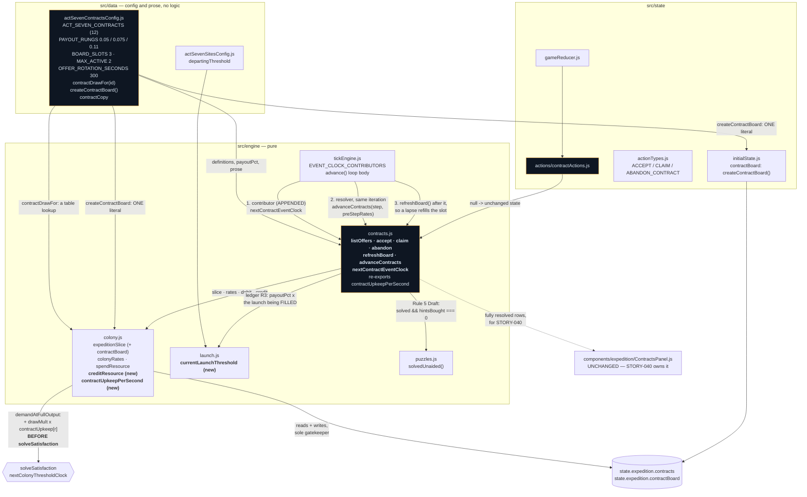

# Design — the contract board and the fuel side quests



## Decision 1: `contractUpkeepPerSecond` is implemented in `colony.js`, not in `contracts.js`

`contracts.js` needs four things from `colony.js`: `expeditionSlice` (nothing outside that file may
touch `state.expedition`), `colonyRates` (every sustain and window predicate is a statement about a
net rate or a stock against its derived ceiling), `spendResource` (Bus Trip's 150 Provisions) and
`creditResource` (every Fuel payout). That dependency is not negotiable.

If `colony.js` then required `contracts.js` for the upkeep term, CommonJS would resolve the cycle by
handing whichever module loaded second a half-built exports object. The failure is invisible at
require time and surfaces as an undefined function on the first tick — and `colony.js` already
documents this exact hazard, at length, over `resolvedSites()`: the site *record shape* lives in
`colony.js` rather than in `sites.js` because `sites.js` imports `expeditionSlice`.

So the same split is taken here:

* the **table** — which contract draws what — lives in `data/actSevenContractsConfig.js` as
  `contractDrawFor(id)`. That is a config lookup in the shape `padUpkeepAt()`, `siteFuelCapacity()`
  and `transitSecondsFrom()` already established, not logic in a data file.
* the **sum over active instances** lives in `colony.js`, which is the slice's gatekeeper and the
  file that already sums site upkeep three lines away.
* `contracts.js` **re-exports** it, so the module's published surface is the one §9.6 specifies and
  no caller has to know where the arithmetic sits.

## Decision 2: The upkeep term goes inside `demandAtFullOutput`, before the solve (ledger R5)

STORY-027 left the landing site named in a comment and the term goes exactly there:

```js
demand[r] += drawMult * (siteUpkeep[r] + contractUpkeep[r]);
```

A contract drawing 3 Power/s is a consumer like any other. Added *after* the solve it can push a
resource through zero inside a step, which is the precise failure the whole file prevents: the
ration would be solved against a demand the colony does not have, `net` would be computed from that
wrong ration, and `nextColonyThresholdClock()` would report a boundary at the wrong instant — or
none at all, so an eight-hour catch-up would apply a pre-crossing rate across the whole absence.

`drawMult` is applied, matching site upkeep and unlike site *production*. A permanent that makes the
colony frugal makes the whole network frugal, and a crew in the field is part of the network.

## Decision 3: Only unaccepted offers expire; an accepted contract has no deadline

Three of the twelve carry `expiresAtClock`, and it is an **offer** deadline. On accept it becomes
`null` and the instance carries a `windowEndsAtClock` instead — a window it is *inside*, which
advances with the clock whether or not the player is watching.

A lapsed offer is removed and its id pushed into `contractBoard.missedIds`, which makes it eligible
to be re-offered as a **Makeup Game**: same payout, window doubled, offered preferentially when the
board would otherwise repeat itself. Nothing is debited, nothing is lost, and the phase's total
available Fuel is unchanged by having missed something. Pillar 3 as a mechanism rather than a
promise, and the reason the Office calls a lapse "a scheduling matter".

Voiding works the same way. Reaching for the click during *Innings Limit* voids it — the instance is
removed and the id joins `missedIds`, exactly as a lapse does. "There is no other penalty" is
implemented as: the same code path as not having accepted it.

## Decision 4: `claim()` refuses on overflow, against the DERIVED ceiling

`integrateColony()` clamps every resource to `[0, capacity]`. A 1,300-Fuel payout into a tank with
200 units of headroom would therefore silently destroy 1,100 Fuel.

`claim()` returns `null` when `payoutFuel > headroom`, and `listOffers()` reports
`claimable: false, refusal: 'tank'` with a line saying why. **Nothing is lost**: the contract stays
claimable forever and becomes claimable the moment the player launches (emptying the tank) or reaches
another site (raising the ceiling). It is the house `null`-means-refused idiom and it creates a
legible interaction — *you cannot bank a payout you have nowhere to put* — in a game whose entire
economy is a threshold.

The ceiling compared against is `colonyRates(state).capacity.fuel`, **never**
`slice.resources.fuel.capacity`. `colony.js` states in terms that the stored ceiling is ignored:
every capacity is recomputed from the modules and sites that justify it, so the stored figure is
whatever it happened to be when the save was written. Comparing against it would refuse claims that
fit and admit claims that do not.

The credit itself goes through a new `colony.creditResource()`, which mirrors `spendResource()`: it
refuses with `null` rather than clamping, because a payout that does not fit is a decision, not a
rounding. `claim()` propagates that `null`. Waiver Claim pays Fuel *and* Salvage, so one claim
touches `creditResource` and `creditWallet` in the same returned object — Fuel is not a wallet
currency and Salvage is, and getting that backwards is the easiest mistake in this section.

## Decision 5: Payouts are percentages of the launch being filled, resolved at offer time

Ledger R3 supersedes §9.2's per-phase table: the ladder is 5% / 7.5% / 11%, and it multiplies **the
threshold of the launch currently being filled**, which `engine/launch.js` already knows how to find
(the lowest unreached rung's origin). That function is exported as `currentLaunchThreshold()` rather
than reimplemented, so the two can never disagree about which burn is being filled.

`payoutFuel` is resolved onto the instance **at offer time**, not at claim time, so the row the
player accepted is the row that pays. Three contracts per launch at 5 + 7.5 + 11 is 23.5%, inside
§7's 40% ceiling with room for PTBNL's 1.5× ceiling draw.

## Decision 6: Sustain progress is a closed-form add, sampled at the rate in force during the step

`colony.js` guarantees rates are linear in time within a step and that the only instants a rate can
change are the boundaries it reports. So if a sustain condition holds at the **start** of a step and
no boundary is crossed inside it, it held for the whole step: `progress += step`. If it does not
hold at step start, `progress = 0`. No integration, no sampling error, no dependence on
`deltaSeconds`.

That "at the start" is the whole correctness argument and it dictates the call site.
`advanceContracts(state, step, rates)` takes the rates **sampled before `integrateColony()` ran**.
Letting it compute its own rates would read the post-step regime — the rate that takes effect at the
boundary the step just landed on — and a contract would be credited or reset against a rate that was
not in force for any of the seconds it is being paid for. `tickEngine` samples once, only when there
is an active contract to sample for, and passes it down.

*Doubleheader* is the one segmented objective and it needs no extra state: `progress` is
seconds-since-last-reset, the segment is derived from it (0–240 hold, 240–360 stand down, 360–600
hold), and a break resets to 0. Its segment boundaries are contributed to
`nextContractEventClock()` so a single step can never span two segments — which is what keeps the
closed-form add exact rather than approximate.

*Rehab Assignment* is the one objective a snapshot genuinely cannot recover, because "has the Oxygen
already been below 20%?" is not a fact about the present. It carries a `stage` counter, and §9.3's
"only `progress` and `roll` are stored" is extended by exactly one field for exactly the reason
`progress` was already granted.

## Decision 7: The rotation clock is a cooldown, and the contributor abstains when the board is full

A refresh only *fills* empty slots; it never churns an offer the player has not seen. So if the board
is full there is nothing for a rotation to do.

If `nextOfferAtClock` were a schedule — advanced every time it came due, full board or not — an
untouched board would propose a boundary every 300 seconds and an idle eight-hour return would burn
roughly 96 iterations resolving nothing. Instead it is a **cooldown**: it is only pushed forward when
a refresh actually places an offer, and `nextContractEventClock()` contributes it only when it is in
the future *and* a slot is free. A due-but-full board leaves it in the past, the contributor
abstains, and `refreshBoard()` — which runs in the loop body every iteration, like `resolveBuilds()`
— fills the slot on the same iteration the player's acceptance empties it.

Past-due boundaries are excluded from every candidate, for the reason `nextArrivalClock()` states:
proposing one makes `step` zero for that iteration and the loop burns an iteration on a step of
nothing.

## Decision 8: The whole subsystem abstains outside a live Act VII expedition

`contractBoard.nextOfferAtClock` defaults to `0`, which is a legitimate stored value and is the
correct default — it means "a refresh may happen now". It is also, unguarded, a boundary in the past
for **every save in every act**, which would step `advance()` to it, call `refreshBoard()`, and
materialise an `expedition` slice into Act I saves.

`colony.js` already fought this exact fight for Home Plate's 2.0 O2/s and won it with
`isExpeditionLive()`, gated on the `ops` feature id rather than on an act index. That function is
exported for this story and every entry point here — `listOffers`, `refreshBoard`,
`advanceContracts`, `nextContractEventClock` — takes the same gate. Six acts pay one cheap feature
lookup and their step sizes are provably unchanged.

## Decision 9: Rain Delay is a demand term derived from gross-at-full-output

§9.5 words *Rain Delay* as "the contract suppresses Power production by 40%". Implemented literally
that is a **production multiplier**, which has to be threaded through `grossProduction()` and
therefore sits inside the fixed-point solve — a second hook into the file the whole act's correctness
rests on, for one contract in one phase.

A **flat** Power draw was the obvious cheap alternative and it is wrong in a way worth recording.
Sized against the reference `lunar` colony it is ~74 Power/sec. That crushes a colony that has just
entered `lunar` and is free for one about to leave it — the exact inverse of what §9.5 asks for,
which is a drill that scales with the affiliate running it. A contract that gets *easier* as the
player gets stronger is the wrong shape for a check on whether the buffer was built.

The shipped form is a third option: `0.4 × grossProduction(owned, ALL_SATISFIED, modifiers, sites)`,
added to `demand` through the *same* term Waiver Claim's flat crew uses. It is safe inside the solve
for a specific reason — gross **at full output** depends only on owned modules, sites and modifiers,
every one of them constant within a step, so `demand` remains constant across the whole solve exactly
as `solveSatisfaction()` requires and the monotonicity the convergence proof rests on is untouched.
Evaluated against the *solved* gross instead it would be a term that moves as the ration moves, the
fixed point would stop being monotone, and the iteration could oscillate forever.

`colony.js` therefore grows one hook rather than two, and every property §9.5 claims for the contract
survives: opt-in, abandonable at any instant, clamping at zero so the colony starves rather than
breaks. Measured on the reference colony: the Power buffer empties inside 20 seconds, the resource
sits pinned at 0 with satisfaction 0.73 for the whole 300-second window, and everything recovers to
1.00 the instant it closes.

## Decision 10: The board is seeded from state; `rng` draws exactly one thing

Which offers appear is derived from `(phaseRank, floor(clock / OFFER_ROTATION_SECONDS))` through a
local mulberry32 — `bookie.js`'s `propOfferSeed` is the template and the reasoning is identical: the
board is recomputed on every render the tick loop causes, and a board built from `Math.random()`
would visibly reroll itself every frame. Seeded from state it holds still, survives a reload
unchanged, and reproduces exactly in a headless run.

`rng = Math.random` still enters `accept()` as a defaulted parameter, and it draws exactly one thing:
*Player To Be Named Later*'s consideration, once, written onto the instance. The payout therefore
cannot be re-rolled by reloading and a headless run with an injected generator is deterministic.

The generator is a second copy of the eight-line mulberry32 in `bookie.js` rather than an import.
The alternatives were worse: importing an Act IV betting module into an Act VII engine is a
dependency edge with no meaning behind it, and extracting a shared `engine/random.js` is a
refactor of two files this story otherwise has no reason to touch.

## Decision 11: Nothing pays out inside `advance()`

Completion sets `status: 'claimable'`. The Fuel moves only when the player presses the button.

An eight-hour catch-up can complete both active contracts inside one iteration. Auto-crediting there
would risk Decision 4's overflow at the worst possible moment, fire two toasts from inside the
simulation — which this repo deliberately does not do, `ToastHost` derives toasts from transitions
precisely to avoid the storm — and rob the payout of the only moment it is dramatically worth
anything. Returning to a board with two claimable lumps on it is a better homecoming than returning
to a full tank.

This is also what makes `advanceContracts()` safe to replay: it never credits, so the worst a
duplicated call can do is set an already-set status.

## Decision 12: The contract draw is added to `actualDraw` as well as to `demand` — and site upkeep is not, which is a defect this change records rather than fixes

Ledger R5 and AC #6 are both about `demand`, which is what the ration is solved against. But `demand`
is not what moves the stock. `colonyRates()` computes `net = gross − actualDraw`, and `actualDraw()`
iterates the owned modules only.

**Measured on this branch:** ten RTGs with On-Deck colonized and a tier-2 pad report
`demand.power = 3.8` and `net.power = 30.0`, which is exactly `gross`. `siteUpkeepPerSecond()` is
added to `demand` in `demandAtFullOutput()` and appears nowhere else, so a colonized site currently
raises the ration pressure on a resource without ever drawing a unit of it. PRD §5.7's own worked
trace disagrees with the code — "gross.power 117, demand.power 102.8 → net +14.2/s" — so the intent
is not in doubt.

The contract term is therefore added to **both** sums. Without it AC #6 would be vacuous: an upkeep
that never draws cannot push a resource through zero, so ordering it before the solve would be
protecting against nothing, and *Waiver Claim* and *Rain Delay* would be free money.

**Site upkeep is left alone,** and the asymmetry is deliberate. Fixing it is a balance change to
STORY-027's territory rather than a correctness change to this one: every site's upkeep would begin
draining stock for the first time, which moves the affordability tables §7.5 measured, and this
change cannot re-take those measurements. It is recorded in a comment at the call site and in the
story's report so that whoever owns it next finds the measurement already taken.
