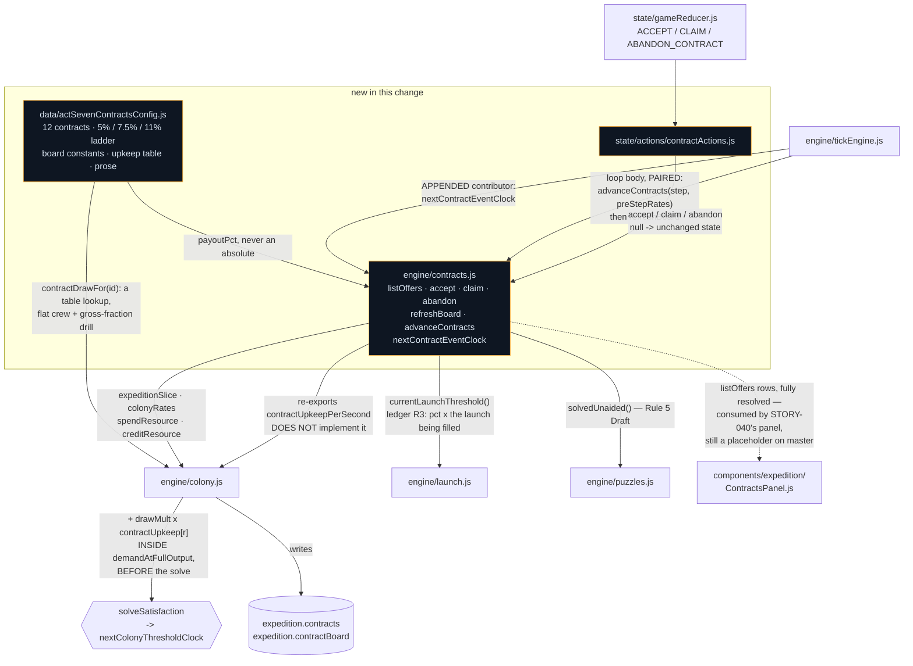

# Act VII — the contract board and the twelve fuel side quests

## Why

Act VII's phases each end on a **lump**: a launch threshold that has to be filled before the door
opens. STORY-028 built the door and STORY-025 built the economy that fills it, and the result is the
most inert thing an incremental game can ask for. The player builds the colony out over the first
third of a phase, reaches the net rate the phase was designed around, and then — for the remaining
two thirds — **watches a bar fill.** Acts I–VI never had this problem because a season is a stream
of events. A threshold is not.

Contracts put something on the other side of that stretch, and they are the first per-player pacing
lever the repo has. `rules` and modifiers move a phase for *everyone*; a contract moves it only for
the player who runs it. That asymmetry — shorten the phase for the engaged player without shortening
it for the one who checks in twice a day — is exactly what an open-ended act needs.

## What changes

| File | Change |
|---|---|
| `engine/contracts.js` | **New, pure.** `listOffers` / `accept` / `claim` / `abandon` / `refreshBoard` / `advanceContracts` / `contractUpkeepPerSecond` / `nextContractEventClock` |
| `data/actSevenContractsConfig.js` | **New.** The twelve contracts across five kinds, the payout ladder as percentages, board constants, the upkeep table and every player-facing string |
| `engine/colony.js` | `contractUpkeepPerSecond` **implemented here** (cycle, below) and summed into `demandAtFullOutput` *before* the solve; new `creditResource`; `contractBoard` added to the slice accessor |
| `engine/launch.js` | Exports `currentLaunchThreshold` — the threshold of the launch currently being filled, which is what a `payoutPct` multiplies (ledger R3) |
| `engine/tickEngine.js` | `nextContractEventClock` appended to the contributor list; `advanceContracts` + `refreshBoard` paired with it in the loop body |
| `state/initialState.js`, `actionTypes.js`, `actions/contractActions.js`, `gameReducer.js` | `contractBoard` in the base shape; `ACCEPT_CONTRACT` / `CLAIM_CONTRACT` / `ABANDON_CONTRACT` |

**`components/expedition/ContractsPanel.js` is deliberately NOT touched.** PRD §9.6 lists it among
this section's files, but the repo has since split every Act VII surface into its own story and the
panel is one of them. `SitesPanel.js` and `LaunchPanel.js` are still placeholders on `master` with
their engines fully shipped, so following §9's file list here would break the pattern the two
stories immediately before this one established. `listOffers()` emits everything that panel will
need, fully resolved, which is the actual deliverable this change owes it.

`data/feedMessages.js` is untouched for the same kind of reason: nothing in this engine emits a feed
entry. §10.4 owns Act VII's feed lines and a `contract` category with no writer is dead config.

## The decisions worth arguing about

**`contractUpkeepPerSecond` is implemented in `engine/colony.js` and only re-exported from
`engine/contracts.js`.** This is the load-bearing structural decision and it is forced. `contracts.js`
needs `expeditionSlice`, `colonyRates`, `spendResource` and `creditResource`, so it must depend on
`colony.js`. If `colony.js` then required `contracts.js` to get the upkeep term, CommonJS would hand
whichever module loaded second a half-built exports object — invisible at require time, an undefined
function on the first tick. `colony.js` already carries the worked precedent 300 lines above the
landing site: `resolvedSites()` lives there, not in `sites.js`, for exactly this reason. So the
per-contract upkeep **table** lives in config (a lookup, like `padUpkeepAt()` and
`siteFuelCapacity()`), `colony.js` sums it over the active instances because it is the slice's
gatekeeper, and `contracts.js` re-exports the result so the module's published surface is the one
§9.6 specifies.

**Only unaccepted offers expire, and a lapse costs nothing.** An accepted contract has no deadline
to miss — it has a window it is inside, and the window advances whether or not the player is
watching. When an *offer* lapses it is removed and its id joins `missedIds`, which makes it eligible
to return as a **Makeup Game**: same payout, window doubled, offered preferentially. Nothing is ever
debited and the phase's total available Fuel is unchanged by having missed something.

**`claim()` refuses rather than overflowing, and it measures against the DERIVED ceiling.** A
1,300-Fuel payout into a tank with 200 units of headroom would silently destroy 1,100 Fuel — the
single worst bug this section can ship. `claim()` returns `null`, `listOffers()` reports
`refusal: 'tank'`, and the contract stays claimable forever: it becomes claimable the moment the
player launches or reaches another site. The comparison is against `colonyRates(state).capacity.fuel`
and never against `slice.resources.fuel.capacity`, because `colony.js` states in terms that the
stored ceiling is ignored — every capacity is recomputed from the modules and sites that justify it.

**Nothing pays out during catch-up.** Completion sets `status: 'claimable'` and the Fuel moves only
when the player presses the button. Auto-crediting inside `advance()` would risk the overflow above
at the worst possible moment, fire toasts from inside the simulation (which this repo does not do),
and rob the payout of the only moment it is dramatically worth anything. Returning to a board with
two claimable lumps is a better homecoming than returning to a full tank.

**Rain Delay is a demand term derived from full-output gross, not a production multiplier.** §9.5
words it as "the contract suppresses Power production by 40%". Implemented literally that is a
multiplier inside `grossProduction()` — which is inside the fixed-point solve, so it would be a
second hook into the file the whole act's correctness rests on, for one contract in one phase.

A **flat** draw was the obvious cheap alternative and it is wrong in an instructive direction: sized
against a representative `lunar` colony it is ~74 Power/sec, which crushes a colony that has just
entered `lunar` and is free for one about to leave it — the exact inverse of a drill that is supposed
to scale with the affiliate running it.

So the draw is `0.4 × grossProduction(owned, ALL_SATISFIED, …)`, added to `demand` alongside Waiver
Claim's flat crew. Gross at full output depends only on owned modules, sites and modifiers — all
constant within a step — so `demand` stays constant across the solve exactly as `solveSatisfaction()`
requires and the monotonicity argument is untouched. One hook in `colony.js`, not two. Measured: the
reference colony's Power buffer empties inside 20 seconds, sits pinned at 0 with satisfaction 0.73
for the window, and recovers to 1.00 the instant it closes — throttled, never broken.

**The board is seeded from state; `rng` is used for exactly one thing.** `bookie.js`'s `propOfferSeed`
is the template: the seed is `(phaseRank, floor(clock / OFFER_ROTATION_SECONDS))` so the board is
identical across a reload and identical for a headless run, without storing the draw. `rng` enters
as a defaulted parameter and draws the PTBNL consideration once, at accept, onto the instance — so
the payout cannot be re-rolled by reloading.

**The rotation clock is a cooldown, not a schedule.** A refresh only *fills* empty slots. If the
board is full, `nextOfferAtClock` is left in the past and the contributor abstains — otherwise an
untouched board proposes a boundary every 300 seconds and an idle eight-hour return burns ~96
iterations resolving nothing. The instant a slot empties, `refreshBoard()` fills it on that same
iteration.

## Verification

Driven under `node` against the pure engines, which is this repo's substitute for a test runner. The
two figures the acceptance criteria name — the 40%-of-threshold ceiling and correct sustain/window
resolution across an 8-hour offline `advance()` — are recorded in comments beside the numbers they
justify, in `data/actSevenContractsConfig.js` and `engine/contracts.js`.
