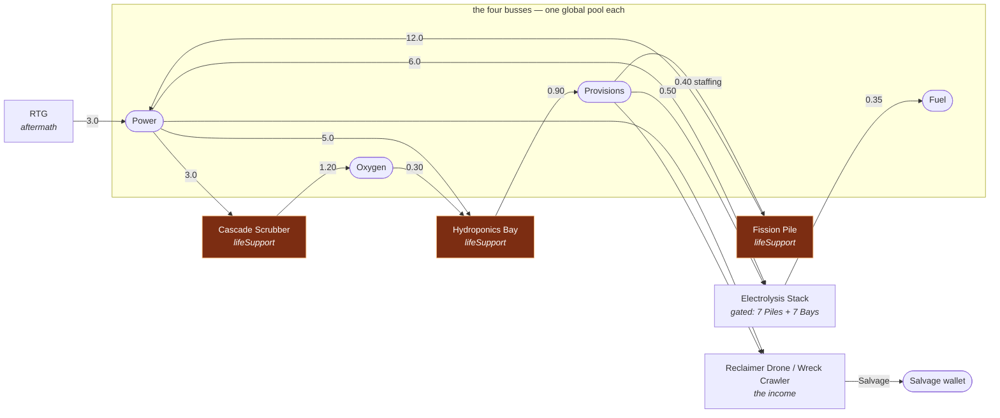

# Design — the full ladder, the interlock, and derived capacity

## The interlock, drawn

This is the change. Everything else follows from the graph having a cycle in it.



The three highlighted modules form a **cycle**: Pile needs Provisions, Bay needs Power *and*
Oxygen, Scrubber needs Power. Buy any one of them and the other two get harder. There is no
purchase order that resolves it, which is exactly why the ration is a fixed point.

**Measured consequence:** the solve reaches **16 passes** — `SOLVE_MAX_PASSES`, i.e. it stops on
the cap rather than on `SOLVE_EPSILON` — once the Pile/Bay pair is deep enough. That is the same
worst case `engine/colony.js` recorded against PRD §5.6's worked example B, now confirmed against
the shipped ladder rather than a synthetic fixture. **The cap is doing real work and is correctly
sized.**

## Capacity, before and after

```
BEFORE                                    AFTER
capacity[r] = slice.resources[r].capacity  capacity[r] = base[r]
              ^ stored, mutable,                       + Σ owned storage grants
                a second source of truth               + Σ sites[].fuelCapacityOnArrival  (fuel)
                                                       ^ derived, every tick
```

`colonyCapacity(slice, owned)` runs before the solve, because the ceiling is an input to
`loadFollowThrottles` — a producer backs off as its bus fills, so a bigger tank changes *when*
throttling starts. Deriving it after the solve would use last tick's ceiling for this tick's
throttle.

**The write-back stays consistent without special handling.** `integrateColony` already writes
`capacity: capacity[resourceId]` from `colonyRates`'s output, so the stored value tracks the derived
one on any tick that moves. On a tick where nothing moves, the stored value may be stale — and
nothing reads it, so that is fine.

## Two gates, deliberately asymmetric

| | `requires` (spend) | `requiresSiteCapability` (colonization) | phase rank |
|---|---|---|---|
| Question | do you own 7 Piles and 7 Bays? | is there a site with `vacuumSolar`? | have you reached `lunar`? |
| On missing data | — | **fails closed** | **fails open** |
| Why | a spend gate cannot be waited out | no site is a fact, not corruption | a bad phase self-heals in one tick |

The phase gate fails open because `expedition.phase` is recomputed from a pure predicate ladder
every `advance()`, so an unrecognized value is a corrupt save one tick from repair — and failing
closed would empty the act's only Salvage sink for that tick. A missing *site* carries no such
promise: `slice.sites` is empty because nothing has been colonized, which is true and will stay
true until STORY-027. Failing open there would offer the cheapest Power in the act from minute one.

Both gates are enforced in **`purchase()` as well as `listOffers()`**. An engine that only enforces
a rule in the function that draws the button is not enforcing it.

## Why storage has a steeper exponent than any producer

Storage growth runs 1.34–1.45; no producer exceeds 1.34 and most sit near 1.2. A producer bought
ten times is ten times the rate. A tank bought ten times is almost never worth it, because **what a
tank buys is time**, and time is only valuable up to the length of a session. The steep exponent is
what stops storage becoming a mindless sink for spare Salvage.

Storage declares `capacity` and neither `produces` nor `consumes`, so it is felt entirely through
the clamp: it changes no rate, only how long a surplus can be banked and how much runway a deficit
has before it pins.

## Starvation is a throttle, never a ratchet

Fixture: 20 Fission Piles (8.0 Prov/s demand) against 2 Hydroponics Bays (1.8 Prov/s) — mutual
rather than one-way, because the Bays need the Power the starved Piles make.

| | Result |
|---|---|
| Drained to the floor | ration **0.200**, Salvage 30.00 → **6.00/s**, net pinned to exactly 0 |
| After 1200s starved | all four module entries **intact** |
| Add **one** Ration Printer | ration 0.200 → **0.228**, Salvage 6.00 → **6.83** |
| Add 29 | ration **1.000**, Salvage back to 30.00, silo refilled |

Two properties worth stating separately, because the acceptance criterion conflates them: **one
generator always strictly improves the ration** (monotonicity — there is no local minimum a player
can get stuck in), and **full recovery requires the deficit actually covered**, which is 29 printers
here. Nothing is ever removed and no resource goes negative.

## Backward compatibility

- No save migration and no version bump. `expeditionSlice` already tolerates an absent slice.
- Acts I–VI are untouched: none of this is reachable without `state.expedition` modules, and the
  colony solve returns all-zero rates for an empty catalogue exactly as before.
- Existing Act VII saves keep every module they own; only the ceiling calculation changes, and only
  ever upward.
