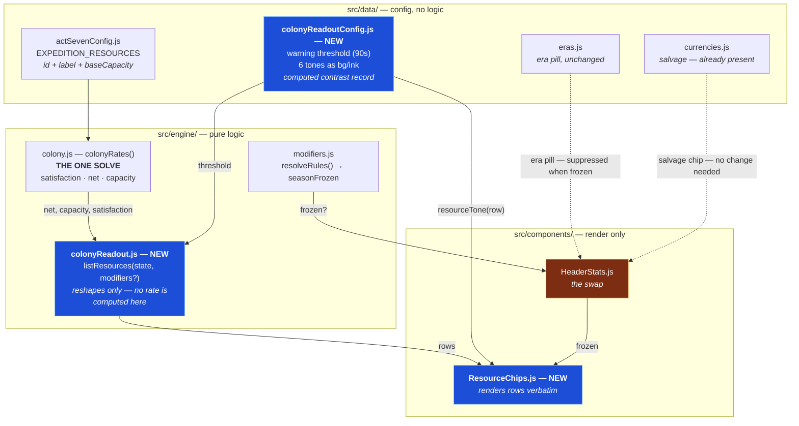

# Design — the frozen-league header and the resource readout

## The change, drawn



The single edge that matters is **`colonyRates → listResources`**. There is no second
arrow into `listResources` carrying a rate, and there must never be one.

## Why one solve is a correctness property, not a performance one

The obvious reading of ledger R5 is "don't do the work twice." That is the lesser half.

`colonyRates` runs a Kleene iteration to a fixed point — up to 16 passes — because the
rations are mutually recursive (a reactor eats the Provisions that the hydroponics grow
using Power). The output is a *ration*, and the ration is what makes a net rate mean
anything.

A header helper that summed the modules itself would need its own copy of the throughput
and load-follow arithmetic. That copy would be correct on the day it was written and wrong
the first time either side changed — and it would be wrong **silently**, producing a
plausible number rather than an error. The failure the player sees is a chip counting down
from forty seconds while the resource hits zero in four.

So the rule is mechanical: **every field `listResources` returns is arithmetic on
`colonyRates`'s output.** It is checkable, and it is checked — `net` and `capacity` are
asserted identical to the engine's under `node`.

## The row shape

```
{ id, label,
  amount, capacity, fraction,      ← amount against the ceiling
  net, trend,                      ← the SIGN, pre-decided
  secondsUntilEmpty, warning,      ← the runway and whether it's alarming
  full, starved }                  ← the two boundary states
```

`trend` rather than leaving the component to compare `net` against 0, and `warning` rather
than leaving it to compare a runway against a threshold. Both are rules questions. The
component's whole job is to put these on screen.

## The two boundary states, and why they are separate

| | `warning` | `starved` |
|---|---|---|
| Means | heading for zero | has arrived at zero and is stable |
| Runway | finite, ≤ 90s | **Infinity** |
| Fix | buy a generator soon | buy a generator; nothing else will move it |

`colonyRates` pins `net` to exactly 0 against a boundary the resource cannot cross — that
pin is what makes the empty state *absorbing* and stops `advance()` burning its iteration
cap on zero-length steps. The consequence for the readout is that a starved resource has a
net of 0, so a naive "seconds until empty = amount / -net" reports 0 seconds forever, and
a naive warning check lights the same colour for a ninety-second emergency and an hour-old
outage.

`secondsUntilEmpty` therefore returns `Infinity` whenever the resource is not actually
falling, and callers format that as an em dash rather than treating it as a large number.

## Why the warning threshold is 90 seconds

Derived, not chosen. The relieving purchase for a bus shortfall in the opening phase is the
cheapest module in the act, and the measured time to afford one from a standing start is
roughly 90 seconds. **A warning is only useful if it arrives while the player can still act
on it**, so the threshold is the cost of the fix.

Deliberately not longer: Act VII's whole economy is resources crossing boundaries, and a
five-minute threshold would light the chip during ordinary play and teach the player to
ignore it — strictly worse than no warning.

## Layout at 390px

Four chips is a lot to add to a contested row, which is why the swap removes five. Each
chip is a **column**, not a row: label and amount on top, net rate below, and the meter
underneath spanning the chip's width. There is no room for a fifth column at 390px, and a
full-width bar is easier to judge at a glance anyway.

Colours are applied as **inline styles from `data/`**, the same way the era pill reads
`data/eras.js` — never as a CSS class per state. Six classes in a stylesheet would put the
tone decision somewhere the contrast measurements cannot live beside it.

## Backward compatibility

Nothing changes for any act before VII: `resolveRules(state).seasonFrozen` is false
everywhere else, so every existing chip renders exactly as before and `ResourceChips` is
never mounted. `listResources` is not called on those paths at all.
