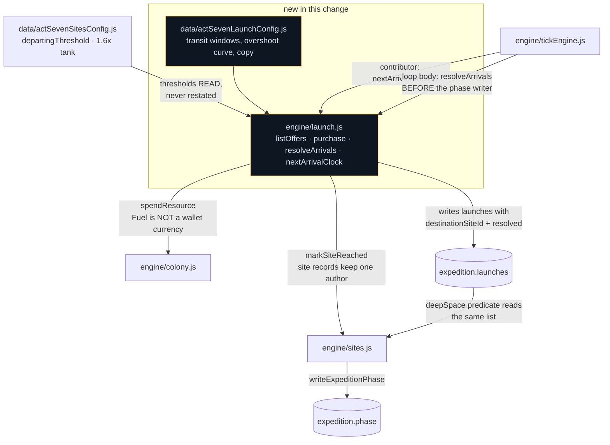

# Act VII — launch commit, transit, arrivals and the overshoot decision

## Why

STORY-027 built the ladder and STORY-025 built the economy that pays for it, and until now neither
could be played: **a site is reached only by a launch, and nothing launched.** `listOffers()` on the
site shop correctly returned zero rows for every phase the game could reach. The act's spine existed
as config and engine with no way to climb it.

A launch is also the act's punctuation. A Fuel threshold is met, the player commits, and a burn runs
over a window — and **the window is the point.** It is the act's one honest invitation to close the
tab, in a game whose whole premise is that leaving is allowed.

## What changes

| File | Change |
|---|---|
| `engine/launch.js` | **New, pure.** `listOffers` / `purchase` / `resolveArrivals` / `nextArrivalClock`, plus `overshootFor` |
| `data/actSevenLaunchConfig.js` | **New.** Transit windows, the overshoot curve and the launch copy |
| `engine/tickEngine.js` | `nextArrivalClock` appended to the contributor list; `resolveArrivals` in the loop body |
| `data/actSevenSitesConfig.js` | The minutes-of-income measurement STORY-027 deferred to this story |

## The decisions worth arguing about

**A committed launch always arrives, and there is no rng anywhere in this path.**

A random outcome resolved inside `advance()` is resolved during an offline catch-up *in front of
nobody*. A player who commits a 40,000-Fuel burn, closes the tab and returns to "the burn fell
short" has been dealt a loss they could not see, influence or audit — and in an idle game, punishing
the player for closing the tab is the one thing that may never happen.

So risk lives at **commit time** and is deterministic. `conventions.md` says randomness enters an
engine as a defaulted `rng` parameter so behaviour is reproducible headlessly; this engine's
decision is stronger — it takes **no** rng at all, so there is nothing to seed and nothing to
reproduce.

**Committing dumps the whole tank, not the threshold.** There is no change. That is what converts
the overshoot band from a rounding error into a decision: the tank holds `1.6 × departingThreshold`
by derivation (ledger R1), so a player may bank up to 60% over and spend the surplus on a shorter
transit and an arrival grant — or launch now and keep the time. Measured: 1,920 Fuel against a 1,200
threshold buys a 137-second transit where the exact threshold buys 180.

**Thresholds are read, never restated.** `data/actSevenSitesConfig.js` instructs this file by name
to read `departingThreshold` rather than copy it, because two hand-typed copies of a threshold is
precisely the drift the 1.6× derivation exists to foreclose. `departingThreshold` is the threshold
of the launch *leaving* a site — the tank you fill is the tank at the place you are standing.

**Arrival goes through `sites.markSiteReached()`.** `engine/sites.js` exports it for this file
specifically, so site records keep a single author and the record-shape note in `engine/colony.js`
stays true in one place. The launch record carries `destinationSiteId` because `sites.js`'s
`deepSpace` predicate already reads that shape off the log — and it turns on the record *existing*
rather than its resolved state, which is what keeps the phase monotone across resolution.

**Fuel debits through `colony.spendResource`, not `engine/wallet.js`.** Fuel lives in
`expedition.resources` and is not a wallet currency. Routing it through the wallet would put a
consumable in a ledger that clamps and reports differently.

**One launch in flight, as a consequence rather than a rule.** The legal destination is always the
lowest unreached rung, so there is never a second thing to launch at. The refusal check is a single
guard rather than a scheduler.

## The measurement, which is the other half of this change

STORY-027 deferred its minutes-of-income measurement here, with a written reason: it could not be
taken on a branch where no site was reachable. It is taken now and recorded in full in
`data/actSevenSitesConfig.js`.

**Every rung comes in cheap — 0.88 to 2.25 measured minutes against 3.3 to 10.0 intended.** Not
retuned. The diagnosis is that this is ledger R2's original error one layer further down: 027
re-derived against STORY-025's measurement, but 025 measured `aftermath` and `lifeSupport`, and
every row in this file is bought in `lunar` or later, where income has compounded roughly
thirty-fold. Holding "minutes of income" needs the rate *at that beat*, and those rates existed for
the first time on this branch.

**The bias direction is stated rather than left to be assumed:** this buyer is competent, not
optimal, so a faster player reaches each rung earlier with lower income and sees *more* minutes than
the table shows. The figures are a **lower** bound. The gap is real; its size is not settled, and
settling it needs an optimal buyer.

**The Warning Track's inversion survives**, which §7.5 asks for explicitly — cheapest of the four to
establish, and a 6.0 `upkeepFactor` making it the most ruinous in the act to sustain.
