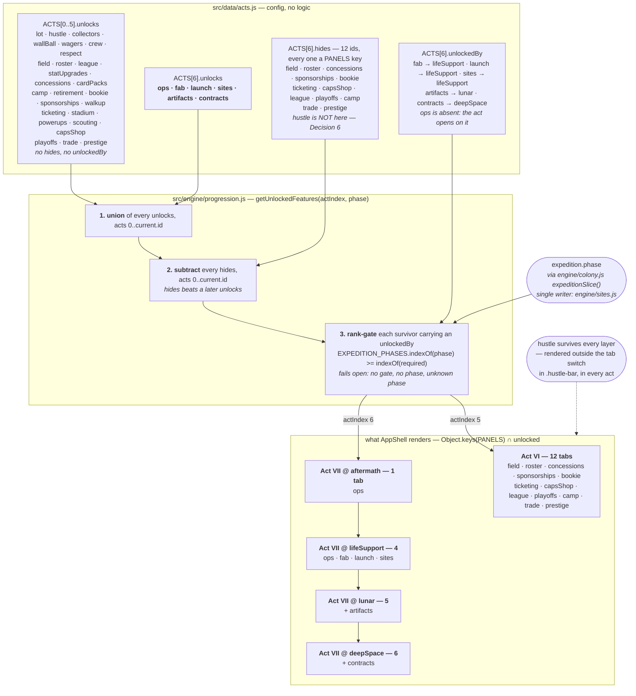

# Design — Act VII's config and the tab shell

## The change, drawn

Act VI and Act VII resolve through the *same* three-layer derivation. Nothing forks; the seventh
act simply supplies arrays the first six never did.



The two acts differ in output and not in path. Act VI's `hides` and `unlockedBy` are absent, so
steps 2 and 3 are no-ops for it, exactly as they were before Act VII existed — which is what makes
"acts 0-5 are byte-identical" a property of the code rather than a hope.

## Decision 1 — `hides` lists only tab ids, and `hustle` is the one that would have been a bug

Feature ids do double duty: an id matching a `PANELS` key gates a whole tab, and every other id
gates a mechanic inside a still-visible panel. `hides` cannot tell them apart, so the rule is
authored rather than enforced: **only tab ids may be hidden.** Three mechanic ids are live today
and would each do damage — `retirement` (read by `tickEngine.js` to decide whether
`checkRetirements()` runs), `walkup` (gates the record crate in `RosterPanel`), and `hustle`.

`hustle` is categorically different from the other two. Retiring it would not be a bug in a
feature; it would break the project invariant that
`changes/odyssey-progression-architecture/design.md` Decision 6 states and `engine/clicker.js`'s
header is entirely about — the manual action exists in every act, so any state is recoverable in
bounded time. Act VII is where that matters most, not least: Salvage is what the click pays, and
every shop the act ships is Salvage-priced.

The near-miss worth recording, because it looked like a real effect and is not: **`concessions` and
`sponsorships` are both tab ids and income-contributor names.** `engine/income.js` gates every
contributor on its own slice contents and never on a feature id, so hiding those two tabs switches
off no income. That is correct — `seasonFrozen` freezes the *season*, and the only rail it takes
down is `ticketing`, from inside that contributor.

## Decision 2 — The reveal keys off `expedition.phase`, not off milestones (PRD §6.5 revised)

PRD §6.5 proposed `unlockedBy: { fab: 'phaseLifeSupport', … }` against `progression.milestones`,
and argued for it on the grounds that milestones are monotonic while a phase could in principle
move backwards. Ledger **R4** overruled it, and this change implements R4:

> §6's `unlockedBy` keys off a phase-rank comparison against `expedition.phase`, not off new
> milestones. Two sources of truth for "how far into the act are we" is exactly the race §7.7 was
> written to prevent, and it would show up only on a real save.

`engine/sites.js` is the single writer of `expedition.phase` and recomputes it from a pure
predicate ladder on every `advance()`. A milestone set alongside it is a second writer for the same
fact, and the two can disagree on a save that crossed a phase boundary inside an eight-hour offline
catch-up. Keying on the phase directly also makes the reveal self-healing for free: a corrupt or
hand-edited phase repairs itself on the next tick and the tab set follows.

The monotonicity worry R4 traded away is handled by the comparison being a **rank**, never an
equality test: a tab revealed at `lunar` stays revealed at `deepSpace` and at `majors`. A phase
that moved backwards would re-hide a tab — but the ladder is a predicate over things the player
owns, and the thing that would move it backwards (losing a colonized site) does not exist.

**Fail-open at both edges, deliberately, and it is one rule rather than two.** An omitted argument
and an unrecognized phase id both reveal everything gated. Only `AppShell` passes a phase; the
three other callers (`HeaderStats` querying currency ids, `RosterPanel` querying `walkup`,
`tickEngine` querying `retirement`) omit it and none of them queries a tab id, so the omitted case
is provably inert. The garbage case is the one that is a choice: failing closed would hide `fab` —
the act's only Salvage sink — for the one tick before the phase heals, and a presentation-only gate
must never be the thing that strands a save. **The rule this creates, and it belongs in the
comment above the function:** only tab ids carry `unlockedBy`, and the only caller that queries tab
ids passes a phase. A future gate on a non-tab id has to revisit those three call sites.

## Decision 3 — `launch` and `sites` gate on `lifeSupport`, not on `launchReady`

R4 lets §7's `launchReady` flag stand for these two tabs, on the grounds that it is a capability
flag rather than a progression signal and has no second writer. It also has **no first writer**:
`engine/sites.js` is a later story. Two options, neither free:

1. Support both gate kinds now — a phase rank and a milestone flag — so the two tabs can move to
   the flag later without touching the resolution. That puts two mechanisms in the shell for one
   question, and the second has nothing to read.
2. Gate both on `lifeSupport` now, and let the sites story tighten them if it wants the flag.

Taken: **2.** The phase rank is never *later* than the flag would be, which is the property that
matters: the first Fuel tank is a `lifeSupport` purchase (PRD §5.3) and `lunar` requires a
completed launch, so both tabs must exist during `lifeSupport` however they are gated. The cost of
being early is a Launch tab that says you have no tank yet. The cost of being late would be a
player who cannot find the button that ends the phase.

## Decision 4 — The `'field'` / `FieldView` fallbacks are removed rather than special-cased

`changes/act-hides-feature-gating/design.md` Decision 4 recorded this as limit 1: `visibleTabs[0]
|| 'field'` and `PANELS[effectiveTab] || FieldView` made the ballpark the answer to every question
the tab gate could not answer, "correct today, wrong for an act that means to retire `field`
itself."

The fix is to delete both literals rather than to branch on the act — a component decides nothing
about which act shows what:

```js
const effectiveTab = visibleTabs.indexOf(activeTab) !== -1 ? activeTab : visibleTabs[0];
const ActivePanel = effectiveTab ? PANELS[effectiveTab] : null;
```

The fallback is now purely structural: whatever the act's first visible tab is. That is `ops` in
Act VII and `field` in Acts III-VI, with no id named in the file at all. Two consequences worth
stating:

- **`ActivePanel` can only be undefined when there are no visible tabs.** It cannot be undefined
  because of a missing `PANELS` entry, since `visibleTabs` is built by intersecting that map's own
  keys with the unlocked set — an unlocked id with no panel never reaches the fallback. So the
  guard covers an act that unlocks no tab at all, and rendering nothing there is the honest answer.
- **`MARK_TAB_SEEN` needed a guard.** `seenTabs.indexOf(undefined)` is `-1`, so without one an act
  with no visible tabs would dispatch an undefined tab id and persist it into the save forever.

**Empirically, in Act VII, the old code would have resolved to `ops` too** — `activeTab` starts as
the literal `'field'`, which is not visible, so `visibleTabs[0]` wins before either backstop is
consulted. The backstops were only reachable in the degenerate case. That is precisely why they had
to go rather than be left: they were wrong in a way nothing would ever have shown you.

## Decision 5 — The pre-season `LotPanel` branch is verified, not hardened

Limit 2 from the same Decision 4: `AppShell` early-returns a pre-season shell rendering `LotPanel`
whenever `state.season` is absent. If Act VII ever took that branch, the act that retires the
ballpark would render as Act I's vacant lot.

**Verified, twice, rather than assumed.** In a `node` harness: entering Act VII leaves `season`
truthy and 30 simulated minutes later it is still truthy, with `schedule`, `standings`,
`scheduleIndex` and `seasonNumber` byte-identical. In the running app on an injected Act VII save:
after ~230 s of live clock, `season.phase` is still `regular`, `scheduleIndex` is 0 and 0 games are
played, with the six-tab Act VII shell on screen throughout.

It holds for a structural reason and not a lucky one. `seasonFrozen` is a suspension and never a
deletion (`season-frozen-rule`, and `tickEngine.js` says so at the gate); the only route into Act
VII is forward through Act III, whose initializer is what creates the season; nothing in the engine
nulls the slice.

**Hardening it was considered and rejected.** Widening the guard to
`!state.season && visibleTabs.length === 0` looks like it makes the Act VII case structurally
impossible, and instead makes it a crash: the code immediately below dereferences
`state.season.tradeWindows`, and `FieldView` and `StandingsPanel` read the season too. A
season-less save would fall through to a null dereference instead of to a lot that at least
renders. The branch keeps its condition and gains a comment recording the invariant and the
measurement.

## Decision 6 — `FINAL_ACT_INDEX` is 6 now; every reader was re-read

It is `ACTS.length - 1`, captured at module load, and appending an act is the edit it was written
to survive. Every reader:

| Reader | Means | Now that it is 6 |
|---|---|---|
| `getActConfig()` clamp | the end of the arc | Correct. An out-of-range index clamps to Act VII, which is what "clamp to the last authored act" has always meant. |
| `checkActTransition()` loop bound | the end of the arc | Correct, and the comment was rewritten. The loop is player-gated by `isExitSatisfied()`, not by the bound; the bound is a belt-and-braces iteration cap. |
| `ACT_INITIALIZERS` `[PRESTIGE_ACT_INDEX]` | the prestige floor | Correct, and this is the one that would have broken. It was keyed on `FINAL_ACT_INDEX` until `changes/prestige-act-index` moved it; under this change that would zero `runStats` at Act VII while prestige still returns to Act VI, inflating the first payout after every prestige by everything earned in Act VI. |
| `resetForPrestige()` | the prestige floor | Correct — already `PRESTIGE_ACT_INDEX`. Under the old line every prestige would now teleport the player into Act VII, past the crossing. |

Nothing else reads either constant. Act VII adds no initializer: it creates no content — the
`expedition` slice is present-and-empty from `createInitialState()` and self-heals through
`expeditionSlice()` for older saves.

## Verification

A throwaway `node` harness (not committed — this repo has no test framework and nothing
test-shaped belongs in it) plus the running app on an injected save.

**Acts 0-5 unchanged.** The baseline is `git show HEAD:src/engine/progression.js` and
`HEAD:src/data/acts.js` loaded side by side with the working copy, so the comparison is against
master rather than against a description of master. `getUnlockedFeatures(i)` for `i` in 0..5 is
string-identical, element for element and in order — and identical again at each of the five phase
values, since no act before VII declares `unlockedBy`. Garbage indices (`undefined`, `null`, `-1`,
`NaN`, `'x'`) are identical. `99` legitimately differs: it clamps to the last act, which moved.

**Act VII's tab set.** At `aftermath` exactly one `PANELS` key survives (`ops`); at `lifeSupport`
four; at `lunar` five; at `deepSpace` and `majors` all six. At every phase: no baseball tab id is
present, `hustle` is present, and the mechanic ids (`retirement`, `walkup`, `statUpgrades`,
`powerups`, `scouting`, `stadium`) all survive. An unknown phase and an omitted phase both reveal
all six.

**The frozen league.** On a state walked to Act VII: `computeModifiers().rules.seasonFrozen` is
`true` (and `false` one act earlier), `season` / `league` / `roster` / `stadium` all survive, the
clock advances by the full 1800 s, no game is played, and the league is byte-identical across those
30 minutes. The control matters as much as the assertion: **the same 30 minutes in Act VI does move
the league**, so the test is measuring the freeze and not a harness that never ran anything.
`totalIncomePerSecond().cash` is 0 while frozen. `seenTabs` is unchanged by the crossing.

**The two registration lists.** Parsed out of the two source files and compared: every `PANELS` key
has a `TabNav` entry, every `TabNav` id has a `PANELS` entry, and the orders match.

**The app, running.** `npm run build`, served statically, with a save injected at
`progression.act: 6` (`meta.version` untouched). At `aftermath`: one tab, Ops, the Ops placeholder
rendered, no baseball tab anywhere, the click reading "Sift the wreck / +1 salvage". At
`deepSpace`: all six tabs, five carrying their NEW badge and `ops` not — which is the behaviour PRD
§6.3 describes, since `ops` is marked seen by the effect that runs on whatever tab is active. Each
of the six was clicked and rendered its own panel. The click credited Salvage 500 → 501. No console
output of any kind. `seenTabs` ended as the six Act VII ids appended to a list nothing cleared.

Injection needed one trick worth writing down for the next person: `useGameTick` saves on
`beforeunload` and on cleanup, so writing `localStorage` and reloading loses the race. Overriding
`Storage.prototype.setItem` to a no-op immediately after the write, then reloading, wins it.
