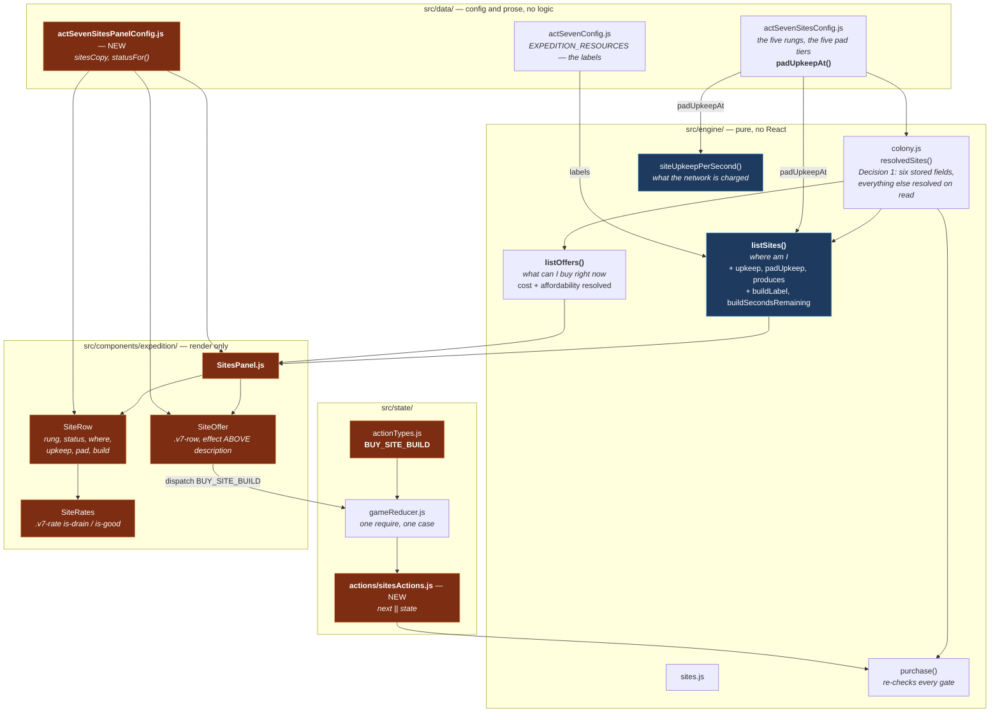

# Design — the Sites panel

## What is actually wired

The two blue nodes are the single most important edge in the diagram: **`listSites()` and
`siteUpkeepPerSecond()` reach the same `padUpkeepAt()`.** The screen and the solve multiply a pad's
upkeep by a site's `upkeepFactor` through one function, so the panel cannot quote a price the
network is not charging. Verified numerically, not by inspection — see Decision 2.

## Decision 1: Two sources, and neither is derived from the other

`engine/sites.js:90-93` states the constraint this change renders:

> this is "where am I", including sites with a build already running and sites finished with, while
> `listOffers()` is "what can I buy right now". A panel needs both and computing either from the
> other loses information the player is looking at.

Both directions of the shortcut lose something real and both are tempting:

- **Ladder from offers.** Drops every site the player has finished with — which by `deepSpace` is
  most of the ladder, and by the end is all of it. The screen would empty out as the player won.
- **Offers from the ladder.** Requires re-implementing `candidateBuildFor()`: which single pad tier
  a rung may build, whether the site is already busy, whether the tier is already held. That is four
  gates, in JSX, disagreeing with `purchase()` the first time any of them changes.

So the panel calls both and renders each into its own half. The cost is one extra `resolvedSites()`
walk per render, over five sites — the same order of work the Ops panel's single Kleene solve does
sixteen times.

## Decision 2: The upkeep the screen prints is the upkeep the colony bills, by construction

`listSites()` returned `upkeepFactor` and left the multiplication to whoever wanted it. The panel
wanting it is exactly the case that must not do it: `pad.upkeep[id] * site.upkeepFactor` written in
a component agrees with the engine today and drifts the first time §7.2's factor grows a rule, and
the drift is a screen advertising a price the network is not charging.

So `listSites()` now resolves three rate lists per site, through the same `padUpkeepAt()`
`engine/colony.js` bills through:

| field | source | scaled by `upkeepFactor`? |
|---|---|---|
| `upkeep` | `site.baseUpkeep` | **no** — a colony feeds itself |
| `padUpkeep` | `padUpkeepAt(site, site.launchPadTier)` | **yes** — a pad is fed *from* the network |
| `produces` | `site.produces` | n/a — Home Plate's 2.0 O2/s, the act's only free atmosphere |

**They stay three lists and are never summed.** That asymmetry *is* the mechanical content of
`upkeepFactor` and it is what §7.4 bought instead of per-site resource pools. One combined figure
would hide the reason the Warning Track is the act's hard decision.

**Checked numerically rather than argued.** With On-Deck colonized at pad tier 2, the Power the
panel prints (2.0 base + 1.8 pad) equals the delta in `colonyRates().demand.power`, to within 1e-9.
Same on Provisions. That assertion is only *possible* because the two go through one function.

## Decision 3: The shop row leads with the upkeep, and the CSS is what keeps it leading

Decision 9 of `act-seven-site-ladder` puts the running cost first in the effect string, and
`describePadEffect()` assembles it that way. A panel can undo a decision like that without changing
a word, in two ways, and both were avoided deliberately:

- **Position.** `FabPanel` renders `description` then `effect`. This panel renders `effect` then
  `description`. A module's row can afford to open with what the thing *is*, because a module's cost
  is paid once and is over. A site's is not.
- **Emphasis.** The effect line takes `--v7-ink` (`.v7-site-offer-effect`), not the muted grey the
  description below it wears. Rendering the upkeep in the same colour as the flavour text would have
  buried it without moving it.

## Decision 4: Reach is rendered from `siteReach()`, has no second state, and is gated on a pad

Three separate rules, all serving one invariant — §7.2's sharpest: **reach is a function of built
pad tier alone, never of current satisfaction. A starved network launches later, never shorter.**

1. **Sourced, not recomputed.** `reachesRung` comes off the row. A component deriving it from
   `launchPadTier` would be a second implementation of "how far does tier N throw", which is the
   exact off-by-one `applyCompletedBuild()` refuses to introduce on the write side.
2. **No degraded variant exists.** `.v7-site-reach` has no `.is-dim`, `.is-warning` or
   `.is-unavailable`. The stylesheet carries a note saying one must never be added, because a class
   that *could* grey the figure out during a shortage is an invitation to wire it up.
3. **Gated on `launchPadTier > 0`.** `siteReach()` answers 0 for a site with no pad, and "reaches
   rung 0" on four rows states a capability where there is none. Silence is the honest reading.

## Decision 5: The bill is shown where the bill is charged

`engine/colony.js` gates site upkeep on `colonized`, not on `reached` — a site you have flown past
but not paid for has no colony on it and nothing to keep alive. The ladder row gates its upkeep
lines on the identical flag.

The temptation is to preview an unreached site's future upkeep, since that is the number the player
needs to decide with. It is refused because it would put a rate on screen that the network is not
paying, and the place that decision is actually made is three inches lower: the shop row leads with
the same figure, at the moment the player can act on it.

## Decision 6: The empty states are authored sentences, and they stay true forever

A site is reached only by a launch, so before `engine/launch.js` exists there is one colonized site
and **zero offers**. That is the ladder working, not a bug, and this change explicitly does not
"fix" it.

Both empty states get a rendered sentence rather than a hidden section:

- **The shop half**, when `listOffers()` is empty — worded so that it is equally true today, when
  nothing has been reached, and at the end of the act, when everything has been built.
- **The ladder half**, when `resolvedSites()` returns `[]` — every save before Act VII.

The section headings render either way. A shop that vanishes when it is empty teaches the player
that the screen sometimes has a bottom half and sometimes does not; this one gains its first row the
moment L1 lands, with no edit to the component.

## Decision 7: One action, because there is one row vocabulary

An offer id is `<buildingId>@<siteId>` — `colonize@onDeck`, `padTier3@firstBase` — and the engine's
note on `OFFER_SEPARATOR` argues that the prefix **is** the `buildingId` that gets stored, precisely
so there is one vocabulary and no mapping table.

A `COLONIZE_SITE` / `BUILD_PAD` pair would reintroduce the mapping: the dispatcher would have to
decide which kind of row was pressed, which is a rules question the engine already answers by
parsing the id it emitted. One action, carrying `offerId`, matching `BUY_MODULE`, `BUY_LOT_ITEM` and
`FILL_STANDING_ORDER`.

## Decision 8: No meters, and the panel says why in words

`.v7-meter` is in the shared primitives and it is the wrong element here. §7.4 rules that Act VII has
**one** resource pool, not one per site; a bar drawn beside a site reads as that site's stock, which
is exactly the thing the ruling says does not exist. The ladder shows rates only, and `poolNote`
states the ruling on the screen rather than relying on the absence of a bar to imply it.

## Decision 9: `buildSecondsRemaining` is computed in the engine because of the clock

`readyAtClock - state.clock` looks like formatting and is not. Every other clock reader in
`engine/sites.js` guards with `Number.isFinite(state.clock) ? state.clock : 0`, and
`engine/colony.js`'s `normalizeResource()` records at length what a NaN reaching a rate does to this
game: it flows into `advance()`'s `step`, exits the loop on the first iteration, and freezes the
clock permanently with no play that repairs it. A subtraction written in JSX skips that guard.

Measured: with `clock: 'lots'`, the row still returns a finite remainder and the panel renders a
countdown.

## What was considered and rejected

- **A `sitesReadout()` in `engine/colonyReadout.js`.** That file's own header says it exists to make
  *one Kleene solve* serve two surfaces. Nothing on this screen needs a solve; a readout module here
  would be indirection with no shared cost behind it.
- **Prettifying the offer effect strings** so `-2 power/s` matches the ladder's `−2.0 Power/s`.
  Rejected: the acceptance criteria pin those strings as rendered *verbatim*, and prettifying them
  means editing `describeRates()` — the function that guarantees the shop can never advertise a
  number the engine does not honour. The casing mismatch is real and is recorded as a known gap.
- **Folding `sitesCopy` into `data/actSevenSitesConfig.js`.** That file is required by the *engine*
  and holds the act's tuning record; this one is required by a *component*. `actSevenFabConfig.js`
  set the precedent and gave the reason.
- **A 44px override on the buy button.** `button.v7-row-cost` is shared with Fab and the standing
  order board and its own comment asks panel stories to extend rather than fork it. If it measures
  under the tap-target floor that is a cross-panel gap, not a Sites-only override.
