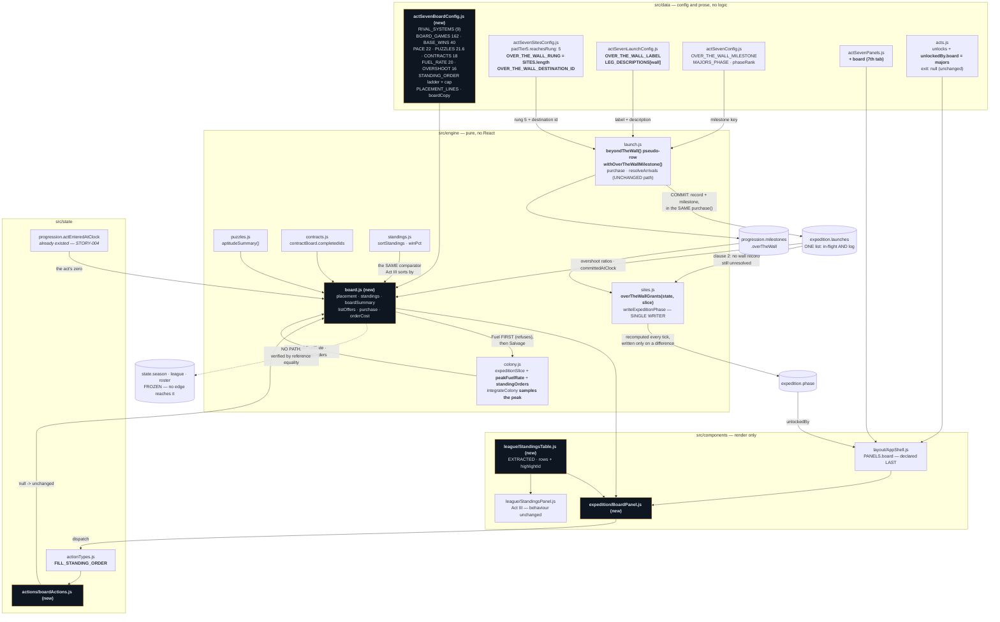

# Design — the win condition, the majors board, and the standing orders



## Decision 1: the majors predicate gains a second clause, rather than the milestone alone

The obvious reading is that the milestone *is* the phase: `overTheWallGrants()` already existed
reading it, and the phase ladder already made `majors` conditional on it. One write and done.

It is wrong, and PRD §7.8 says so in consecutive sentences. "`launch.purchase` on the over-the-wall
offer sets `progression.milestones.overTheWall`. That is the win condition" — and then, "Twelve
minutes later the transit resolves and `phase` becomes `majors`." The milestone-alone reading
collapses those two into one instant and deletes the last transit in the game, which is the one the
whole act has been building a pad for.

So:

```js
function overTheWallGrants(state, slice) {
  if (milestones[OVER_THE_WALL_MILESTONE] !== true) return false;
  return !slice.launches.some((l) =>
    l && l.destinationSiteId === OVER_THE_WALL_DESTINATION_ID && l.resolved !== true);
}
```

**Why the absence of an unresolved record and not the presence of a resolved one.** The three cases:

| save | milestone | wall record | phase |
|---|---|---|---|
| at commit | set | present, unresolved | holds at `deepSpace` |
| at arrival | set | present, resolved | promotes to `majors` |
| hand-edited | set | **absent** | promotes at once |

`resolved === true` would read the third row as permanently in flight — a run that has won and can
never be told so, with no play that repairs it. Absence-of-in-flight fails open, matching every
other defaulted read in the act, and the worst it can do is promote a corrupt save one transit
early into a ladder that self-heals anyway.

**This is not the parallel-milestone arrangement ledger R4 refused.** R4 rejected
`phaseLifeSupport` / `phaseLunar` / `phaseDeepSpace` because two sources of truth for how far the
run has got is a race that only ever shows up on somebody's real save. A milestone the *single
writer reads* is the opposite arrangement — and it is exactly what `launchCommitGrants()` already
does against the launch log for `deepSpace`. `expedition.phase` still has one author and is still
recomputed from scratch every tick.

## Decision 2: the wall is a four-field pseudo-row, and nothing downstream branches

`data/actSevenSitesConfig.js` states the constraint in the comment on `padTier5.reachesRung: 5`:
this is a number and not a `reachesWall: true` flag, "because a flag would be a second kind of
reach, and reach is meant to be one comparison."

`currentLeg()` therefore falls through to:

```js
{ id: OVER_THE_WALL_DESTINATION_ID, rung: OVER_THE_WALL_RUNG, label: OVER_THE_WALL_LABEL, colonizeCost: 0 }
```

Those four fields are the entire set the rest of `launch.js` asks a destination for. With them,
`currentLeg()`, `blockedReasonFor()`, `listOffers()` and `purchase()` run the last burn in the game
through the identical path as the first — `siteReach(origin) < destination.rung` is satisfied by
`padTier5.reachesRung: 5` for exactly the reason The Mound's 2 satisfies it at On-Deck.

**`OVER_THE_WALL_RUNG` is `ACT_SEVEN_SITES.length`, derived and not typed.** Rungs are 0-indexed and
dense, so the ladder's length *is* one past the top — which is what `reachesRung: 5` states from the
pad's side. Typed as a literal, a sixth site would silently split the pair: the ladder grows a rung,
the top pad keeps reaching past it, and the win fires one site early with no error anywhere.

**Arrival needed no change at all**, and that is the finding rather than an omission.
`markSiteReached()` looks for a site with that id, finds none and returns state by identity;
`arrivalGrantFor()` finds no colonization cost and returns 0. Not being a site is already what
"beyond the wall" means. The same is true of `nextArrivalClock()`: the wall record is an ordinary
unresolved launch with a finite `arrivesAtClock`, so **this change appends nothing to
`EVENT_CLOCK_CONTRIBUTORS`.**

`currentLaunchThreshold()`'s comment did move, though its answer did not. It used to say
`currentLeg()` returns `null` at the top of the ladder; it now returns the wall leg, so between The
Swing and the commit that function takes its *first* branch. Both branches answer 42,000 — verified
under `node` rather than reasoned about, because `engine/contracts.js` multiplies `payoutPct`
against it and a contract paying a percentage of the wrong burn would look like balance rather than
a bug.

## Decision 3: the placement returns a breakdown, and every weight is a budget of wins

§7.8 asks for two things and the second is the harder one: *deterministic, computed from the run*
**and** *the board tells them which line they earned*.

A score satisfies the first and fails the second. So every weight is denominated in **wins against a
162-game schedule**, and `placement()` returns seven rows that sum exactly to the win column:

| input | budget | why that size |
|---|---:|---|
| reached the majors | 40.0 | a floor, not a trophy — the board is a table of interstellar networks |
| elapsed time | 22.0 | §12's own 300-minute ceiling as the full-credit mark |
| artifacts | 21.6 | 9 × 2.4 unaided; the largest, because §8's thesis is that the panel has no manual |
| contracts | 18.0 | 12 × 1.5, sized *below* puzzles — §9 is the act's one optional system |
| peak Fuel/s | 20.0 | ramped against STORY-031's measured 28.0/s sustaining rate |
| overshoot | 16.0 | the only budget that cannot be ground — you held or you went |
| **maximum** | **137.6** | against the top rival's **141** |

Rounding happens **once**, at the end. Rounding each row would make the breakdown fail to sum to its
own total by up to three wins, which on a screen whose entire job is auditability is the worst
possible place for a rounding convention to surface.

**Elapsed time is measured to the COMMIT, not to now.** Using `state.clock` would make the board
tick downward for as long as the tab stayed open — a run re-judged for time it spent after the run
was over.

**A perfect run finishes second**, and the standing orders take it to first at six orders. That is
AC #5 wired into the board rather than sitting beside it. After the win column saturates at 162 the
run-differential term keeps climbing, and `sortStandings` falls through to run differential, so the
tail never stops having a number that goes up.

## Decision 4: the table is extracted, not reimplemented

`StandingsPanel` was 89 lines with the six columns inline, reading `PLAYER_TEAM_ID` and calling
`resolveTeamName(state, row.teamId)` per row. Neither means anything to a table of farm systems, and
carrying them into a shared component would have produced an `isBoard` branch — a second layout
wearing one component's name.

So `StandingsTable` takes **rows and a `highlightId`**. Each caller resolves both in its own
vocabulary: `StandingsPanel` maps `teamId` through `resolveTeamName()` and highlights
`PLAYER_TEAM_ID`; the board hands over rows that were never teams and highlights `earth`. The
component knows about neither league.

The board also reuses `sortStandings()` and `winPct()` from `engine/standings.js` rather than
restating "win percentage, then run differential" — which would be the first place the last screen
of the game disagreed with the first one.

**And that reuse creates the sharpest hazard in the change.** Rows minted in the shape of
`season.standings` are exactly the thing that gets accidentally sourced from, or written back into,
the slice they resemble — which is AC #6. The guarantee is structural rather than tested:
`engine/board.js` imports `engine/standings.js` for its two pure functions and nothing else from the
baseball half of the game. No `PLAYER_TEAM_ID`, no `engine/schedule.js`, no writer of any kind.
There is no code path from the board into season state. It is *also* verified by reference equality
across an 8h `advance()` spanning the win.

## Decision 5: standing orders are a purchase; Salvage compounds and Fuel is capped

§7.8 calls them "long contracts". Built as timed rows they would need a `readyAtClock`, an
`EVENT_CLOCK_CONTRIBUTORS` entry, a resolver in the loop body, and the whole idempotence burden that
`resolveBuilds()` and `resolveArrivals()` each carry a page of comment about — for a post-game sink
whose entire design content is "it costs more each time". As a purchase it resolves inside the
dispatch, in front of the player, and an eight-hour offline return cannot advance it by one order.
The order is long; the **ladder** is the wait.

**The price asymmetry is correctness, not balance.** Salvage has no ceiling, so a geometric Salvage
price is always eventually payable and the ladder stays endless. Fuel *has* one — the sum of every
reached site's tank — so a geometric Fuel price crosses it and the ladder becomes permanently
unbuyable at a level nobody planned, which is a soft-lock on the only content in `majors`. Measured:
Salvage runs 1.20M → 6.28M → 32.9M → 900M at levels 0/10/20/40, while Fuel reaches its 33,600 cap
at level 20 and stays there.

**The dual debit is ordered.** `spendResource()` refuses with `null` rather than flooring;
`debitWallet()` is a ledger write behind a check. The refusing debit goes first, so a purchase that
cannot complete cannot take the player's Salvage and give them nothing on a row that costs seven
minutes of income. Both affordances are also checked before either debit, so the ordering is a
backstop to a gate rather than the gate itself. The slice is then read back off the **fuel-spent**
state — spreading a slice captured before `spendResource()` would restore the Fuel it just spent.

## Decision 6: `peakFuelRate` is sampled inside `integrateColony`, and costs nothing

`colonyRates()` is a 16-pass Kleene fixed point, and the tick loop is careful enough about it that
`advanceContracts()` is handed the solve from the top of the iteration rather than taking its own.
An unconditional second solve per tick, to record one number for one screen at the end of the act,
would be the most expensive line in the loop. Inside `integrateColony`, `net` is already four lines
above and the peak is a comparison.

**Monotone, which is stronger than idempotent.** A maximum cannot be double-counted, so an 8h
catch-up crossing the same rate regime forty times records it once. No boundary, no resolver, no
contributor.

**It cannot materialise a slice into the six earlier acts**, by the same structural argument the
Home Plate note makes rather than by an act check: the only thing in the game that produces Fuel is
an Act VII module, so `net.fuel` is 0 for every save that owns none, and 0 is never greater than the
stored 0.

## Decision 7: `board` is the seventh tab, declared last in every list

Four registrations, three of them silent when missed: `ACT_SEVEN_PANELS` (TabNav spreads it
automatically), `unlocks`, `unlockedBy: { board: 'majors' }`, and AppShell's hand-authored `PANELS`.

**Last in `PANELS` specifically.** `visibleTabs` is `Object.keys(PANELS)` filtered by the unlocked
set and `visibleTabs[0]` is the fallback tab — the comment there credits `ops` being first for
making the teardown land on the terminal. Declaring `board` any earlier would change which screen a
`majors` run falls back to, and would put the screen that says the act is over in among the screens
the player uses to play it.

The `seenTabs` NEW badge then fires automatically on reveal, because that list is append-only across
the act boundary. That is a nice property here specifically: the board is the one tab in the game
where the badge is the announcement.

## What was considered and not built

**A `reachesWall: true` flag.** Refused by `data/actSevenSitesConfig.js` in advance, by name. Reach
is one comparison.

**A second `expedition.startedAtClock`.** Nearly built, then found:
`progression.actEnteredAtClock` has carried exactly this since STORY-004, written by `enterAct()`
and already read by `engine/narrative.js` for the same kind of question. Two clocks answering one
question is the drift `data/actSevenConfig.js`'s header exists to forbid.

**A reset / replay axis.** §14 item 6 sketches Service Time — a new run of Act VII only, with
accumulated service time granting a flat bonus, reusing `resetForPrestige`'s structure without
touching `PRESTIGE_ACT_INDEX`. Explicitly out of scope. Shipping `majors` without it leaves the game
with an ending and an idle tail, which is more than Act VI has today.
