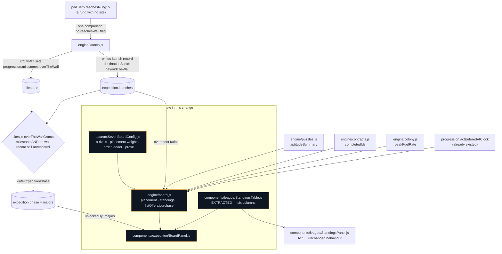

# Act VII — the win condition, the majors standings board, and the endless standing orders

## Why

The odyssey has had a ladder since STORY-027, burns since STORY-028, an economy since STORY-025 and
puzzles and contracts since 029 and 030 — and **no way to win.** `engine/launch.js`'s `currentLeg()`
returned `null` the moment every rung was reached, with a comment saying so and naming this story;
`engine/sites.js`'s `overTheWallGrants()` read a milestone nothing wrote; `padTier5.reachesRung: 5`
pointed at a rung with no site. Three files were holding a shape open for a fourth that did not
exist.

The act could be played to the top of the ladder and then stopped, in silence, with a pad built and
nowhere to throw.

**And what is on the other side is a standings table.** Not a colony, not a sixth phase, not a new
content area. The terminal comes back up and shows the exact component the player learned in Act
III, in a six-game little league season behind a hardware store. Earth is one row among nine other
farm systems. *The last screen of the game is the first screen the game ever taught you, and you are
in the standings.*

## What changes

| File | Change |
|---|---|
| `engine/board.js` | **New, pure.** Earth's deterministic placement, the ten board rows, and the post-game shop |
| `data/actSevenBoardConfig.js` | **New.** Nine rival systems, every placement weight, the order ladder, all prose |
| `components/league/StandingsTable.js` | **New — extracted from `StandingsPanel`.** The six columns, shared |
| `components/expedition/BoardPanel.js` | **New.** The seventh Act VII tab, revealed only in `majors` |
| `state/actions/boardActions.js` | **New.** One reducer over `board.purchase` |
| `engine/launch.js` | The fifth burn: an over-the-wall leg, and the milestone write at commit |
| `engine/sites.js` | `overTheWallGrants()` gains its second clause — milestone **and** nothing still in the air |
| `engine/colony.js` | `peakFuelRate` on the slice, sampled inside `integrateColony` |
| `data/actSevenSitesConfig.js` | The wall's rung and destination id; §12's optimal-buyer measurement |
| `data/acts.js`, `data/actSevenPanels.js`, `AppShell.js` | The `board` tab, gated on `majors` |

## The decisions worth arguing about

**Winning is a COMMIT; arriving is what moves the phase. Twelve minutes apart, deliberately.**

§7.8 states both in consecutive sentences and they are not the same instant. `launch.purchase` on
the over-the-wall offer sets the milestone — the game's last act should be the player's, not a
timer's, which is Decision 3.2's argument applied to the ending. Then the transit runs, and
`expedition.phase` becomes `majors` on arrival. So `overTheWallGrants()` gained a second clause:
milestone set **and** no wall record still unresolved.

That is one predicate in one ladder with one writer, not a second phase path. Ledger R4 forbids
milestone flags that *mirror* the phase; a milestone the single writer *reads* is the arrangement
`launchCommitGrants()` already uses against the launch log.

The clause is written as the **absence of something in flight** rather than the presence of
something resolved, and that direction is the whole design: a hand-edited save carrying the
milestone and no launch log promotes immediately instead of being stranded in transit forever.

**No `reachesWall` flag, because `data/actSevenSitesConfig.js` asked for none.** The fifth burn's
destination is a four-field pseudo-row — `rung`, `id`, `label`, `colonizeCost: 0` — so the last
burn in the game runs through `currentLeg()`, `blockedReasonFor()`, `listOffers()` and `purchase()`
by the identical path as the first, with no `isWall` test anywhere. Reach stayed one comparison.
Arrival needed no special case either: `markSiteReached()` finds no site with that id and returns
state by identity, `arrivalGrantFor()` finds no colonization cost and returns 0. **Not being a site
is already what "beyond the wall" means.**

**The placement is deterministic and returns a breakdown, not a score.** §7.8 asks for two things —
"deterministic, computed from the run. No dice" *and* "the board tells them which line they earned."
The second is the harder one. Every weight is a **budget of wins** against a 162-game schedule, so
the panel prints seven rows that sum exactly to the win column: *Artifacts · 7 solved unaided,
2 with hints · +19.2 W*. A player can audit the last screen of the game against their own run.

**A perfect run finishes second.** The budgets total 137.6 wins against the top rival's 141. That is
what makes the endless ladder mean something: the top of the board is reachable only through the
post-game, so `majors` has somewhere to go rather than being a screen you read once. Measured at six
standing orders to first.

**The standing orders are a repeatable purchase, not a timed build.** §7.8 calls them "long
contracts"; building them as timed rows would mean a new `readyAtClock`, a new event-clock
contributor, a new resolver and the full idempotence burden — for a post-game sink whose entire
design content is "it costs more each time". The order is long; the **ladder** is the wait.

Their Salvage price compounds and their **Fuel price is capped**, and that asymmetry is correctness
rather than balance. Salvage has no ceiling, so a geometric price stays payable forever. Fuel *has*
one, so a geometric Fuel price crosses the network's total tank capacity and the ladder becomes
permanently unbuyable — a soft-lock on the only content in `majors`.

**The dual-currency debit is ordered, not merely checked.** `spendResource()` refuses with `null`;
`debitWallet()` is a ledger write behind a check. The refusing debit goes **first**, so a purchase
that cannot complete cannot take the player's Salvage and give them nothing.

**The board never touches `state.season`, structurally.** It mints rows in the *shape* of
`season.standings` so one table renders both — which is exactly the thing that gets accidentally
sourced from the slice it resembles. So `engine/board.js` imports `engine/standings.js` for its two
pure functions and nothing else from the baseball half of the game: no `PLAYER_TEAM_ID`, no
`engine/schedule.js`, no writer of any kind.

**No reset or replay axis, and that is a decision.** §14 item 6 sketches Service Time and leaves it
unbuilt so this ships. The game gets an ending and an idle tail, which is more than Act VI has.

## The measurement, which is the other half of this change

STORY-028 deferred §12's five-hour ceiling here and STORY-031 re-confirmed the deferral, both
recording that their buyers were competent rather than optimal and specifically **did not chase the
Fuel-tank gate**. Taken now, with an optimal buyer through the real `advance()`:

**The act is won — the fifth burn committed — at 291.8 minutes. 4.86 hours against a 5.00-hour
ceiling. The ceiling holds.** Chasing the Fuel Bladder's seven Fission Piles and seven Hydroponics
Bays ahead of everything else is worth 814 minutes against STORY-031's clock.

**The bias is stated rather than left to be assumed.** This buyer is a limit, not a person: it
re-evaluates the catalogue every second, spends to zero, and never stops to look at anything. **A
real player will exceed five hours.** What is established is the correct reading of §12's criterion
— the act *is* completable inside the ceiling — and the margin is 2.7%, thin enough that any retune
lengthening a fill should re-run this before shipping. Nothing was retuned to produce it.

It also ignores §8 and §9 entirely, which makes 291.8 an upper bound on the optimal clock rather
than a best case. And it has a consequence worth knowing: **that speedrunner finishes sixth on the
board.** The board measures the run, not the clock.

## A field that already existed

The placement needs the clock at which Act VII began, and this change nearly added one to
`expedition` before finding that `progression.actEnteredAtClock` has carried exactly that since
STORY-004 — written by `enterAct()` on every act boundary, already read by `engine/narrative.js` for
the same kind of question. Two clocks answering one question is the drift `data/actSevenConfig.js`'s
header exists to forbid. Recorded here because it was nearly not caught.
