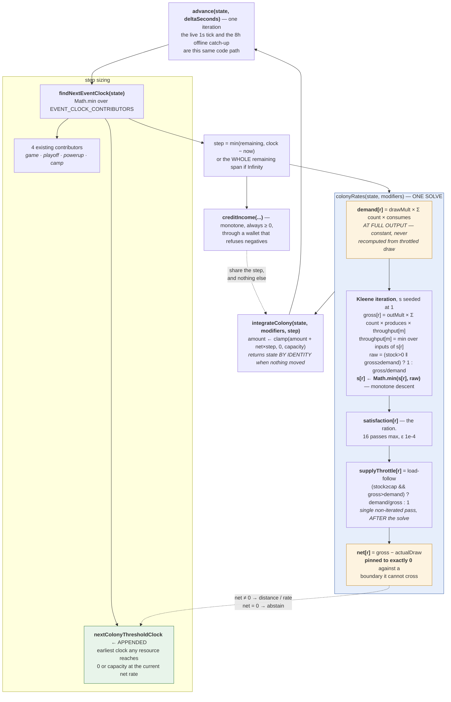

## Context

See proposal.md — Why. The constraints that actually shape the approach:

- `advance()` is one function serving two callers with wildly different `deltaSeconds`. There is no
  separate offline path to special-case, and adding one would be the classic failure this repo's
  conventions call out by name.
- `engine/wallet.js` structurally refuses a negative balance, and `creditIncome()` takes a bundle
  that is always `>= 0`. Neither can carry a consumable.
- `engine/tickEngine.js` is the most contended file in the codebase for parallel work, and
  `findNextEventClock()` was refactored into a contributor list in the immediately preceding story
  precisely so that this change would be an append.
- Fuel's base capacity is `0` and that is a real value, so every capacity default must distinguish
  absent from zero. `expeditionSlice()` already uses `Number.isFinite` for this reason.
- There is no test framework in this repo, so "offline-safe" has to be *demonstrated* under `node`,
  not asserted.

## Goals / Non-Goals

**Goals:**

- A signed, capacity-clamped rate model that integrates correctly across an 8-hour step.
- A boundary contributor that makes the piecewise-constant model *exact* rather than approximate.
- One solve, one place. No consumer may ever compute a colony rate itself.
- Provable zero behaviour change on the shipped game.

**Non-Goals:**

- **No module content.** The catalogue ships empty. Pricing belongs to the stories that sell it.
- **No `expedition.phase` writes.** Predicates only; `engine/sites.js` is the single writer.
- **No site or contract terms.** Both fold into `demandAtFullOutput()` / `grossProduction()` later,
  and the seams are commented in place. Guessing at their shape now would produce a conflict.
- **No `BONUS_KEYS` registration.** The §5.9 multiplier reads exist and default to 1; registering
  the keys changes `computeModifiers()`'s output and belongs to the powerup story.
- **No `income.js` change.** Salvage is a currency and joins the income list in its own story.

## The change

The dashed edge from `net` back to the contributor is the loop that makes the whole thing exact. A
resource with a non-zero net rate reports the instant it reaches its boundary; `advance()` steps
exactly there, re-solves, and the rate changes discretely. A resource pinned against a boundary has
`net` of exactly `0` and abstains, so a crossing *removes* a future boundary rather than adding one.
That is why the measured iteration count for an 8-hour return is 5 rather than the PRD's a-priori
ceiling of 21.

## Decision 1 — The consumables get a sibling integration path, not an income contributor

`totalIncomePerSecond()` is currency-additive and always `>= 0`. Forcing the consumables through it
means one of two things, and both are worse than a second path:

- **Split each resource into a produce-side and a consume-side contributor.** This loses the
  satisfaction coupling, which *is* the mechanic: a module's output depends on whether its inputs
  were satisfied, and that is a joint solve across all four resources, not a sum of independent
  terms.
- **Relax the invariant `engine/wallet.js` exists to hold.** Not negotiable; Decision 6 rests on it.

So `advance()` calls `integrateColony()` on the line after `creditIncome()`. They share the step and
nothing else. This is the shape PRD §5.8 specifies and the reason it specifies it.

## Decision 2 — `demand[r]` is computed at full output, never from actual throttled draw

This is the decision an implementer is most likely to "improve", because it reads like an
inconsistency: the colony plainly is not drawing `demand[r]`.

Recomputed from actual draw, a resource pinned at zero whose consumers happen to be throttled harder
by some *other* input ends up with a small positive net rate. It lifts off zero, which un-throttles
it next step, which drains it back to zero, which pins it again — an unbounded sequence of
microscopic boundary crossings, each one an `advance()` iteration, burning `safetyCapIterations` on
an offline return.

Full-output demand makes the pinned state **absorbing**. The price is stated openly: surplus arising
because a consumer was throttled elsewhere is discarded, a small and explicit loss of conservation
bought in exchange for exactness at the boundary and a closed form. A pinned resource un-pins on an
**event** — the player buys a generator, or a downstream module load-follows off — never on
continuous drift.

The corollary is that a pinned resource's `net` is `0` **by assignment, not by subtraction**.
`gross - draw` for a starved resource is some small negative number the clamp would discard anyway,
but leaving it negative means the contributor keeps reporting a boundary on a resource already
standing on one, and a zero-distance boundary is a zero-length step. The same pin is applied at the
capacity end, which the PRD does not state but which follows verbatim: a resource at capacity with
an unabsorbable surplus (a site production term does not load-follow) would otherwise report a cap
boundary it is already on, every iteration, forever.

## Decision 3 — Monotone descent is the convergence mechanism, not defensive clamping

`gross` and `satisfaction` are mutually recursive — reactors eat the Provisions that the hydroponics
grow using Power. The ration is a fixed point, solved by Kleene iteration from the top element.

`gross` is monotone non-decreasing in `satisfaction` and `satisfaction` is monotone non-decreasing in
`gross`, so the composed operator is monotone. Started at the top and forced downward by
`Math.min(previous, raw)`, the sequence is monotone-decreasing and bounded below by 0, therefore
convergent. **Without the `Math.min` the Power/Provisions loop alternates forever**, and an
oscillating ration means a boundary clock that moves every time it is asked.

**Measured** (harness in `/tmp`, not committed — there is no test runner here): 1 pass on an empty
colony, 1 on a healthy one, 2 with one bus starved, 16 on a mutual collapse. Worst case 16, which is
`SOLVE_MAX_PASSES`. At the cap the collapse fixture sits 0.02% from the closed-form fixed point, so
16 is comfortable rather than marginal. The sequence was asserted non-increasing on every pass of
every fixture rather than inferred from the fact that it converged.

## Decision 4 — Load-following is a single non-iterated pass, run *after* the solve

Lowering `gross` *raises* the load-follow ratio `demand / gross`, so folding it into the Kleene loop
would break the monotonicity that Decision 3 rests on. The cascade it leaves unresolved — a producer
backing off stops eating its inputs, which may push an input into surplus — is not lost. It is a
**boundary event**, resolved by the next `advance()` iteration. The iteration bound is derived with
that allowance rather than by assuming load-following terminates in one pass.

## Decision 5 — `spendResource()` refuses, where `debitWallet()` floors

`debitWallet()` floors at zero and always succeeds, so a call site that forgets to check
affordability produces a poor game rather than a negative balance. `spendResource()` returns `null`
instead.

These are not inconsistent; they answer different questions. A currency is a **price you pay**. Fuel
is a **threshold you fill** — a launch either has enough to leave or it does not, and half a launch
is not a thing. A caller that silently took what was there would burn the player's tank and not go
anywhere, which is destruction, which Decision 6 forbids. Refusing consumes nothing, removes
nothing, and leaves the player filling the tank.

## Decision 6 — The catalogue ships empty, and that is the proof strategy

With no modules owned, `colonyRates()` is all zeros, the contributor abstains before it even
computes modifiers, and `integrateColony()` returns its argument **by identity**. That last detail
is load-bearing twice over: it makes "identical to before" provable by *reference* equality rather
than by a deep compare that could paper over a reordered key, and it stops a pre-slice save from
having an `expedition` key materialised onto it by six acts that have no use for one.

The catalogue is also read **at call time**, never memoized into a module-load lookup map. This is
the `FINAL_ACT_INDEX` lesson applied: that constant is `ACTS.length - 1` captured at load and
`getActConfig()` clamps above it, which has twice caused a test appending to `ACTS` to pass for the
wrong reason. A load-time map here would do exactly that to every synthetic colony a harness
injects — the injection would be invisible, every rate would solve to zero, and an offline-safety
suite would go green having simulated nothing.

## Verification

No test framework, so the `node` harness *is* the acceptance check. Every fixture asserts it is
genuinely live (non-zero gross, non-zero demand, net negative where claimed) before asserting
anything about safety, so a vacuous pass is detectable.

| Check | Result |
|---|---|
| 8h `advance()` vs the real pre-change engine, zero modules | deep-identical; `expedition` reference-identical; a pre-slice save still has no `expedition` key |
| Solve vs PRD §5.6's published trace | passes 1–3 reproduce exactly; engine matches an independent oracle to 1e-12 |
| Chunked vs stepwise across a zero crossing | chunked **exact**; dt=1s off by 0.467, dt=0.01s off by 0.0047 (100x) |
| Chunked vs stepwise across a cap crossing | chunked **exact**; dt=1s off by 20.6, dt=0.01s off by 0.171 (120x) |
| Contributor de-registered (mutation test) | 4x wrong on the zero fixture, 40% under-credit on the cap fixture |
| Over-committed colony, 8h | every resource in `[0, capacity]`, no module removed, no currency negative, full clock, recoverable by adding generators |
| Iteration bound, 8h | worst case **5** against `safetyCapIterations` 2,000 |
| Convergence bound | worst case **16** passes, monotone on every pass of every fixture |

The `FINAL_ACT_INDEX` trap was avoided by **not touching `ACTS` at all** — the colony model is
act-independent, so no fixture needed act rules. Nothing was appended to `ACTS` and no act was
mutated.

## Risks

| Risk | Mitigation |
|---|---|
| A later story "fixes" full-output demand into actual draw | Decision 2, restated at length in the code above `demandAtFullOutput()`, in terms of the failure it causes |
| A later story folds load-follow into the Kleene loop | Decision 4, restated above `loadFollowThrottles()` |
| A UI story computes its own rate and disagrees about time-to-empty | `colonyRates()` is documented as the single solve; §6's `listResources()` is specified as a thin wrapper |
| A content story memoizes the catalogue at module load | Decision 6, with the `FINAL_ACT_INDEX` precedent named in `data/actSevenConfig.js` |
| The harness is not committed, so these results are not re-runnable in CI | There is no CI. The measured figures are recorded as comments in `engine/colony.js`, which the conventions treat as deliverables |
