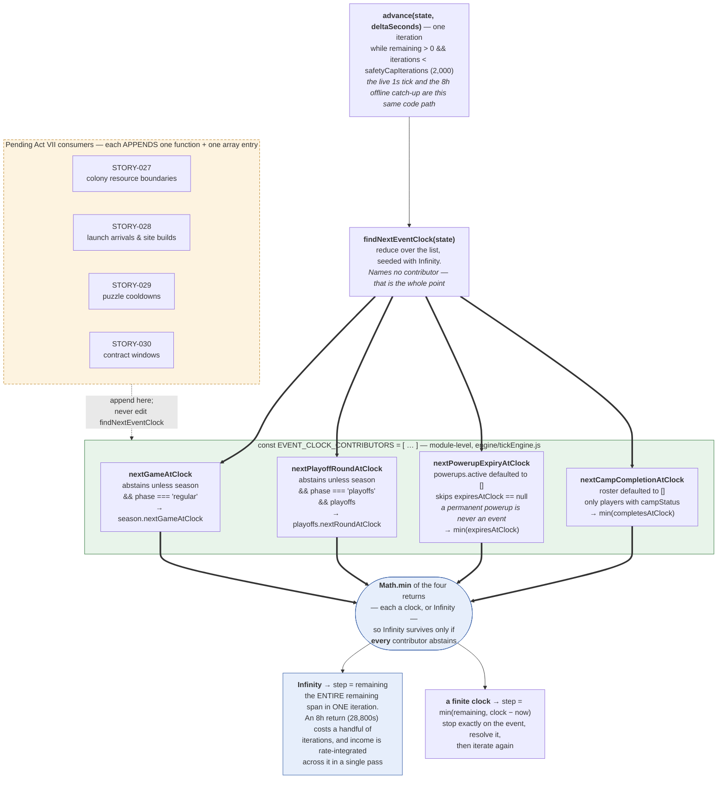

## Context

See proposal.md — Why. The constraints that actually shape the approach:

- `findNextEventClock()` is called once per `advance()` iteration and its return value becomes
  `step` (`tickEngine.js`, the `nextEventClock === Infinity ? remaining : ...` line). It is on
  the hottest path in the game and it is also on the offline catch-up path, which is the same
  path.
- It is already exported and consumed by the header's countdown bar, so its signature and
  `module.exports` must not move.
- Another branch (STORY-019) is editing `tickEngine.js` concurrently from an older base, adding
  a `seasonFrozen` gate around season-phase progression. Diff surface here is a real cost paid
  by a real person, not a style preference.
- There is no test framework in this repo, so "behaviour-preserving" has to be *demonstrated*
  under `node`, not asserted.

## Goals / Non-Goals

**Goals:**

- Appending a candidate source is an append, never an edit to shared control flow.
- Identical return values to the pre-change implementation on every reachable state.
- The `Infinity` contract is written down where the next author will read it, in terms of the
  failure it prevents.

**Non-Goals:**

- No new module. A `engine/eventClock.js` was considered and rejected — see Decision 2.
- No exporting of the individual contributors. No consumer exists.
- No `seasonFrozen` handling, and no anticipation of it. That belongs to STORY-019 and guessing
  at its shape from here would produce a conflict rather than avoid one.
- No performance work. Four calls and a `reduce` replace four pushes and a spread `Math.min`;
  the difference is noise against `simulateGame()`.

## The change

One iteration of the loop, drawn top to bottom. The loop then repeats until `remaining` is
exhausted.

The left-hand outcome is the load-bearing one. If every contributor abstains, the reduce's seed
`Infinity` survives, `step` becomes the *entire* remaining span, and an 8-hour return resolves in
a handful of iterations. A contributor that returned `0` instead of `Infinity` for "nothing
pending" would pin `step` at `0` and burn all 2,000 iterations without advancing the clock.

## Decisions

### Decision 1 — An array of functions, not a chain of named calls

`engine/income.js` is the ergonomic model this story was asked to copy, but it is not a literal
template: `totalIncomePerSecond()` sums its contributors in an inline expression. That shape
solves half the problem — the guards are per-contributor — but adding a source still means
editing the shared sum, which is the exact collision this story exists to remove. So the
contributors are named pure functions *in the income.js style*, collected into an explicit
module-level `EVENT_CLOCK_CONTRIBUTORS` array, and `findNextEventClock()` reduces over it and
never mentions any contributor by name.

`reduce(Math.min, Infinity)` rather than building a candidates array and spreading it: the
identity value *is* the empty-case answer, so the `candidates.length ? … : Infinity` ternary
disappears rather than being reimplemented one level up. It also removes a spread of an array
whose length is now unbounded by future stories.

**Alternative rejected:** a registration function (`registerEventClockContributor(fn)`) called
from each consumer's module. It would let contributors live next to the slice they read, but
registration order would then depend on `require` order, and a module that nothing imports would
silently never register. A literal array is greppable, deterministic, and shows the full set of
sources in one screen.

### Decision 2 — The list stays inside `tickEngine.js`

A separate `engine/eventClock.js` would be a cleaner module boundary in isolation. Rejected
because it makes the diff *wider*, not narrower: it deletes twelve lines from the file STORY-019
is concurrently rewriting and adds a new import at the top of it, which is a second conflict
point in the most contended region of the file. The whole change is currently one contiguous
hunk sitting in the dead centre of the file, far from both the imports and the `advance()`
season block. Re-evaluate once the Act VII contributors have landed and the block has grown to
eight or more — at that point extraction is a mechanical move with no live consumers in flight.

### Decision 3 — Contributors guard their slice, even where Decision 2 of the odyssey change says they need not

The pre-change function dereferences `working.powerups.active` and `working.roster` with no
guard at all; it *throws* if either is absent. The new contributors default both to `[]`.

This is the change's only behavioural difference and it is deliberate. The AC requires that a
contributor for a slice that does not exist returns `Infinity` and never throws, which is a
forward-looking contract aimed at the four Act VII slices — all of which will be `null` for most
of a run. Applying it uniformly to all contributors, rather than only to the new ones, is what
makes the contract a property of the list instead of a convention some entries follow.

It is worth naming the tension explicitly: odyssey design.md Decision 2 argues *against* this,
on the grounds that `roster` and `powerups` are present-and-empty from t=0 so "guarding every
call site" is neither free nor correct. That argument holds for `advance()`'s loop body, which
this change does not touch. It is weaker for a contributor list whose defining property is that
entries are added by authors who did not write the loop. The divergence is unreachable in the
shipped game — verified: the only states that distinguish the two implementations are ones where
`state.roster` or `state.powerups` has been deleted outright, which `createInitialState()` never
produces and no reducer removes — and it fails safe (`Infinity`, i.e. "I have nothing pending")
rather than crashing the tick loop.

### Decision 4 — Degenerate values are preserved, not repaired

`nextGameAtClock` returns `state.season.nextGameAtClock` raw, and the powerup/camp contributors
keep the original's `candidates.length ? Math.min(...candidates) : Infinity` shape rather than
folding with `<`. Both are on purpose. If a malformed save carried an `undefined`
`completesAtClock`, the pre-change function produced `NaN`; the obvious rewrites either keep that
or silently swallow it, and those are different programs. Faithfulness won: a refactor billed as
behaviour-preserving must not quietly fix bugs, because the fix then ships unreviewed and
unattributed inside a diff nobody is reading for behaviour. Two sweep fixtures pin the `NaN`
cases specifically. If that `NaN` should become `Infinity`, that is a real behaviour change and
deserves its own change with its own reasoning.

## Verification

Behaviour preservation is demonstrated rather than asserted, since the repo has no test
framework. The pre-change module is extracted verbatim from `git HEAD` into a temporary sibling
file so the *real* prior implementation is the baseline — not a hand-copied approximation — and
both are driven over fixtures built by overlaying onto the app's own `createInitialState()`, so
every slice genuinely exists in the shape the game produces. Results compared with `Object.is`,
so `NaN` vs `NaN` reports honestly rather than as a mismatch. The script lives in `/tmp` and the
temporary baseline file is deleted; nothing test-shaped is committed, per the repo's standing
instruction not to introduce a test framework as a side effect.

25 fixtures, covering: no season; regular season; regular season carrying a stale `playoffs`
object (the phase gate must ignore it); playoffs; playoffs phase with `playoffs: null` (the guard
branch); offseason; timed powerups; a permanent powerup with `expiresAtClock: null`; mixed
permanent and timed; single and multiple in-progress camps; camps mixed with non-campers; the
two `NaN` cases from Decision 4; and combinations where all four sources are pending at once —
including one fixture per contributor in which *that* contributor is the strict minimum, plus an
exact-tie fixture.

Those per-contributor minimum fixtures are what make the sweep discriminating, and that was
confirmed by mutation rather than by inspection: deleting each of the four registrations in turn
and re-running produces 5, 2, 4 and 7 divergences respectively. No contributor can be dropped or
broken without the sweep noticing.

Separately: absent `roster`/`powerups`/both return `Infinity` where the baseline threw
(Decision 3), and `advance(quietState, 28800)` still carries the clock the full 28,800 seconds,
confirming the `Infinity` path still collapses an 8h catch-up into one step. `npm run build`
passes with only the pre-existing bundle-size warnings.

## Risks / Trade-offs

- **A future contributor returns `0`, `null` or `undefined` for "nothing pending" and pins
  `step` at zero, burning `safetyCapIterations` and silently discarding an offline return.** This
  is the failure mode with real player consequences and it fails *quietly*. → The block comment
  above the list states the contract in exactly these terms, naming the consequence rather than
  the rule. Not defended in code: a runtime `Number.isFinite` assertion on every contributor's
  return, every iteration, costs more than the bug it catches and there is no test harness to
  house it in. Revisit if a contributor ever ships with this bug.
- **A future contributor is expensive.** Every contributor runs every iteration, and an offline
  catch-up can run 2,000 of them. The four present are array scans over collections bounded by
  roster size. → Contract is documented as pure and cheap; a contributor needing real work should
  memoise against `state.clock` rather than the list growing a laziness mechanism.
- **The list grows past the point where a flat array is the right structure.** → Decision 2 sets
  the re-evaluation trigger explicitly (roughly eight entries, and only once no branch is
  in flight).
- **Merge conflict with STORY-019 anyway.** → Reduced as far as it goes: the change is one
  contiguous hunk in the middle of the file, and STORY-019's `seasonFrozen` gate targets the
  `advance()` season block and game resolution, neither of which is touched here. Worth noting
  for whoever lands second that `nextGameAtClock` and `nextPlayoffRoundAtClock` are precisely the
  two contributors a `seasonFrozen` gate will want to suppress, and after this change that is one
  added clause inside each of two small functions rather than surgery on shared control flow.
