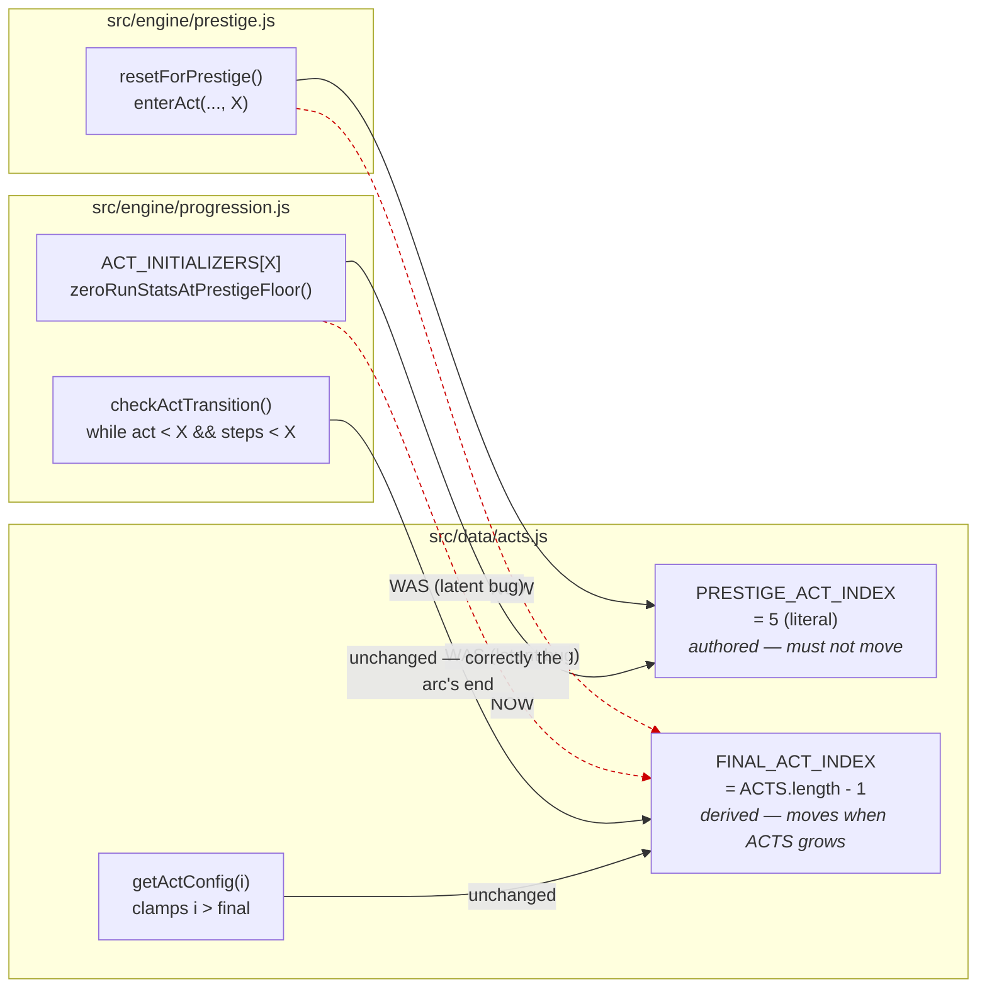

## Context

See proposal.md — Why, for the motivation. The state that shapes the approach:

`src/data/acts.js` exports one index constant, `FINAL_ACT_INDEX = ACTS.length - 1`, currently 5.
Three places read it, and they are asking two different questions:

| Call site | Question it is actually asking | Correct constant |
| --- | --- | --- |
| `prestige.js: resetForPrestige()` → `enterAct(..., X)` | where does a prestiging player land? | prestige floor |
| `progression.js: ACT_INITIALIZERS[X]` (zeroes `runStats`) | where does a prestige run begin? | prestige floor |
| `progression.js: checkActTransition()` loop bound | where does the authored arc end? | final act |
| `acts.js: getActConfig()` clamp | what is the highest real act? | final act |

Both questions have the answer 5 today and only one of them is derived from `ACTS.length`.

Constraints that shaped the implementation:

- `src/data/` may hold config and prose but no logic, so the new constant has to be a value, not
  a lookup.
- Saves are never migrated (`persistence/saveLoad.js` discards on version mismatch), so any
  observable change to prestige would be unrecoverable for existing players. The change must be
  provably inert.
- There is no test framework, so "provably" means driving the pure engine under `node`.

## Goals / Non-Goals

**Goals:**

- Make the prestige floor a named, authored decision that survives `ACTS` growing.
- Leave a comment trail that stops the next reader from re-merging the two constants — the two
  meanings now sit in the same file and look interchangeable.
- Prove inertness rather than assert it.

**Non-Goals:**

- Adding Act VII, or anything that touches `ACTS` content.
- Changing prestige semantics. `changes/odyssey-progression-architecture/design.md` **Decision 4**
  stands unamended: prestige resets to the Act VI index, the odyssey is played once per save. This
  change is the mechanism that keeps Decision 4 true, not a revision of it.
- Removing `progression.js`'s `FINAL_ACT_INDEX` re-export. Nothing in `src/` reads it any more
  once `prestige.js` stops, but deleting an export is unrelated churn in a change whose whole
  selling point is that it changes nothing.

## The change



The two dashed red edges are the change. Everything else is drawn to show what deliberately did
*not* move: `checkActTransition()`'s loop and `getActConfig()`'s clamp keep reading
`FINAL_ACT_INDEX`, in the same file as an initializer that now reads the other constant.

## Decisions

**1. `PRESTIGE_ACT_INDEX` is the literal `5`, not a derivation.**

Alternatives considered:

- `ACTS.length - 1` — this is literally the bug.
- `ACTS.findIndex((a) => a.unlocks.includes('prestige'))` — elegant, and wrong for this constant.
  It would make the prestige floor auto-track an unlocks array, so adding `prestige` to a later
  act's unlocks (a plausible edit) would silently relocate the floor with nobody deciding it
  should. The defect being fixed is a constant that changes meaning when data changes; a
  derivation reintroduces it in a new costume.
- A literal, with the reasoning in the comment. Chosen. It is the only form where growing `ACTS`
  to seven entries leaves prestige behaviour unchanged, which is the acceptance criterion stated
  as one line of code.

No runtime assertion guards the literal. `getActConfig()` already clamps out-of-range indices to
the last act, so a bad value degrades rather than throws, and a throw from `src/data/` in a repo
with no test framework would first surface to a player.

**2. The `runStats` initializer moves with prestige, not with the arc's end.**

Decision 4 lists "Entering the final act zeroes `prestige.runStats`" as a *consequence of the
prestige-floor decision*. The zeroing exists so `calculateLegacyPoints()` does not divide
odyssey-wide `totalRevenue` by 100,000 into the first payout, and that payout is gated by the
`prestige` unlock Act VI carries. It is a prestige-floor concern that inherited the last-act name.

Under a seventh act, leaving it keyed to `FINAL_ACT_INDEX` would zero `runStats` on entering Act
VII while prestige returned the player to Act VI — so every post-prestige payout would be inflated
by everything earned in Act VI, which is the exact bug the zeroing was written to prevent. It is
byte-identical today (both constants are 5), so re-keying costs nothing against the inertness
criterion. The function is renamed `zeroRunStatsAtPrestigeFloor` so the name stops asserting the
thing that is no longer true.

**3. `prestige.js` imports from `../data/acts`, not through `progression.js`.**

`prestige.js` already requires `../data/balanceConfig`; engine→data is the established direction.
Routing a data constant through a second engine module only to re-export it adds a hop that hides
where the number is authored.

**4. `checkActTransition()`'s comment states a structural invariant, not an act count.**

The old comment justified the unbounded-looking loop with "Act VI declares no exit, so this can
never run past the final act". Both halves expire under Act VII: Act VI would gain an exit, and
"the final act" would be a different act. The replacement records the invariant that survives —
every iteration requires `isExitSatisfied()`, which is only ever true because of something the
player did, so the loop can only collapse boundaries already earned; and the *terminal* act
returns false structurally because it declares `exit: null`, a property of what that act is rather
than of which index it occupies. The comment also separates `steps < FINAL_ACT_INDEX` (an
iteration cap) from the thing actually preventing overshoot (the gate), which the old wording
conflated, and explicitly warns that this call site must keep reading `FINAL_ACT_INDEX`.

## Verification

No test framework, so the inertness claim is proved by driving the pure engine under `node`.

Harness (`/tmp/story014-prestige-fixture.js`, deliberately not committed): builds a fixture from
the app's own `createInitialState()` — not a hand-rolled literal, so every slice the act
initializer touches really exists — sets `progression.act = 5`, a fixed `clock`, a populated
wallet and non-zero `runStats`, then runs `resetForPrestige()` and prints
`JSON.stringify(result, null, 2)`.

Two sources of nondeterminism had to be pinned or the diff would have been noise:

- `Math.random()` — `playerFactory.js` uses it directly for legend names, so
  `createStartingRoster()` and `createLeagueTeams()` are random. Replaced with a seeded
  mulberry32 before any `require`, which makes roster, league and schedule comparable instead of
  having to be excluded from the diff. **Nothing was excluded from the comparison.**
- `Date.now()` — `createInitialState()` stamps `meta.createdAt`. Frozen.

The baseline was captured twice pre-change and diffed against itself first, to confirm the harness
is deterministic before trusting it as evidence.

Result: 839 lines of JSON, `diff` clean between pre-change and post-change trees. Positive
assertions were checked too, since an empty diff of two identical crashes is also empty:

```
actAfterPrestige: 5      runStatsZeroed: true     legacyPointsAwarded: 403
era: 3                   rosterSize: 15           leagueTeamCount: 11    scheduleLength: 33
```

**A second harness covers the other path into the re-keyed initializer.** `resetForPrestige()`
is only one of the two ways to enter the prestige floor; the other is `checkActTransition()`
advancing a player organically out of Act V, which is how anyone reaches Act VI the first time.
Since `ACT_INITIALIZERS`' *key* is what changed, the prestige-path diff alone does not cover that
call site. `/tmp/story014-transition-fixture.js` sets `progression.act = 4` and the
`minorsPennantWon` milestone (Act V's exit has no registered predicate, so `isExitSatisfied()`
falls through to the milestone lookup) and drives `checkActTransition()`. 668 lines, `diff` clean,
landing at act 5 with `runStats` zeroed and stable on a second pass — the loop stops at the
terminal act, as the rewritten comment claims.

Both harnesses were re-run against a clean `git archive` of the base commit (3dc3542) extracted to
`/tmp`, not just against the pre-edit working tree, so the comparison is against committed code.

The counterfactual was checked directly — pushing a synthetic seventh act onto `ACTS` at runtime
makes `ACTS.length - 1` evaluate to 6 (what `resetForPrestige()` used to pass) while
`PRESTIGE_ACT_INDEX` stays 5 (what it passes now).

`npm run build` compiles: 3 pre-existing bundle-size warnings, no errors.

## Risks / Trade-offs

- **A hardcoded 5 goes stale if the acts are ever reordered or one is inserted before Act VI.**
  → Accepted, and preferred to the alternative: an insertion that moves Act VI is exactly the
  moment a human should have to make a decision about where prestige lands, rather than have it
  silently follow. The comment says so at the constant.
- **Two near-identical constants in one file invite a future "cleanup" that re-merges them.**
  → Mitigated with comments at all three sites — the constant, the initializer, and the loop —
  each recording what breaks if they are merged, plus this design doc.
- **The change is inert today, so no amount of playtesting can validate it.** → Which is why the
  verification is a byte-comparison against the pre-change tree rather than a play session, and
  why the counterfactual was exercised separately.

## Migration Plan

None required. No save-shape change, no `meta.version` bump — `persistence/saveLoad.js` discards
on mismatch and nothing persisted is touched. Rollback is a straight revert; the change is
self-contained across three files and nothing depends on the new export yet.
