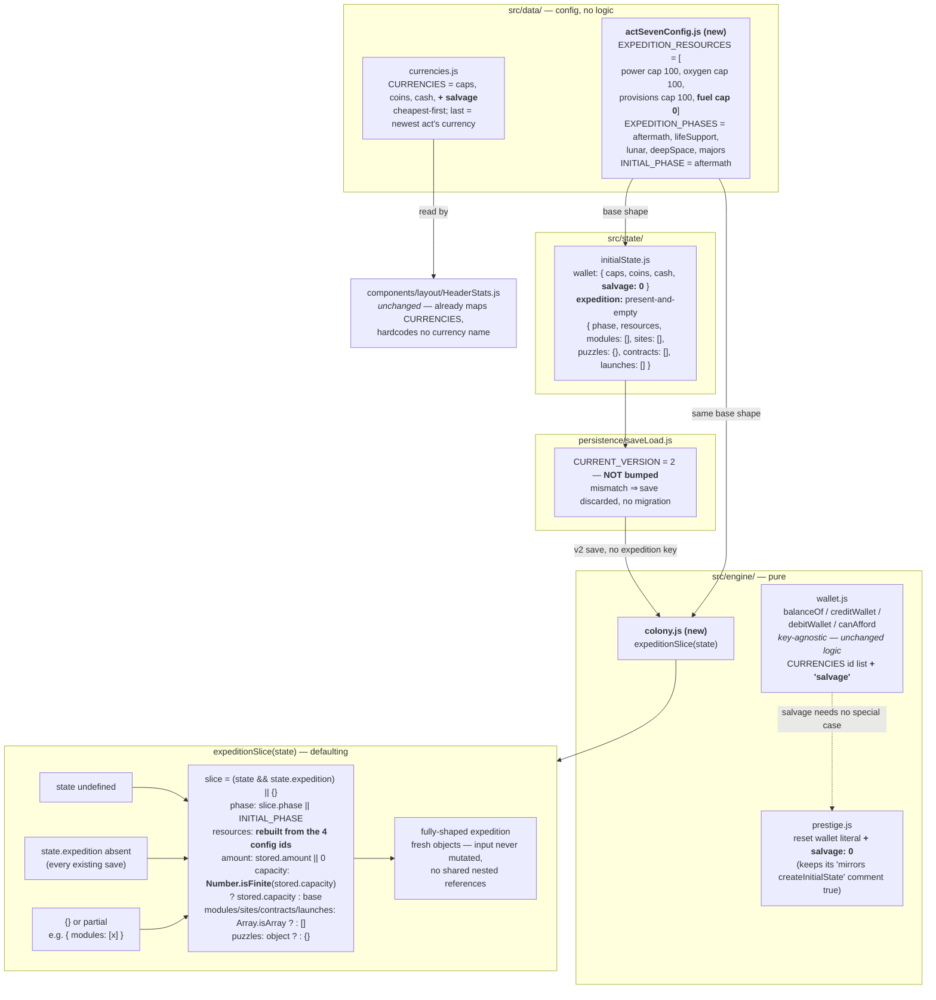

## Context

See proposal.md — Why. Three existing constraints shape everything below.

1. **No save migration.** `persistence/saveLoad.js` compares `meta.version` to `CURRENT_VERSION` and
   returns `null` — a fresh game — on any mismatch. There is no migration function to write.
2. **The defaulting slice accessor** (`concessionsSlice()`, `wallBallSlice()`, `walkupSlice()`,
   `capsShopSlice()`) is how this codebase gets away with that. A slice added today is absent from
   every existing save; the accessor is what makes absent equal empty.
3. **`initialState.js`'s null-vs-present-and-empty rule** (`odyssey-progression-architecture`
   design, Decision 2): player-visible *content* is `null` until its act creates it; *tick-loop
   collections* are present-and-empty from t=0, because `advance()` dereferences them every
   iteration and guarding every call site is worse than iterating an empty array.

## Goals / Non-Goals

**Goals:**

- Land the `expedition` shape and the `salvage` currency so later Act VII stories have something to
  write against.
- Prove the absent-slice defaulting against saves that predate the change, at several acts.
- Keep one source of truth for the expedition's base shape so `initialState.js` and the accessor
  cannot disagree.

**Non-Goals:**

- Any behaviour. Nothing credits salvage, nothing integrates the four resources, nothing renders the
  slice, no tab appears. `income.js`, `tickEngine.js` and every component are untouched.
- The rest of `engine/colony.js` per PRD §5.8 — `colonyRates`, `integrateColony`,
  `nextColonyThresholdClock`, `spendResource`, `listOffers`/`purchase`. This change creates the file
  and puts only the accessor in it.
- Act VII itself: no entry in `data/acts.js`, no phase writer, no puzzle config, no module table.
- Currency succession — what happens to cash when the odyssey begins — which stays with the
  `odyssey-progression-architecture` change.

## Decisions

### Decision 1 — `CURRENT_VERSION` stays at 2

**Decision.** Do not bump. Adding a key that every reader defaults is not a breaking change; bumping
would delete every in-flight player's save to no benefit, since there is no migration to run.

**Alternative considered:** bump to 3 and write a migration. Rejected because it would introduce a
migration mechanism the repo has deliberately never had, in the one story that has no mechanic to
justify it. The point of this story is to show a slice can be added *without* one.

**How it is verified.** Fixtures built from `git show master:src/state/initialState.js` — the
pre-change initial state — advanced into Acts I, III and VI through `enterAct()`, JSON round-tripped
(what localStorage actually does), pushed through the real `loadGame()` against an in-memory
`localStorage` stub, then `advance()`d. Building fixtures by hand and re-implementing the version
check in the harness would test a paraphrase of `saveLoad.js`, not `saveLoad.js`.

### Decision 2 — `expedition` is present-and-empty, not `null`

**Decision.** Apply Decision 2 of `odyssey-progression-architecture` unchanged. `expedition.modules`,
`sites`, `contracts` and `launches` are tick-loop collections — PRD §5.8 has `integrateColony()` and
`nextColonyThresholdClock()` reading them from inside `advance()`'s loop body on every iteration —
so they are present-and-empty from t=0.

`phase` is present-and-`'aftermath'` for the same reason `wallBall` is a bag of counters rather than
`null`: there is no "absent" reading of a phase. A player who has not started the odyssey is in the
aftermath of nothing, which costs nothing and reads correctly.

**Alternative considered:** `expedition: null` until Act VII's initializer creates it, matching
`travelBall`/`bookie`. Rejected because those are *content* — a bookie's table does not exist until
someone sets one up — whereas these are collections the tick loop sums. The accessor makes `null`
survivable either way, so this is about which model is honest, not about which one crashes.

### Decision 3 — the base shape lives in `data/actSevenConfig.js`, read by both writers

**Decision.** The resource ids, their base capacities, the five phase ids and the initial phase go in
a new `data/actSevenConfig.js`. `state/initialState.js` builds the slice from it and
`engine/colony.js`'s accessor defaults from it.

**Rationale.** Not tidiness — drift. `concessionsSlice()`'s own comment records the failure mode: the
accessor's return value is spread when a slice is written back, so a key the accessor forgets is a
key every later write silently deletes. Two hand-written copies of the same shape is exactly how that
key goes missing. One config, two readers, no second copy. It is also the house rule: a magic number
inline in an engine or a state module is a bug, and `initialState.js` already reads
`balanceConfig.startingCash` and `balanceConfig.startingReputation` this way.

The config carries *shape*, not tuning: no module table, no site table, no costs. Those belong to the
stories that land them.

### Decision 4 — capacity defaults with `Number.isFinite`, not `||`

**Decision.** The accessor reads a stored `amount` with `|| 0` but a stored `capacity` with
`Number.isFinite(stored) ? stored : base`.

**Rationale.** Fuel's base capacity is **0**, and 0 is a legitimate stored value for any of the four.
`stored || base` is the idiom `odyssey-progression-architecture` Decision 3 already flags for treating
a legitimate `0` as absent. Today the two happen to coincide for fuel (stored 0, base 0), which is
precisely what would let the bug sit undetected until the first mechanic that lowers a capacity, at
which point the accessor would silently hand back the base ceiling and let the player over-fill a tank
they no longer have.

### Decision 5 — resources are rebuilt from the config's id list, never adopted from the save

**Decision.** The accessor iterates the four configured resource ids and constructs a fresh
`{ amount, capacity }` for each, reading the stored record only for its two values. It never returns
`slice.resources` itself, and never returns a stored per-resource record itself.

**Rationale.** Two properties at once. A save carrying only `{ power: … }` still yields all four, so
no reader has to guard a resource lookup — the whole point of the accessor. And because every nested
object is fresh, the returned value shares no reference with the input, so a caller mutating the
result cannot reach back into state. A top-level object literal alone would not give that: it would
hand back the input's own `resources` object.

### The change, end to end

## Risks / Trade-offs

- **A currency added to `CURRENCIES` shows up in the header at zero for every existing player.** →
  It does not, and this was checked rather than assumed. `HeaderStats` picks
  `unlockedCurrencies.length > 0 ? unlockedCurrencies : held`; no act's `unlocks` array in
  `data/acts.js` contains a currency id, so `unlockedCurrencies` is always empty and the list is
  always `held` — `wallet[id] > 0 || rates[id] > 0`. Salvage is 0 with no income, so it is filtered
  out. This preserves the `currency` spec's "not shown, including at a zero balance". Verified
  headlessly by replicating those two filter lines against a fixture, not asserted in prose.

- **The accessor and `initialState.js` drift, and a later write deletes a key.** → Decision 3: one
  config object is the only place the base shape is written. Also the reason the config lists
  resource ids rather than letting each writer name them.

- **`expedition` bloats every save from t=0 even for players who will never reach Act VII.** →
  Accepted, and it is small: one phase string, four two-number records, four empty containers. The
  same trade `roster: []` and `powerups` already make, and the alternative (`null`) buys nothing
  because the accessor exists regardless.

- **`engine/colony.js` exists with one function in it and looks thin.** → Accepted deliberately. PRD
  §5.8 assigns the whole colony simulation to that file; putting the accessor anywhere else now would
  mean moving it later, and every intervening story would import from the wrong place.

- **`prestige.js` gains `salvage: 0` — is that behaviour?** → No. Salvage is 0 everywhere today, so
  omitting the key and setting it to 0 are indistinguishable at runtime (`balanceOf` reads an absent
  key as 0). It is added because that literal's comment claims it mirrors `createInitialState()`, and
  a comment that stops being true is how the next person gets it wrong.

## Open Questions

- **Does prestige clear the expedition?** `resetForPrestige()` spreads `...state`, so as written the
  slice survives a prestige. It cannot matter yet — nothing writes the slice — and the answer depends
  on whether the odyssey is re-run per era or is a one-time arc, which Act VII's own stories decide.
  Deferring it changes nothing here: it is one key in one literal, in the file that already resets
  every other run-scoped slice. Flagged rather than guessed.

## Migration Plan

None, and that is the point — see Decision 1. `CURRENT_VERSION` is unchanged, so no save is
discarded and no save is rewritten. An existing v2 save gains the `expedition` key the first time it
is saved after this ships, and reads correctly through the accessor before that ever happens.

Rollback is a plain revert: a save written *after* this change carries `expedition` and
`wallet.salvage`, and reverting leaves both as ignored extra keys — nothing reads them and the
version still matches, so the save keeps loading.
