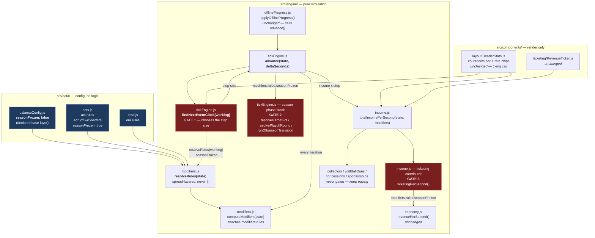

# Design — The `seasonFrozen` Rule

Source PRD: `docs/PRD-act-seven-farm-team.md` §3.5 (normative) and §11.1 story 0.5.
Extends: `openspec/changes/odyssey-progression-architecture/` (its Decision 1 and Decision 3).

This change is small in diff and architectural in consequence: it establishes that a progression
stage can suspend a whole simulation subsystem without deleting it, and it establishes where such
a gate is allowed to live. Act VII is built on top of it, so getting the placement wrong here is
expensive later.

## Context

Three properties of the existing code constrain the whole design, and all three were verified in
the source rather than assumed:

1. **The season slice cannot be absent once it exists.** `advance()` dereferences `state.season`
   every iteration, and `components/layout/AppShell.js:91` early-returns a whole pre-season shell
   — the lot and the wall — whenever `!state.season`. Absence is already the game's encoding for
   "this player has not reached Act III". Reusing it to mean "this player has gone past Act VI"
   makes those two states indistinguishable, and the app renders the earlier one.
2. **`resolveRules()` already layers arbitrary keys** by spread, `balanceConfig ← act.rules ←
   era.rules`, specifically so a legitimate falsy override survives (`playoffTeams: 0` is a real
   league with no postseason). A new rule therefore needs no change to `engine/modifiers.js` at
   all — which is the whole point of that helper existing.
3. **`engine/income.js` already owns a suspension gate inside a contributor.** The
   `phase !== 'offseason'` check lives inside `ticketingPerSecond()`, placed there by Decision 1
   of the odyssey change on the reasoning that suspension is a property of ticket sales rather
   than of income in general.

## The change, as it actually runs

Three gates, one rule, one source of truth. Everything else on that diagram is untouched.

## Decision 1 — The rule is declared in `balanceConfig` as an explicit `false`

**Decision.** `balanceConfig.seasonFrozen = false`, resolved through `resolveRules()` like every
other rule, and read only as `modifiers.rules.seasonFrozen` or `resolveRules(state).seasonFrozen`.

**Why declare it at all,** when an absent key already resolves to `undefined` and `undefined` is
falsy? Because the layering exists to distinguish "not overridden" from "overridden to a falsy
value", and a rule with no base value has nothing to be distinguishable *from*. It is also the
only place a reader can discover the rule exists: `data/balanceConfig.js` is the enumeration of
what a stage may override, and a rule that appears only in the act that uses it is a rule the next
act author will re-invent. The odyssey change's income spec already settled the underlying
question in its scenario *An override to a zero or disabling value*.

**Alternative rejected:** a `state.progression` flag. It would be persisted, would need a save
migration when it changed shape, and would be settable by something other than the act the player
is in. Rules are derived from the act on every read and are self-healing (Decision 5 of the
odyssey change); a flag is neither.

## Decision 2 — The gate goes in `findNextEventClock()` too, and that is the load-bearing one

This is the decision most likely to be undone by a later reader as redundant, so it is recorded
with the measurement that produced it.

**Problem.** `advance()` picks its step size as
`min(remaining, max(0, nextEventClock - clock))`. A frozen season is never rescheduled, so its
`nextGameAtClock` slides permanently into the past. With only the phase-block gate in place,
every iteration would choose that stale clock as the next event, compute `step = max(0, past -
now) = 0`, resolve nothing (the phase block is skipped), and come round to the same target — never
decrementing `remaining`. The loop burns all 2,000 `safetyCapIterations` and returns. Income is
gated on `step > 0`, so nothing accrues either.

**Measured.** With the phase-block and ticketing gates in place but this one removed, a
4,000-second frozen `advance()` produced `clockDelta: 60` and `caps: 61` — it stepped once to the
first stale fixture and then span. With the gate: `clockDelta: 4000`, `caps: 4001`. The frozen act
does not slow the game down; without this gate it *stops* it, which is precisely the failure mode
freezing the season instead of nulling it exists to prevent.

**Decision.** `findNextEventClock()` omits season candidates when the rule resolves true. Powerup
expiry and camp completions stay in the candidate list — they are clock-driven, not baseball.

**Signature.** Rules are resolved *inside* `findNextEventClock(working)` rather than passed in,
keeping the exported one-argument signature. Two reasons. First, it cannot be misused: there is no
call site that can forget to pass the gate. Second, `components/layout/HeaderStats.js` calls it
with `state` alone for its countdown bar and therefore gets correct frozen behaviour with no edit.
Precisely: while frozen the bar counts down to whichever *non-season* event is pending — a powerup
expiring or a camp completing, both of which unlock well before any act that would freeze a season
— and falls back to `Infinity`, no bar at all, only when nothing at all is pending. Both readings
are correct rather than a leak, because that chip is worded for scheduled events in general
("Time until the next scheduled event" / "Nothing scheduled — income is accruing") and not for the
next fixture. The cost is one extra `resolveRules()` per loop iteration against a module-memoized
acts lookup, which is not measurable.

**Alternative rejected:** advancing `nextGameAtClock` forward while frozen, so it never goes stale.
That mutates the season every iteration, which directly violates the "untouched" requirement, and
it would resume the schedule at a fabricated clock if the rule were ever lifted.

## Decision 3 — The income gate stays inside the `ticketing` contributor

**Decision.** `ticketingPerSecond()` returns 0 when the rule resolves true, sitting beside the
`phase !== 'offseason'` gate that is already there.

**Why not an act-level branch in `advance()`,** which is superficially simpler? Because Decision 1
of the odyssey change already answered this, and its reasons all still hold: a stage-level branch
has to be duplicated wherever income is read, and every new stage edits a conditional that every
other stage also touches. There are three readers of `totalIncomePerSecond()` today — the tick
loop, `HeaderStats`, and `RevenueTicker` — and a gate inside the contributor means all three agree
for free, with no second gate to keep in sync. A frozen league sells no tickets; the act that
froze it has income of its own, and suspending income as a whole would take that down with the
turnstiles.

`modifiers.rules` is dereferenced without a guard, matching the existing precedent in
`tickEngine.js` (`modifiers.rules.playoffTeams`): `computeModifiers()` always attaches it, and
every caller was checked to confirm it passes a real `computeModifiers()` result.

## Decision 4 — `roster` and `powerups` keep changing while frozen, deliberately

The requirement says these slices stay "untouched and valid", and the two halves are not the same
strength for all five slices. `season`, `league` and `stadium` are byte-for-byte identical while
frozen — nothing outside the season block writes them. `roster` and `powerups` are *not*, and must
not be: `expirePowerups()`, `processCampCompletions()` and `updatePeakRating()` are clock-driven
rather than season-driven, and a frozen act still has a clock. A powerup bought before the freeze
must still expire on time.

So the guarantee is: **structurally valid and never emptied, nulled or reshaped** for all five, and
additionally byte-identical for the three the season block owns. Anything asserting byte-identity
on `roster` is asserting the wrong thing, and the fix is the assertion, never disabling camp and
powerup processing.

**One caller outside the frozen guard can still rewrite a protected slice, and it was checked
rather than overlooked.** `checkActTransition()` runs every iteration regardless of the freeze,
and it begins with `repairTravelBall(repairMissingSeason(state))` — repairs that rebuild `season`
and `league` for a save that crossed an act boundary before that act had an initializer. Probing
confirmed they *can* rewrite both wholesale: a harness state jumped from Act III straight to Act
VI had its 6-game/4-team season rebuilt at 33 games and 11 clubs on the first frozen iteration.
That is correct behaviour — it is a repair of an incoherent state, not season progression — and it
is a harness artifact rather than a real path, because Act VII is reached by playing Acts IV and V
and so arrives coherent. The verification below settles it either way: a 4,000-iteration chunked
frozen run from a settled state leaves `season` and `league` byte-identical, so the repairs no-op
on every state that can actually reach a frozen act. Deliberately not gated on the freeze: a save
that needs repairing needs it whether or not the league is running.

## Verification

There is no test framework in this repo; `src/engine/` and `src/data/` are plain CommonJS, so the
conventional check is to drive them directly under `node`. A harness did the following, with
`Math.random` and `Date.now` patched to deterministic stubs *before any require*, so that
module-load-time randomness cannot vary between runs.

**Unset case — five scenarios, run before and after the change and deep-compared in full.** All
five final states were byte-identical (~75 KB of state JSON):

| Scenario | Fixtures | Playoff rounds | Offseason rollovers | Ticketing |
|---|---|---|---|---|
| Act III, 4,000 × 1s calls | 40 | 0 | 6 | 12/sec |
| Act III, one 4,000s call | 40 | 0 | 6 | 12/sec |
| Act VI, 4,000 × 1s calls | 45 | 2 | 2 | 21/sec |
| Act VI, one 4,000s call | 45 | 2 | 2 | 21/sec |
| Offline catch-up, 4,000s | 30 | 0 | 4 | 12/sec |

Two properties of that table matter as much as the equality. First, the chunked and single-call
patterns are compared *each against its own before-state*, never against each other — they
legitimately differ, because rate integration over one large step is not the same arithmetic as
4,000 one-second steps. Second, the coverage counts are asserted non-zero: two runs that resolved
no fixtures would also diff clean and prove nothing.

**Set case — a scratch act declaring `rules: { seasonFrozen: true }`,** injected in the harness
rather than in `data/acts.js` (that file belongs to the Act VII story, and `getActConfig()` clamps
at the final act index), so the real `actRules → getActConfig → resolveRules` path is exercised.
Over 4,000 frozen seconds, both chunked and single-call: clock advanced the full 4,000; caps
accrued from a non-ticket contributor; cash unchanged and the ticketing rate exactly 0; zero
fixtures, playoff rounds or rollovers; `season`, `league` and `stadium` byte-identical; `roster`
and `powerups` structurally valid; `season` still truthy; and `computeModifiers().rules.seasonFrozen`
true throughout.

**Build.** `npm run build` is the repo's only automated gate and passes.

## Risks

| Risk | Mitigation |
|---|---|
| A later reader deletes the `findNextEventClock` gate as redundant | Decision 2 above, plus a long comment at the code site recording the deadlock and the measured numbers |
| A future income contributor forgets it should freeze | Contributors are independently gated by design (Decision 3); a contributor that should freeze declares it, and one that should not is correct by default |
| The frozen season's stale `nextGameAtClock` fires if the rule is ever lifted | One fixture resolves immediately and the schedule then re-paces normally. No act lifts the rule; noted here rather than defended against |
| `resolveRules()` called twice per iteration | Measured as immaterial against a memoized acts lookup; the alternative was a signature change that pushes the gate onto every caller |
